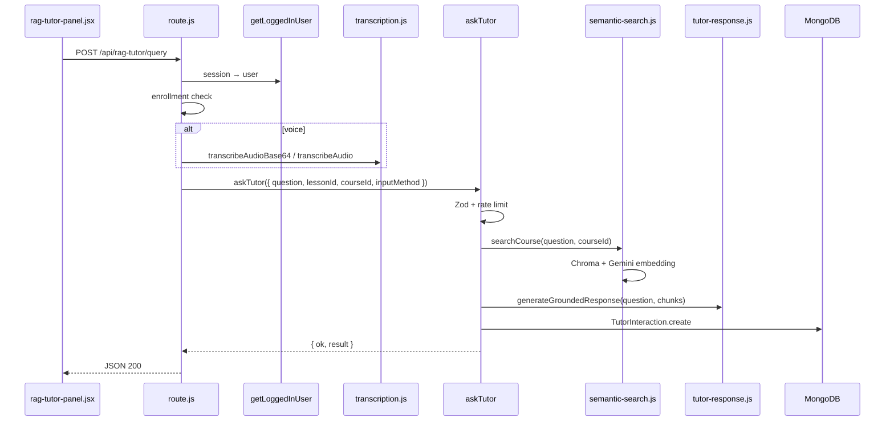

# API Implementation — Code Sample (Single API)

End-to-end implementation walkthrough for **`POST /api/rag-tutor/query`**: ask the AI tutor a question (text or voice) during a lesson, with answers grounded in indexed lecture content.

**Related:** [API_DESIGN.md](./API_DESIGN.md) (all endpoints), [MODULE_IMPLEMENTATION.md](./MODULE_IMPLEMENTATION.md) (RAG module).

---

## 1. API contract

| Item | Value |
|------|--------|
| **Path** | `/api/rag-tutor/query` |
| **Method** | `POST` |
| **Auth** | Session cookie (NextAuth) |
| **Content-Type** | `application/json` |

### Request body

```json
{
  "lessonId": "507f1f77bcf86cd799439011",
  "courseId": "507f1f77bcf86cd799439012",
  "question": "What is gradient descent?",
  "inputMethod": "text"
}
```

**Voice (base64 from browser):**

```json
{
  "lessonId": "...",
  "courseId": "...",
  "audioBase64": "<base64>",
  "audioMimeType": "audio/webm",
  "inputMethod": "voice"
}
```

**Voice (URL after S3 upload):**

```json
{
  "lessonId": "...",
  "courseId": "...",
  "audioUrl": "https://...",
  "inputMethod": "voice"
}
```

### Success response (200)

```json
{
  "ok": true,
  "result": {
    "interactionId": "65a1b2c3d4e5f6789012345",
    "question": "What is gradient descent?",
    "response": "Gradient descent is an optimization algorithm...",
    "isGrounded": true,
    "timestampLinks": [
      { "seconds": 120, "label": "Optimization intro" }
    ],
    "reciteBackRequired": true,
    "rateLimitWarning": null
  }
}
```

### Error responses

| HTTP | `error` | When |
|------|---------|------|
| 401 | `UNAUTHORIZED` | No session |
| 403 | `FORBIDDEN` | Not enrolled (and not admin/instructor) |
| 400 | `MISSING_REQUIRED_FIELDS` | Missing `lessonId` or `courseId` |
| 400 | `TRANSCRIPTION_FAILED` | Voice could not be transcribed |
| 400 | `VALIDATION_ERROR` | Zod failed in `askTutor` |
| 429 | `RATE_LIMITED` | ≥10 questions per lesson in 24h |
| 500 | `INTERNAL_SERVER_ERROR` | Uncaught exception |

---

## 2. Call chain (architecture)



**Design note:** The route handler is thin; business logic lives in the **Server Action** `askTutor` so the same logic can be reused without duplicating RAG code.

---

## 3. Layer 1 — Route handler (`app/api/rag-tutor/query/route.js`)

Entry point: connect DB, authenticate, authorize, normalize input (text vs voice), delegate to `askTutor`, map errors to HTTP status.

```1:79:app/api/rag-tutor/query/route.js
import { NextResponse } from "next/server";
import { getLoggedInUser } from "@/lib/loggedin-user";
import { transcribeAudio, transcribeAudioBase64 } from "@/lib/ai/transcription";
import { askTutor } from "@/app/actions/rag-tutor";
import { dbConnect } from "@/service/mongo";

/**
 * POST /api/rag-tutor/query
 * Accepts voice (base64 audio or audioUrl) or text, transcribes if needed, and queries the RAG tutor.
 */
export async function POST(request) {
  await dbConnect();
  
  try {
    const user = await getLoggedInUser();
    if (!user) {
      return NextResponse.json({ ok: false, error: "UNAUTHORIZED" }, { status: 401 });
    }

    const body = await request.json();
    const { audioUrl, audioBase64, audioMimeType, question, lessonId, courseId } = body;

    if (!lessonId || !courseId) {
      return NextResponse.json({ ok: false, error: "MISSING_REQUIRED_FIELDS" }, { status: 400 });
    }

    const { hasEnrollmentForCourse } = await import("@/queries/enrollments");
    const isEnrolled = await hasEnrollmentForCourse(courseId, user.id);
    if (!isEnrolled && user.role !== 'admin' && user.role !== 'instructor') {
        return NextResponse.json({ ok: false, error: "FORBIDDEN" }, { status: 403 });
    }

    let finalQuestion;
    let inputMethod = 'voice';

    if (audioBase64) {
      const transcription = await transcribeAudioBase64(audioBase64, audioMimeType || "audio/webm");
      if (!transcription) {
        return NextResponse.json({ ok: false, error: "TRANSCRIPTION_FAILED" }, { status: 400 });
      }
      finalQuestion = transcription;
      inputMethod = 'voice';
    } else if (audioUrl) {
      const transcription = await transcribeAudio(audioUrl);
      if (!transcription) {
        return NextResponse.json({ ok: false, error: "TRANSCRIPTION_FAILED" }, { status: 400 });
      }
      finalQuestion = transcription;
      inputMethod = 'voice';
    } else if (question) {
      finalQuestion = question;
      inputMethod = 'text';
    } else {
      return NextResponse.json({ ok: false, error: "Either audioBase64, audioUrl, or question is required" }, { status: 400 });
    }

    // Query tutor using the server action
    const result = await askTutor({
      question: finalQuestion,
      lessonId,
      courseId,
      inputMethod
    });

    if (!result.ok) {
      const status = result.error === 'RATE_LIMITED' ? 429 : 400;
      return NextResponse.json(result, { status });
    }

    return NextResponse.json(result);

  } catch (error) {
    console.error("[API_POST_RAG_TUTOR_QUERY_ERROR]", error);
    return NextResponse.json({ 
      ok: false, 
      error: error.message || "INTERNAL_SERVER_ERROR" 
    }, { status: 500 });
  }
}
```

### Implementation checklist (route layer)

1. `await dbConnect()` before any Mongoose use.
2. Resolve user with `getLoggedInUser()` (DB user + `_id`, not only JWT).
3. Enforce **enrollment** (or staff roles) before expensive AI calls.
4. Normalize **one** `finalQuestion` string for downstream code.
5. Map action errors: `RATE_LIMITED` → **429**, others → **400**.

---

## 4. Layer 2 — Auth helper (`lib/loggedin-user.js`)

Session from cookie → full user document (needed for `user.id` and `user.role`).

```1:11:lib/loggedin-user.js
import "server-only";
import { auth } from "@/auth";
import { getUserByEmail } from "@/queries/users";


export async function getLoggedInUser(){
    const session = await auth();
    if(!session?.user) return null;

    return getUserByEmail(session?.user?.email);
}
```

---

## 5. Layer 3 — Server Action (`app/actions/rag-tutor.js`)

Core use case: validate → rate limit → RAG search → LLM → persist.

```22:107:app/actions/rag-tutor.js
export async function askTutor(data) {
  await dbConnect();
  const t = await getTranslations("RagTutor");

  try {
    const user = await getLoggedInUser();
    if (!user) {
      return { ok: false, error: "UNAUTHORIZED" };
    }

    // 1. Validate Input
    const validated = ragTutorQuerySchema.safeParse(data);
    if (!validated.success) {
      return { 
        ok: false, 
        error: "VALIDATION_ERROR", 
        details: validated.error.errors 
      };
    }

    const { question, lessonId, courseId, inputMethod } = validated.data;

    // 2. Rate Limiting (Soft limit: 10 questions per lesson per user)
    const questionCount = await TutorInteraction.countDocuments({
      userId: user.id,
      lessonId: lessonId,
      createdAt: { $gt: new Date(Date.now() - 24 * 60 * 60 * 1000) } // Last 24 hours
    });

    if (questionCount >= 10) {
      return { 
        ok: false, 
        error: "RATE_LIMITED",
        message: t('rateLimitExceeded') || "You have reached the daily limit for tutor questions in this lesson."
      };
    }

    // 3. Search Course Content (RAG)
    const searchResults = await searchCourse(question, courseId, user, { limit: 3, threshold: 0.6 });
    
    // 4. Generate Grounded Response
    const { response, isGrounded, timestampLinks } = await generateGroundedResponse(
      question, 
      searchResults.results
    );

    // 5. Persist Interaction
    const interaction = await TutorInteraction.create({
      userId: user.id,
      lessonId: lessonId,
      courseId: courseId,
      question: question,
      questionInputMethod: inputMethod,
      response: response,
      isGrounded: isGrounded,
      retrievedChunks: searchResults.results.map(res => ({
        chunkId: res.chunkId,
        content: res.text.substring(0, 500),
        similarity: res.score
      })),
      timestampLinks: timestampLinks,
      reciteBackRequired: isGrounded
    });

    return {
      ok: true,
      result: {
        interactionId: interaction._id.toString(),
        question: question,
        response: response,
        isGrounded: isGrounded,
        timestampLinks: timestampLinks,
        reciteBackRequired: interaction.reciteBackRequired,
        rateLimitWarning: questionCount >= 8 ? t('rateLimitWarning') : null
      }
    };

  } catch (error) {
    console.error("[ASK_TUTOR_ACTION_ERROR]", error);
    return {
      ok: false,
      error: error.message || "INTERNAL_SERVER_ERROR"
    };
  }
}
```

### Validation schema (`lib/validations.js`)

```508:519:lib/validations.js
export const ragTutorQuerySchema = z.object({
  question: z.string().max(1000, 'Question too long').optional(),
  audioUrl: z.string().url().optional(),
  lessonId: z.string().min(1, 'Lesson ID is required'),
  courseId: z.string().min(1, 'Course ID is required'),
  inputMethod: z.enum(['voice', 'text'])
}).strict().refine(data => {
  if (data.inputMethod === 'voice') return !!data.audioUrl || !!data.question;
  return !!data.question && data.question.length >= 3;
}, {
  message: "Missing question content"
});
```

---

## 6. Layer 4 — Semantic search (`service/semantic-search.js`)

Retrieval step: embed question → query ChromaDB → filter by similarity threshold.

```18:88:service/semantic-search.js
export async function searchCourse(query, courseId, user, options = {}) {
  const { limit = 5, threshold = 0.7 } = options;
  const startTime = Date.now();

  await dbConnect();

  // 1. Enrollment Verification
  const isEnrolled = await hasEnrollmentForCourse(courseId, user.id);
  const { isAdmin, verifyInstructorOwnsCourse } = await import("@/lib/authorization");
  const isOwner = await verifyInstructorOwnsCourse(courseId, user.id, user);
  const isAuthorized = isEnrolled || isOwner || isAdmin(user);

  if (!isAuthorized) {
    throw new Error('You are not enrolled in this course');
  }

  // 2. Attempt ChromaDB connection
  const { getCollection } = await import("@/service/chroma");
  const collection = await getCollection();

  if (!collection) {
    console.warn('[SemanticSearch] ChromaDB unavailable — returning empty results for graceful degradation');
    return {
      query,
      results: [],
      totalMatches: 0,
      searchTimeMs: Date.now() - startTime,
      degraded: true,
    };
  }

  // 3. Generate Query Embedding
  const queryEmbedding = await generateEmbedding(query);

  // 4. Search ChromaDB
  const chromaResults = await queryEmbeddings(queryEmbedding, courseId, limit * 2);

  // 5. Filter and Transform Results
  const filteredResults = [];
  for (const res of chromaResults) {
    const score = 1 - (res.score / 2);
    if (score < threshold) continue;

    const lesson = await Lesson.findById(res.metadata.lessonId).select('title').lean();
    
    filteredResults.push({
      chunkId: res.id,
      score: Math.round(score * 100) / 100,
      text: res.document,
      headingPath: res.metadata.headingPath,
      lessonId: res.metadata.lessonId,
      lessonTitle: lesson?.title || 'Unknown Lesson',
      courseId: res.metadata.courseId
    });

    if (filteredResults.length >= limit) break;
  }

  return {
    query,
    results: filteredResults,
    totalMatches: chromaResults.length,
    searchTimeMs: Date.now() - startTime
  };
}
```

`askTutor` passes `{ limit: 3, threshold: 0.6 }` for tighter, lesson-focused context.

---

## 7. Layer 5 — Grounded generation (`lib/rag/tutor-response.js`)

LLM call with retrieved chunks as context; returns answer + grounding flag + timestamp hints.

```63:79:lib/rag/tutor-response.js
export async function generateGroundedResponse(question, contexts) {
    if (!question) {
        throw new Error("Question is required");
    }

    const hasContext = Array.isArray(contexts) && contexts.length > 0;

    const contextText = hasContext
        ? contexts
              .map(
                  (c, i) =>
                      `[Context ${i + 1}]: ${c.text || c.content || JSON.stringify(c)}`
              )
              .join("\n\n")
        : "No specific lecture content found for this question.";

    const prompt = `Context from Lecture:\n${contextText}\n\nStudent Question: "${question}"`;
```

Uses **Gemini** (or **Ollama** when `AI_PROVIDER=local`) with a structured JSON schema for `response`, `isGrounded`, and `suggestedTimestamps`.

---

## 8. Layer 6 — Persistence (`model/tutor-interaction.model.js`)

Each Q&A is stored for analytics, recite-back, and rate limiting.

```14:50:model/tutor-interaction.model.js
const tutorInteractionSchema = new Schema({
  userId: {
    type: Schema.Types.ObjectId,
    ref: 'User',
    required: true,
    index: true
  },
  lessonId: {
    type: Schema.Types.ObjectId,
    ref: 'Lesson',
    required: true,
    index: true
  },
  courseId: {
    type: Schema.Types.ObjectId,
    ref: 'Course',
    required: true,
    index: true
  },
  question: {
    type: String,
    required: true,
    maxlength: 1000
  },
  questionInputMethod: {
    type: String,
    enum: ['voice', 'text'],
    required: true
  },
  response: {
    type: String,
    required: true,
    maxlength: 10000
  },
  isGrounded: {
    type: Boolean,
    required: true,
```

---

## 9. Layer 7 — Client (`rag-tutor-panel.jsx`)

Client Component: records audio or text, `fetch`es the API with credentials (cookies), updates chat UI.

```50:100:app/[locale]/(main)/courses/[id]/lesson/_components/rag-tutor-panel.jsx
  const handleSubmit = async (input, method) => {
    setIsSubmitting(true);
    
    const userMsg = {
      id: Date.now().toString(),
      role: "user",
      content: method === "text" ? input : "🎤 (Voice Question)",
      timestamp: new Date()
    };
    setMessages(prev => [...prev, userMsg]);

    try {
      let bodyPayload = { lessonId, courseId, inputMethod: method };

      if (method === "voice") {
        const arrayBuffer = await input.arrayBuffer();
        const base64 = btoa(
          new Uint8Array(arrayBuffer).reduce((data, byte) => data + String.fromCharCode(byte), '')
        );
        bodyPayload.audioBase64 = base64;
        bodyPayload.audioMimeType = input.type || "audio/webm";
      } else {
        bodyPayload.question = input;
      }

      const response = await fetch("/api/rag-tutor/query", {
        method: "POST",
        headers: { "Content-Type": "application/json" },
        body: JSON.stringify(bodyPayload)
      });

      const data = await response.json();

      if (response.ok) {
        const botMsg = {
          id: data.result.interactionId,
          role: "bot",
          content: data.result.response,
          question: data.result.question,
          timestampLinks: data.result.timestampLinks,
          isGrounded: data.result.isGrounded,
          reciteBackRequired: data.result.reciteBackRequired,
          timestamp: new Date()
        };
        
        if (method === "voice") {
          setMessages(prev => prev.map(m => 
            m.id === userMsg.id ? { ...m, content: data.result.question } : m
          ));
```

**Important:** `fetch("/api/rag-tutor/query")` relies on the browser sending the **session cookie**; no `Authorization` header.

---

## 10. Manual test with `curl`

After logging in (copy session cookie from DevTools):

```bash
curl -X POST http://localhost:3000/api/rag-tutor/query \
  -H "Content-Type: application/json" \
  -H "Cookie: next-auth.session-token=YOUR_TOKEN" \
  -d '{
    "lessonId": "YOUR_LESSON_ID",
    "courseId": "YOUR_COURSE_ID",
    "question": "Summarize the main idea of this lesson",
    "inputMethod": "text"
  }'
```

### Prerequisites for a successful grounded answer

1. Student **enrolled** in `courseId`.
2. Lesson content **indexed** in Chroma (`embeddingStatus: indexed` on lecture document).
3. `GEMINI_API_KEY` set; Chroma running if you want non-empty retrieval.

---

## 11. Template: adding a similar API

Use the same pattern for a new endpoint:

```javascript
// app/api/my-feature/route.js
import { NextResponse } from "next/server";
import { dbConnect } from "@/service/mongo";
import { getLoggedInUser } from "@/lib/loggedin-user";
import { myFeatureSchema } from "@/lib/validations";
import { doMyFeature } from "@/app/actions/my-feature"; // or lib/service directly

export async function POST(request) {
  await dbConnect();
  try {
    const user = await getLoggedInUser();
    if (!user) {
      return NextResponse.json({ ok: false, error: "UNAUTHORIZED" }, { status: 401 });
    }

    const body = await request.json();
    const parsed = myFeatureSchema.safeParse(body);
    if (!parsed.success) {
      return NextResponse.json(
        { ok: false, error: "VALIDATION_ERROR", details: parsed.error.flatten() },
        { status: 400 }
      );
    }

    // Optional: enrollment / ownership
    // await hasEnrollmentForCourse(...) or verifyInstructorOwnsCourse(...)

    const result = await doMyFeature({ ...parsed.data, userId: user.id });
    if (!result.ok) {
      return NextResponse.json(result, { status: 400 });
    }
    return NextResponse.json(result);
  } catch (err) {
    console.error("[MY_FEATURE_API]", err);
    return NextResponse.json(
      { ok: false, error: "INTERNAL_SERVER_ERROR" },
      { status: 500 }
    );
  }
}
```

| Step | File |
|------|------|
| Define Zod schema | `lib/validations.js` |
| Business logic | `app/actions/*.js` or `lib/` + `service/` |
| HTTP adapter | `app/api/.../route.js` |
| UI call | Client `fetch` or Server Action (if no polling/upload) |

---

## 12. Environment variables for this API

| Variable | Required | Purpose |
|----------|----------|---------|
| `MONGODB_CONNECTION_STRING` | Yes | Users, enrollments, `TutorInteraction` |
| `NEXTAUTH_SECRET` | Yes | Session |
| `GEMINI_API_KEY` | Yes | Embeddings + tutor answer + transcription |
| `CHROMA_HOST` | Optional | Vector search (degrades if missing) |
| `AI_PROVIDER=local` | Optional | Use Ollama instead of Gemini for generation |

---

*This sample documents one API in full; all other routes follow the same layered pattern described in [MODULE_IMPLEMENTATION.md](./MODULE_IMPLEMENTATION.md).*
