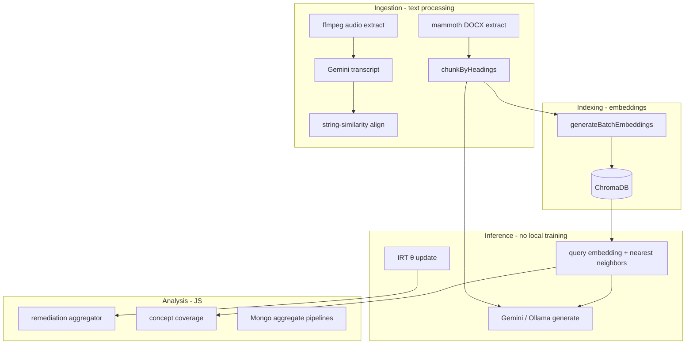

# Intelligent Algorithms — ML, Text Processing & Data Analysis

How **LMS-main** implements “intelligent” behavior: retrieval-augmented generation (RAG), embeddings, classical psychometrics (IRT), NLP-style text processing, and **interpreted JavaScript** analytics.

**Important:** This repository does **not** train custom ML models (no TensorFlow/PyTorch training loops in-repo). Intelligence comes from:

1. **Pre-trained APIs** — Google Gemini (embeddings + generation), optional Ollama locally  
2. **Vector retrieval** — ChromaDB + cosine similarity  
3. **Classical algorithms** — IRT 3PL, EAP estimation, fuzzy string alignment, Jaccard dedup  
4. **Rule-based scoring** — Remediation priority, certificate completion  
5. **Structured LLM outputs** — JSON schemas validated in code  

**Related:** [BUSINESS_LOGIC_LAYER.md](./BUSINESS_LOGIC_LAYER.md), [VECTOR_DATABASE_DESIGN.md](./VECTOR_DATABASE_DESIGN.md), [MODULE_IMPLEMENTATION.md](./MODULE_IMPLEMENTATION.md).

---

## Table of contents

1. [Approach overview](#1-approach-overview)
2. [RAG: retrieval + generation](#2-rag-retrieval--generation)
3. [Text processing pipeline](#3-text-processing-pipeline)
4. [Embedding-based analysis](#4-embedding-based-analysis)
5. [Adaptive testing (IRT, not ML)](#5-adaptive-testing-irt-not-ml)
6. [LLM generation with schema validation](#6-llm-generation-with-schema-validation)
7. [Duplicate & similarity detection](#7-duplicate--similarity-detection)
8. [Data analysis with interpreted code](#8-data-analysis-with-interpreted-code)
9. [Analysis & debug scripts](#9-analysis--debug-scripts)
10. [Adding custom ML training (outside this app)](#10-adding-custom-ml-training-outside-this-app)
11. [Implement a new intelligent feature](#11-implement-a-new-intelligent-feature)
12. [Testing & evaluation](#12-testing--evaluation)
13. [Environment variables](#13-environment-variables)

---

## 1. Approach overview



| Technique | Trained in-repo? | Where |
|-----------|-----------------|--------|
| Custom neural classifier | **No** | — |
| Gemini embeddings | **No** (API) | `lib/embeddings/gemini.js` |
| Gemini / Ollama LLM | **No** (API/local) | `lib/rag/`, `lib/ai/`, `lib/mcq-generation/` |
| Chroma vector index | **Built at runtime** | `service/chroma.js`, `embedding-queue.js` |
| IRT 3PL + EAP | **N/A** (math) | `lib/irt/` |
| Fuzzy alignment | **N/A** (heuristic) | `lib/alignment/text-aligner.js` |

---

## 2. RAG: retrieval + generation

**Goal:** Answer student questions using **only** (primarily) lecture content, with optional video timestamps.

### Pipeline (interpreted orchestration)

| Step | Function | Type |
|------|----------|------|
| 1. Embed question | `generateEmbedding(question)` | API |
| 2. Retrieve top-k chunks | `queryEmbeddings` in Chroma, filter by `courseId` | Vector search |
| 3. Build prompt | Concatenate `[Context n]: text` | Text processing |
| 4. Generate answer | `generateGroundedResponse` | LLM + JSON schema |
| 5. Persist | `TutorInteraction` | DB |

### Retrieval scoring (interpreted)

In `service/semantic-search.js`, Chroma distance is converted to similarity:

```javascript
// distance ∈ [0, 2] (cosine-related) → similarity ∈ [0, 1]
const score = 1 - (res.score / 2);
if (score < threshold) continue;  // default threshold 0.6–0.7
```

Results include `chunkId`, `text`, `headingPath`, `lessonId`, `lessonTitle`.

### Generation rules (conditions in prompt)

From `lib/rag/tutor-response.js`:

- If answer is in **context** → grounded response, `isGrounded: true`  
- If not in context → say so; may use general knowledge with disclaimer  
- Max ~300 words; return `suggestedTimestamps` for video jumps  

```117:144:lib/rag/tutor-response.js
async function _geminiResponse(prompt, hasContext) {
    const model = genAI.getGenerativeModel({
        model: modelName,
        generationConfig: {
            responseMimeType: "application/json",
            responseSchema,
        },
        systemInstruction: SYSTEM_INSTRUCTION,
    });
    const result = await model.generateContent(prompt);
    const parsed = JSON.parse(result.response.text());
    return {
        response: parsed.response,
        isGrounded: parsed.isGrounded && hasContext,
        timestampLinks: /* mapped from suggestedTimestamps */,
    };
}
```

**Local alternative:** `AI_PROVIDER=local` + Ollama (`lib/ai/ollama.js`) with JSON-only system prompt.

### End-to-end caller

- API: `POST /api/rag-tutor/query` → `askTutor` → `searchCourse` + `generateGroundedResponse`  
- See [API_IMPLEMENTATION_SAMPLE.md](./API_IMPLEMENTATION_SAMPLE.md)

---

## 3. Text processing pipeline

### 3.1 DOCX → structured text

**Library:** `mammoth` (no ML).

```8:33:lib/docx/extractor.js
export async function extractTextFromDocx(buffer) {
  const rawResult = await mammoth.extractRawText({ buffer });
  const fullText = rawResult.value;
  const htmlResult = await mammoth.convertToHtml({ buffer });
  const structuredContent = parseHtmlToBlocks(htmlResult.value);
  return {
    fullText,
    wordCount: fullText.split(/\s+/).filter(Boolean).length,
    structuredContent,
    extractedAt: new Date(),
    extractionDurationMs: durationMs,
  };
}
```

**Block types:** `heading`, `paragraph`, `list`, `table` — used for alignment and chunking.

### 3.2 Semantic chunking (for embeddings)

`lib/embeddings/chunker.js`:

- Walk `structuredContent` by headings  
- **CHAR_LIMIT ≈ 8000** (~2000 tokens)  
- Split at paragraph boundaries; carry `headingPath` metadata  

```13:39:lib/embeddings/chunker.js
export function chunkByHeadings(structuredContent) {
  const CHAR_LIMIT = 8000;
  // ... flush buffer when over limit ...
  chunks.push({
    content: trimmed,
    headingPath: path,
    headingLevel: level,
    chunkIndex: chunkIndex++,
    tokenCount: Math.ceil(trimmed.length / 4),
  });
}
```

### 3.3 Video → transcript (STT)

1. `lib/alignment/audio-extractor.js` — FFmpeg extracts audio  
2. `lib/alignment/transcriber.js` — Gemini returns **segments** `{ text, start, end }`  
3. Word-level times interpolated within segments for alignment  

### 3.4 Text–video alignment (fuzzy matching)

**Algorithm:** Sliding window + `string-similarity.compareTwoStrings` (Sørensen–Dice on bigrams, not ML).

```19:70:lib/alignment/text-aligner.js
export function alignTextWithTranscript(structuredContent, transcriptWords, threshold = 70) {
  // For each DOCX block:
  //   normalize(block), search forward in transcript (500-word window)
  //   best window score * 100 >= threshold → aligned with startSeconds/endSeconds
}
```

**Statuses:** `aligned`, `low-confidence`, `not-spoken`, `unable-to-align`.

---

## 4. Embedding-based analysis

All use **same embedding model** (`gemini-embedding-001` or fallback) for consistent vector space.

### 4.1 Single & batch embed

```32:76:lib/embeddings/gemini.js
export async function generateEmbedding(text) {
  // Tries GEMINI_EMBEDDING_MODEL, gemini-embedding-001, text-embedding-004
  const result = await model.embedContent(text);
  return result.embedding.values;  // e.g. 3072 floats
}
```

Batch: up to **100 texts** per API call (`generateBatchEmbeddings`) — used in indexing pipeline.

### 4.2 Cosine similarity (interpreted math)

```33:52:lib/ai/semantic-similarity.js
export function cosineSimilarity(a, b) {
  // dot(a,b) / (||a|| * ||b||)  →  score in [0, 1]
}
```

**Uses:**

| Feature | Comparison | Typical threshold |
|---------|------------|-------------------|
| Oral assessment pass | student text vs reference answer | 0.6 (configurable) |
| Recite-back pass | recitation vs tutor response | 0.5 |
| Concept coverage | response vs each key concept | 0.6 |

### 4.3 Concept coverage analysis (multi-label via embeddings)

Interpreted loop — no separate classifier model:

```12:44:lib/ai/concept-coverage.js
export async function analyzeConceptCoverage(studentResponse, keyConcepts, threshold = 0.6) {
  const studentEmbedding = await generateEmbedding(studentResponse);
  const conceptEmbeddings = await generateBatchEmbeddings(keyConcepts);
  const details = keyConcepts.map((concept, index) => {
    const similarity = cosineSimilarity(studentEmbedding, conceptEmbeddings[index]);
    return { concept, similarity, addressed: similarity >= threshold };
  });
  return {
    addressed: details.filter(d => d.addressed).map(d => d.concept),
    missing: details.filter(d => !d.addressed).map(d => d.concept),
    details,
  };
}
```

This is **semantic multi-label classification** via thresholded cosine similarity, not trained weights.

### 4.4 Indexing into Chroma (runtime “training” of index)

`service/embedding-queue.js`:

1. `chunkByHeadings(doc.extractedText.structuredContent)`  
2. `generateBatchEmbeddings` in batches of 100  
3. `addEmbeddings` with metadata: `courseId`, `lessonId`, `lectureDocumentId`, `headingPath`  

**Re-index:** `removeEmbeddingsByDocument` then re-add — no model retraining.

---

## 5. Adaptive testing (IRT, not ML)

Student ability **θ** is estimated with **Item Response Theory** (3PL + EAP), not machine learning.

| Step | Algorithm | File |
|------|-----------|------|
| P(correct \| θ) | Logistic 3PL | `probability.js` |
| Item information | Fisher Information | `information.js` |
| Update θ | EAP quadrature (41 points) | `estimation.js` |
| Pick next item | Max information (+ module weights) | `selection.js` |
| BAT: pick 2 items | Band matching on **b** difficulty | `block-selection.js` |

**Why not ML here:** IRT parameters **a, b, c** come from item design / Gemini MCQ generation (`difficulty-estimator.js` Bloom→b), then refined by instructor review — not from fitting a neural net on response logs in this codebase.

**Possible extension (not implemented):** Calibrate **b** from response data using marginal maximum likelihood — would be a separate offline script exporting JSON into `Question` documents.

---

## 6. LLM generation with schema validation

Pattern: **prompt + `responseSchema` (Gemini)** → `JSON.parse` → **validator**.

### MCQ generation

`lib/mcq-generation/generator.js`:

- Input: lecture chunk text + metadata  
- Output schema: `questions[]` with `text`, `options`, `correctOptionId`, `difficulty.bValue`, `bloomLevel`  
- Post-process: `validateGeminiResponse`, `isBValueValidForBloomLevel`, `detectDuplicate`  

### Oral evaluation

`lib/ai/evaluation.js` — structured `{ score, feedback }` vs reference answer.

### Transcription

`lib/ai/transcription.js` — audio → text (Gemini multimodal or Ollama after WAV conversion).

**Interpreted validation** = business rules on LLM output, not model training.

---

## 7. Duplicate & similarity detection

`lib/mcq-generation/duplicate-detector.js`:

| Method | When used |
|--------|-----------|
| **Jaccard** on word tokens | Fast text overlap |
| **Cosine** on embeddings | If embeddings provided |
| Threshold default **0.85** | Flag as duplicate |

```7:18:lib/mcq-generation/duplicate-detector.js
export function calculateJaccardSimilarity(str1, str2) {
  const getTokens = (s) => new Set(s.toLowerCase().split(/\W+/).filter(t => t.length > 2));
  const intersection = new Set([...set1].filter(x => set2.has(x)));
  const union = new Set([...set1, ...set2]);
  return intersection.size / union.size;
}
```

---

## 8. Data analysis with interpreted code

### 8.1 Remediation weakness aggregation

**Input events** from MongoDB (BAT missed concepts, failed oral responses):

```91:131:lib/remediation/aggregator.js
export async function aggregateWeaknessesForStudent(studentId, courseId) {
  // Load BAT attempts → missedConceptTags[]
  // Load failed oral StudentResponse → conceptsMissing[]
  // Build normalized events → mergeWeaknessEvents(events)
}
```

**Pure analysis** (`mergeWeaknessEvents`):

- Group by `normalizeConceptTag` (lowercase trim)  
- Dedupe sources per concept  
- `calculatePriorityScore` — weighted formula (see [BUSINESS_LOGIC_LAYER.md](./BUSINESS_LOGIC_LAYER.md))  
- Sort by priority, then recency  

**Timestamp resolution:** `timestamp-resolver.js` runs semantic search over course to find video segment for concept text.

### 8.2 Admin analytics (Mongo aggregation)

`queries/admin.js` — interpreted analytics in JS + Mongo pipelines:

```javascript
// Example pattern in getAdminStats
const revenueResult = await Payment.aggregate([
  { $match: { status: 'succeeded' } },
  { $group: { _id: null, total: { $sum: '$amount' } } },
]);
```

Counts, group-bys, and dashboards — **data analysis**, not ML.

### 8.3 Adaptive analytics

`app/actions/adaptive-analytics.js` — ability distributions, item drift detection using stored θ and responses (statistics on IRT outputs).

### 8.4 Course completion analysis

`lib/certificate-helpers.js` — set operations on completed lesson IDs vs ordered published lessons + quiz pass map.

---

## 9. Analysis & debug scripts

| Script | Purpose |
|--------|---------|
| `scripts/view-chroma.js` | Inspect Chroma collections, counts, sample metadata |
| `scripts/cleanup-stuck-pipelines.js` | Operational cleanup |
| `playground-1.mongodb.js` | Ad-hoc Mongo queries |
| `start_chroma.py` | Start Chroma server (uvicorn) |

**Example: explore vectors**

```bash
node scripts/view-chroma.js
```

**Example: ad-hoc analysis in Node**

```javascript
// scripts/analyze-weakness-distribution.mjs (pattern — create if needed)
import { dbConnect } from "../service/mongo.js";
import { WeaknessProfile } from "../model/weakness-profile.model.js";
import { mergeWeaknessEvents, calculatePriorityScore } from "../lib/remediation/priority-scorer.js";

await dbConnect();
const profiles = await WeaknessProfile.find({ courseId: "..." }).lean();
for (const p of profiles) {
  const scores = (p.weaknesses || []).map((w) => w.priorityScore);
  console.log(p.studentId, "mean priority", scores.reduce((a,b)=>a+b,0)/scores.length);
}
```

Prefer **pure functions in `lib/`** + thin scripts so logic stays testable.

---

## 10. Adding custom ML training (outside this app)

The LMS runtime expects **Gemini embeddings** and **Gemini/Ollama text**. Training your own model requires an **offline pipeline** and integration points:

### Option A — Fine-tune / train elsewhere, serve via API

1. Train classifier or embedder in Python (PyTorch, scikit-learn, etc.)  
2. Export model → serve with FastAPI / TorchServe  
3. Add `lib/ai/custom-client.js` that calls your endpoint  
4. Swap `generateEmbedding` or `generateGroundedResponse` behind env flag  

### Option B — Calibrate IRT from logs (classical, not deep learning)

1. Export `Attempt` + `Question` responses to CSV  
2. Fit **b** parameters with existing IRT software (R `mirt`, Python `girth`)  
3. Import calibrated `a,b,c` back into MongoDB via admin script  

### Option C — Improve RAG without training

Often sufficient in this architecture:

- Better chunking (`chunker.js`)  
- Hybrids: BM25 + vector (would need new service module)  
- Reranking with cross-encoder API  
- Stronger prompts in `tutor-response.js`  

### Option D — Labeled data from LMS for future training

MongoDB already stores:

- `TutorInteraction` (question, response, chunks, grounded flag)  
- `StudentResponse` (transcription, scores, concepts)  
- `ReciteBackAttempt` (similarity scores)  

Export for supervised fine-tuning or reward modeling — **not wired in app today**.

---

## 11. Implement a new intelligent feature

**Example:** Classify student questions into topics using **embedding centroids** (no training loop — prototype with labeled centroids).

### Step 1 — Define centroids (interpreted config)

```javascript
// lib/topic-classifier/centroids.js
export const TOPIC_CENTROIDS = {
  calculus: null,   // filled at startup from seed phrases
  algebra: null,
};

export async function loadCentroids() {
  const { generateBatchEmbeddings } = await import("@/lib/embeddings/gemini.js");
  const phrases = ["derivatives and integrals", "linear equations and factoring"];
  const [calc, alg] = await generateBatchEmbeddings(phrases);
  TOPIC_CENTROIDS.calculus = calc;
  TOPIC_CENTROIDS.algebra = alg;
}
```

### Step 2 — Classify by nearest centroid

```javascript
// lib/topic-classifier/classify.js
import { generateEmbedding } from "@/lib/embeddings/gemini.js";
import { cosineSimilarity } from "@/lib/ai/semantic-similarity.js";
import { TOPIC_CENTROIDS } from "./centroids.js";

export async function classifyQuestion(text) {
  const qEmb = await generateEmbedding(text);
  let best = { topic: "general", score: 0 };
  for (const [topic, centroid] of Object.entries(TOPIC_CENTROIDS)) {
    if (!centroid) continue;
    const sim = cosineSimilarity(qEmb, centroid);
    if (sim > best.score) best = { topic, score: sim };
  }
  return best.score >= 0.55 ? best : { topic: "general", score: best.score };
}
```

### Step 3 — Wire into `askTutor` or analytics action

### Step 4 — Tests with mocked embeddings

```javascript
jest.mock("@/lib/embeddings/gemini.js", () => ({
  generateEmbedding: jest.fn().mockResolvedValue([1, 0, 0]),
}));
```

---

## 12. Testing & evaluation

**Full schedule and tools:** [TEST_PLAN.md](./TEST_PLAN.md).

| Test area | Path |
|-----------|------|
| IRT math | `tests/unit/irt/*.test.js` |
| Text alignment | `tests/unit/text-aligner.test.js` |
| DOCX / chunking | `tests/unit/docx-extractor.test.js`, `heading-chunker.test.js` |
| Embeddings (mocked) | `tests/unit/gemini-embeddings.test.js` |
| Duplicate detection | `tests/unit/duplicate-detector.test.js` |
| MCQ generator (mocked LLM) | `tests/unit/mcq-generator.test.js` |
| Remediation | `__tests__/lib/remediation/*.test.js` |
| RAG flow | `__tests__/actions/rag-tutor.test.js` |

**Evaluating RAG quality (manual / offline):**

1. Sample questions from `TutorInteraction`  
2. Check `isGrounded` vs instructor rubric  
3. Measure chunk relevance: similarity scores in `retrievedChunks`  
4. A/B prompt changes in `SYSTEM_INSTRUCTION`  

**Evaluating retrieval:**

- Query Chroma with known lesson phrases; verify top-3 contain expected section (`view-chroma.js` + test queries)

---

## 13. Environment variables

| Variable | Intelligent feature |
|----------|---------------------|
| `GEMINI_API_KEY` | Embeddings, generation, STT, evaluation |
| `GEMINI_EMBEDDING_MODEL` | Override embedding model |
| `GEMINI_GENERATION_MODEL` | Override chat model |
| `AI_PROVIDER=local` | Ollama instead of Gemini for some paths |
| `CHROMA_HOST` | Vector retrieval |
| `CHROMA_COLLECTION` | Collection name |

---

## Quick reference: which algorithm where?

| Problem | Technique in LMS | Train in-repo? |
|---------|------------------|----------------|
| Answer from course materials | RAG (Chroma + Gemini) | No — index at runtime |
| Find similar lecture text | Cosine on embeddings | No |
| Grade oral answer | Embedding similarity + LLM score | No |
| Pick next quiz question | IRT Fisher information | No — math |
| Map text to video time | Fuzzy string match | No |
| Dedupe generated MCQs | Jaccard + embedding cosine | No |
| Prioritize weak concepts | Weighted score formula | No |
| Extract DOCX structure | mammoth + HTML parser | No |

---

*For business-rule formulas see [BUSINESS_LOGIC_LAYER.md](./BUSINESS_LOGIC_LAYER.md). For vector schema see [VECTOR_DATABASE_DESIGN.md](./VECTOR_DATABASE_DESIGN.md).*
