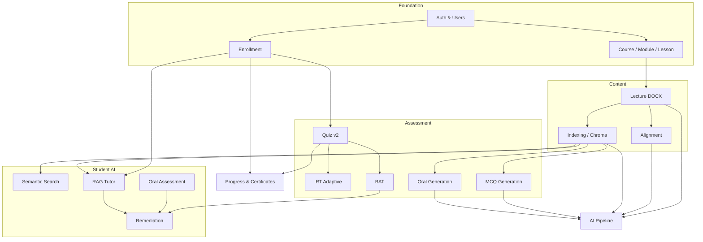

# Module Implementation Guide

How each **main feature module** is built in LMS-main: purpose, key files, data flow, and step-by-step guidance to **extend or implement** similar behavior.

**Prerequisites:** Node.js 22+, MongoDB, `.env` from `.env.example`, optional ChromaDB + `GEMINI_API_KEY` for AI modules.

**Related docs:** [ARCHITECTURE.md](./ARCHITECTURE.md) (deep design), [INTELLIGENT_ALGORITHMS.md](./INTELLIGENT_ALGORITHMS.md) (RAG, ML APIs, text pipelines), [TEST_PLAN.md](./TEST_PLAN.md) (what/when/tools), [PROJECT_STRUCTURE.md](./PROJECT_STRUCTURE.md) (folders), [API_DESIGN.md](./API_DESIGN.md), [SECURITY_AND_PERMISSIONS.md](./SECURITY_AND_PERMISSIONS.md).

---

## Table of contents

1. [Shared implementation pattern](#1-shared-implementation-pattern)
2. [Authentication & users](#2-authentication--users)
3. [Course, module & lesson management](#3-course-module--lesson-management)
4. [Enrollment & payments](#4-enrollment--payments)
5. [Quiz system (Quiz v2)](#5-quiz-system-quiz-v2)
6. [Adaptive testing (IRT)](#6-adaptive-testing-irt)
7. [Block adaptive testing (BAT)](#7-block-adaptive-testing-bat)
8. [Lecture documents (DOCX)](#8-lecture-documents-docx)
9. [AI content pipeline](#9-ai-content-pipeline)
10. [Text–video alignment](#10-textvideo-alignment)
11. [Semantic indexing & search](#11-semantic-indexing--search)
12. [MCQ auto-generation](#12-mcq-auto-generation)
13. [Oral question generation](#13-oral-question-generation)
14. [RAG tutor & recite-back](#14-rag-tutor--recite-back)
15. [Oral assessment (lesson checkpoints)](#15-oral-assessment-lesson-checkpoints)
16. [Remediation dashboard](#16-remediation-dashboard)
17. [Progress tracking & certificates](#17-progress-tracking--certificates)
18. [Admin & platform management](#18-admin--platform-management)
19. [Reviews & testimonials](#19-reviews--testimonials)

---

## 1. Shared implementation pattern

Every feature module follows the same **layered flow**:

```text
UI (page + _components)
    → Server Action (app/actions/*.js)  OR  API route (app/api/**/route.js)
        → Auth: getLoggedInUser() / auth() + lib/authorization.js
        → Validate: lib/validations.js (Zod)
        → Business logic: lib/* + service/*
        → Persist: queries/* + model/*
        → Optional: revalidatePath() / JSON response
```

### Checklist for a new feature

| Step | What to do |
|------|------------|
| 1 | Add or extend **Mongoose model** in `model/` |
| 2 | Add **Zod schemas** in `lib/validations.js` |
| 3 | Add **query helpers** in `queries/` (reads/writes) |
| 4 | Put **pure logic** in `lib/` (no direct UI imports) |
| 5 | Add **Server Action** in `app/actions/` (forms, mutations) |
| 6 | Add **API route** only if the client needs polling, uploads, or non-action HTTP |
| 7 | Build **UI** under `app/[locale]/...` with `_components/` |
| 8 | Enforce **auth**: enrollment, `verifyInstructorOwnsCourse`, or `hasPermission` |
| 9 | Add **tests** under `tests/` or `__tests__/` |

### Response shapes

- Server Actions often return `{ ok: true, ... }` or `{ success: true, ... }` (legacy modules differ).
- Prefer `withActionErrorHandling` from `lib/action-wrapper.js` for new actions.
- APIs use `NextResponse.json` with HTTP status codes (see [API_DESIGN.md](./API_DESIGN.md)).

---

## 2. Authentication & users

### Purpose

Register users, log in with email/password, store JWT session in HttpOnly cookie, enforce roles (`admin`, `instructor`, `student`) and account status.

### Key files

| Layer | Files |
|-------|--------|
| Auth config | `auth.config.js`, `auth.js`, `auth-edge.js` |
| Route protection | `middleware.js`, `lib/routes.js` |
| Roles | `lib/permissions.js`, `lib/auth-helpers.js` |
| API | `app/api/register/route.js`, `app/api/auth/[...nextauth]/route.js`, `app/api/me/route.js` |
| UI | `app/[locale]/login/`, `register/`, `setup/admin/` |
| Model | `model/user-model.js` |

### How it works

1. **Register:** `POST /api/register` validates body with `registerSchema`, hashes password (bcrypt 12 rounds), creates `User` with role `student` or `instructor`.
2. **Login:** NextAuth `CredentialsProvider` in `auth.js` loads user, checks `status === 'active'`, compares password, returns user claims → JWT in cookie (`session.strategy: 'jwt'`).
3. **Session:** `jwt` / `session` callbacks in `auth.config.js` attach `id`, `role`, `status` to `session.user`.
4. **Middleware:** Redirects anonymous users from non-public routes; blocks `/admin` and `/dashboard` by role; inactive users → login with `account_inactive`.

### How to implement / extend

- **New role:** Add to `user-model` enum, `ROLES` + `ROLE_PERMISSIONS` in `lib/permissions.js`, middleware `ROLE_PROTECTED_ROUTES`, and redirects in `lib/auth-redirect.js`.
- **OAuth provider:** Register provider in `auth.js` (keep `auth.config.js` Edge-safe); set `NEXTAUTH_URL`.
- **Profile update:** Use `app/actions/account.js` + `GET /api/me`; avatar via `POST /api/profile/avatar`.

### Environment

`NEXTAUTH_SECRET`, `NEXTAUTH_URL`, `MONGODB_CONNECTION_STRING`

---

## 3. Course, module & lesson management

### Purpose

Instructors build **Course → Module → Lesson** hierarchy, upload thumbnails/videos, publish content.

### Key files

| Layer | Files |
|-------|--------|
| Actions | `app/actions/course.js`, `module.js`, `lesson.js` |
| Queries | `queries/courses.js`, `modules.js`, `lessons.js` |
| Models | `course-model.js`, `module.model.js`, `lesson.model.js` |
| Auth | `lib/authorization.js` (`assertInstructorOwnsCourse`, …) |
| UI | `app/[locale]/dashboard/courses/...` |
| Upload | `app/api/upload/route.js`, `app/api/upload/video/route.js` |

### Data relationships

```text
Course (instructor ref)
  └── Module[] (ordered, lessonIds[])
        └── Lesson (videoUrl, videoFilename, lectureDocumentId, …)
```

### How it works

1. Instructor opens dashboard course page; server loads course via `getCourseWithOwnershipCheck`.
2. **Create/update** course fields through Server Actions (title, price, publish flags).
3. **Modules:** reorder with `@hello-pangea/dnd`; `app/actions/module.js` verifies `verifyOwnsAllModules`.
4. **Lessons:** CRUD in `lesson.js`; video upload streams to `uploads/videos/` and updates `Lesson.videoFilename` + `videoUrl` (`/api/videos/[filename]`).

### How to implement / extend

1. Add fields on **Mongoose schema** + Zod in `lib/validations.js`.
2. Extend **query** in `queries/courses.js` (or lesson/module).
3. Add **action** method; call `assertInstructorOwnsCourse(courseId, user.id, user)`.
4. Add **form component** in dashboard `_components/`.
5. `revalidatePath` for course and lesson layouts after publish.

---

## 4. Enrollment & payments

### Purpose

Students enroll in courses (free or paid via **MockPay**); enrollment gates lesson/quiz access.

### Key files

| Layer | Files |
|-------|--------|
| Actions | `app/actions/enrollment.js` |
| Queries | `queries/enrollments.js` (`hasEnrollmentForCourse`, `enrollForCourse`) |
| Models | `enrollment-model.js`, `payment-model.js` |
| API | `app/api/payments/mock/confirm/route.js`, `payments/status/route.js` |
| UI | `components/enroll-course.jsx`, `checkout/mock/`, `enroll-success/` |

### How it works

1. **Free course:** `enrollInFreeCourse` action — auth, rate limit, `price === 0`, create `Enrollment`.
2. **Paid (demo):** Checkout → `POST /api/payments/mock/confirm` creates `Payment` (`provider: mockpay`) + `Enrollment`.
3. **Access checks:** `hasEnrollmentForCourse(courseId, userId)` in lesson layout, semantic search, RAG, video stream (students).

### How to implement / extend

- **Real Stripe:** Add Stripe SDK webhook route, set `Payment.provider: 'stripe'`, map `sessionId`; keep enrollment creation idempotent (see mock confirm pattern).
- **New enrollment rule:** Centralize in `queries/enrollments.js`; never trust client-only checks.

---

## 5. Quiz system (Quiz v2)

### Purpose

Instructors create quizzes and questions; students take quizzes (fixed order); attempts and scores stored.

### Key files

| Layer | Files |
|-------|--------|
| Actions | `app/actions/quizv2.js`, `quizProgressv2.js` |
| Queries | `queries/quizv2.js` |
| Models | `quizv2-model.js`, `questionv2-model.js`, `attemptv2-model.js` |
| UI (student) | `courses/[id]/quizzes/[quizId]/` |
| UI (instructor) | `dashboard/.../quizzes/`, `questions/` |
| API | `app/api/quizv2/attempts/[attemptId]/route.js` |

### How it works

1. Instructor creates **Quiz** linked to `lessonId` or course scope.
2. **Questions** support types (MCQ, oral, etc.) with `points`, optional IRT fields (`a`, `b`, `c`).
3. Student starts **Attempt**; answers stored on attempt subdocuments.
4. Grading: auto for MCQ; oral uses async path (`evaluate-oral` API).

### How to implement / extend

1. Extend `questionv2-model` + validation schema.
2. Add grading branch in `quizv2.js` / `quizProgressv2.js`.
3. Update quiz-taking UI in `_components/quiz-taking-interface*.jsx`.
4. For polling oral grades: `GET /api/answers/[answerId]/status`.

---

## 6. Adaptive testing (IRT)

### Purpose

Per-question adaptive quizzes using **3PL IRT**: estimate ability θ, select next item by maximum Fisher information.

### Key files

| Layer | Files |
|-------|--------|
| Math | `lib/irt/` (`probability.js`, `information.js`, `estimation.js`, `selection.js`) |
| Actions | `app/actions/adaptive-quiz.js`, `adaptive-analytics.js` |
| UI | `adaptive-quiz-container.jsx`, `ability-indicator.jsx` |
| Model | Quiz `type: adaptive`, attempt stores θ trajectory |

### How it works

1. Quiz configured as adaptive in `quizv2-model`.
2. On each response: update θ via **EAP** (`estimation.js`).
3. **Select next question** with `selection.js` (MFI + content balancing).
4. Stop when SE threshold or max items reached.
5. Instructor analytics from `adaptive-analytics.js`.

### How to implement / extend

- Tune stopping rules in adaptive action (not in UI).
- Add constraints in `selection.js` (e.g. exclude seen items, module balance).
- Unit-test math in `tests/unit/irt/`.

**No external API** — pure `mathjs` in process.

---

## 7. Block adaptive testing (BAT)

### Purpose

Adaptive quiz in **blocks of 2 questions**; θ updated after each block; fixed length (e.g. 5 blocks); concept gap analysis on misses.

### Key files

| Layer | Files |
|-------|--------|
| Math | `lib/irt/block-selection.js` |
| Actions | `app/actions/bat-quiz.js` |
| UI | `bat-quiz-container.jsx`, `block-progress-indicator.jsx` |
| Dashboard | `concept-gap-analysis.jsx` |

### How it works

1. Student submits a **block** of answers (not single question).
2. Server recalculates θ once per block.
3. Next block drawn from `block-selection.js` by difficulty band.
4. Missed concepts logged for instructor remediation views.

### How to implement / extend

- Change block size in action + UI contract together.
- Feed gaps into `ConceptGap` / remediation aggregator (see §16).

---

## 8. Lecture documents (DOCX)

### Purpose

Upload `.docx` per lesson; extract structured text for alignment, search, and question generation.

### Key files

| Layer | Files |
|-------|--------|
| Extract | `lib/docx/extractor.js` (`mammoth`) |
| Actions | `app/actions/lecture-document.js` |
| API | `app/api/lecture-documents/*` |
| Model | `lecture-document.model.js` |
| UI | `dashboard/.../lessons/[lessonId]/document/` |

### How it works

1. Instructor uploads DOCX (`POST /api/lecture-documents` multipart).
2. `assertInstructorOwnsCourse` → create `LectureDocument` (`status: processing`).
3. `extractTextFromDocx` → `extractedText.fullText` + `structuredContent` (headings, paragraphs).
4. `Lesson.lectureDocumentId` set; status `ready` or `failed`.

### How to implement / extend

- Support new format: extend `lib/docx/extractor.js`, keep API contract on `extractedText` shape.
- Re-index after replace: `PUT /api/lecture-documents/[id]` then trigger indexing job.

---

## 9. AI content pipeline

### Purpose

One-click orchestration: extraction → alignment + indexing (parallel) → MCQ + oral generation (parallel).

### Key files

| Layer | Files |
|-------|--------|
| Orchestrator | `service/pipeline-orchestrator.js` |
| Action | `app/actions/pipeline.js` (`triggerPipeline`) |
| Model | `pipeline-job.model.js` |
| API | `GET /api/pipeline/[lessonId]/status` |
| UI | `pipeline-dashboard.jsx`, `components/pipeline/` |

### Stage flow

```text
pending → extracting → [aligning ∥ indexing] → generating → completed | failed
```

### How it works

1. `triggerPipeline(lessonId)` validates instructor ownership.
2. `PipelineOrchestrator.startPipeline`:
   - Caps concurrent pipelines (5).
   - Cancels stale jobs (>10 min).
   - Cancels other active jobs for same lesson.
3. Calls queues: `alignment-queue`, `embedding-queue`, `mcq-generation-queue`, `oral-generation-queue`.
4. UI polls `GET /api/pipeline/[lessonId]/status`.

### How to implement / extend

1. Add stage in `pipeline-job.model.js` `stages` object.
2. Hook stage in orchestrator `advanceStage` / completion callbacks.
3. Update `pipeline-dashboard.jsx` labels.
4. Run `npm run cleanup-stuck-pipelines` for ops.

**Requires:** DOCX uploaded, video present, `GEMINI_API_KEY`, Chroma optional.

---

## 10. Text–video alignment

### Purpose

Map lecture document paragraphs to **video timestamps** so students jump from text to video and questions get `sourceTimestamp`.

### Key files

| Layer | Files |
|-------|--------|
| Lib | `lib/alignment/` (`audio-extractor.js`, `transcriber.js`, `text-aligner.js`, `timestamp-lookup.js`, `job-processor.js`) |
| Service | `service/alignment-queue.js` |
| Action | `app/actions/alignment.js` |
| Model | `video-transcript.model.js`, `alignment-job.model.js` |
| API | `GET /api/alignments/lesson/[lessonId]`, `job/[jobId]` |

### How it works

1. Extract audio from video (**ffmpeg** via `ffmpeg-static`).
2. **Transcribe** with timestamps (`transcriber.js` → Gemini structured segments).
3. **Align** DOCX blocks to transcript (`text-aligner.js` + `string-similarity`).
4. Persist `VideoTranscript.alignments` and `alignmentStatus`.

### How to implement / extend

- Tune thresholds in `lib/alignment/config.js`.
- Expose review UI on `dashboard/.../alignment/page.jsx`.
- Question generation reads timestamps via `timestamp-lookup.js`.

---

## 11. Semantic indexing & search

### Purpose

Chunk lecture text, embed with Gemini, store in **ChromaDB**; students/instructors search course content.

### Key files

| Layer | Files |
|-------|--------|
| Chunk + embed | `lib/embeddings/chunker.js`, `gemini.js` |
| Service | `service/embedding-queue.js`, `chroma.js`, `semantic-search.js` |
| Action | `app/actions/indexing.js`, `semantic-search.js` |
| API | `POST /api/semantic-search`, `GET .../status` |
| Model | `indexing-job.model.js`, fields on `lecture-document.model.js` |

### How it works

1. `processIndexingJob`: chunk by headings → `generateBatchEmbeddings` → `addEmbeddings` to Chroma with metadata (`courseId`, `lessonId`, `chunkId`).
2. `searchCourse`: verify enrollment → embed query → Chroma query → filter by threshold.
3. If Chroma down: return `{ results: [], degraded: true }` (no hard fail).

### How to implement / extend

1. Start Chroma: `python start_chroma.py` or remote `CHROMA_HOST`.
2. Set `GEMINI_API_KEY`, `CHROMA_COLLECTION`.
3. New metadata field: update `addEmbeddings` in `service/chroma.js` and search filters.

---

## 12. MCQ auto-generation

### Purpose

Generate draft MCQs from indexed chunks with estimated IRT parameters; instructor reviews before publish.

### Key files

| Layer | Files |
|-------|--------|
| Lib | `lib/mcq-generation/` (generator, validator, duplicate-check, difficulty) |
| Service | `service/mcq-generation-queue.js` |
| Actions | `app/actions/mcq-generation.js` |
| API | `POST /api/mcq-generation`, `GET .../[jobId]` |
| Model | `generation-job.model.js` |
| UI | `generate-questions/`, `components/mcq-generation/` |

### How it works

1. Requires `LectureDocument.embeddingStatus === 'indexed'`.
2. `triggerQueueGeneration` creates `GenerationJob`, processes chunks async.
3. Gemini generates 1–3 questions per chunk; saves as draft `Question` documents.
4. Poll job API for progress; instructor edits in questions UI.

### How to implement / extend

- Adjust prompts in `lib/mcq-generation/generator.js`.
- Stricter validation in `validator.js` before insert.
- Wire pipeline stage in orchestrator (already calls MCQ queue).

---

## 13. Oral question generation

### Purpose

Generate oral-style questions (reference answers, key concepts) from indexed content.

### Key files

| Layer | Files |
|-------|--------|
| Lib | `lib/oral-generation/` |
| Service | `service/oral-generation-queue.js` |
| Actions | `app/actions/oral-generation.js` |
| API | `POST /api/oral-generation`, `GET .../[jobId]` |
| Model | `oral-generation-job.model.js` |

### How it works

Same queue pattern as MCQ; requires existing `Quiz` for lesson. Pipeline triggers oral queue in parallel with MCQ after indexing.

---

## 14. RAG tutor & recite-back

### Purpose

Students ask questions grounded in lesson embeddings; optional **recite-back** checks understanding via semantic similarity.

### Key files

| Layer | Files |
|-------|--------|
| RAG | `lib/rag/tutor-response.js`, `app/actions/rag-tutor.js` |
| API | `POST /api/rag-tutor/query`, `recite-back` |
| Models | `tutor-interaction.model.js`, `recite-back-attempt.model.js`, `concept-gap.model.js` |
| UI | `rag-tutor-panel.jsx`, `recite-back-modal.jsx` |
| AI | `lib/ai/transcription.js` (voice), `semantic-similarity.js` |

### Query flow

```text
Question (text or voice)
  → transcribe if needed
  → searchCourse(limit: 3)
  → generateGroundedResponse(chunks)
  → save TutorInteraction
  → return answer + timestampLinks + reciteBackRequired
```

### Recite-back flow

1. Client sends `interactionId`, recitation or `audioUrl`.
2. Compare recitation to `interaction.response` (similarity ≥ 0.5 = pass).
3. After 3 failures → upsert `ConceptGap`.

### How to implement / extend

- Rate limit: `TutorInteraction` count per lesson per 24h in `askTutor`.
- Change grounding: edit system prompt in `tutor-response.js`.
- Local LLM: `AI_PROVIDER=local` + Ollama (`lib/ai/ollama.js`).

---

## 15. Oral assessment (lesson checkpoints)

### Purpose

Timed oral checkpoints during video (instructor-approved questions); student speaks or types; scored vs reference answer.

### Key files

| Layer | Files |
|-------|--------|
| Actions | `app/actions/oral-assessment.js` |
| API | `GET .../oral-assessment/lesson/[lessonId]`, `POST .../submit` |
| Models | `oral-assessment.model.js`, `student-response.model.js` |
| Lib | `lib/ai/evaluation.js`, `concept-coverage.js` |
| UI | `oral-assessment-panel.jsx`, `components/assessment/` |

### How it works

1. Instructor creates assessments (`createOralAssessment`) with `triggerTimestamp`, `referenceAnswer`, `keyConcepts`.
2. Student submits → transcribe → `computeSemanticSimilarity` + `analyzeConceptCoverage` → `StudentResponse` saved.
3. Enqueue remediation aggregation on submit.

### How to implement / extend

- Add assessment fields on `oral-assessment.model.js` + Zod.
- Approval workflow: filter `status: approved` in `getAssessmentPoints`.

---

## 16. Remediation dashboard

### Purpose

Aggregate concept weaknesses from BAT, oral, recite-back into a **prioritized profile** with video deep links.

### Key files

| Layer | Files |
|-------|--------|
| Lib | `lib/remediation/` (`aggregator.js`, `priority-scorer.js`, `profile-merge.js`, `timestamp-resolver.js`, `run-aggregation.js`) |
| Service | `service/remediation-queue.js` |
| Actions | `app/actions/remediation.js` |
| API | `POST /api/remediation/aggregate` (cron secret) |
| Models | `weakness-profile.model.js`, `concept-gap.model.js` |
| UI | `dashboard/remediation/` |

### How it works

1. Events (failed oral, BAT gap, recite-back) call `enqueueRemediationAggregation`.
2. Worker / cron hits `POST /api/remediation/aggregate` with `courseId`, `studentId`.
3. `runStudentWeaknessAggregation` merges sources, scores priority, resolves timestamps via Chroma search.
4. Student UI lists weaknesses; “Review concept” links to lesson player time.

### How to implement / extend

1. Add new signal in `lib/remediation/aggregator.js`.
2. Call `enqueueRemediationAggregation` from your feature after failure.
3. Set `REMEDIATION_AGGREGATE_SECRET` for internal API.

---

## 17. Progress tracking & certificates

### Purpose

Track lesson watch state; completion reports; PDF certificate when course 100% complete.

### Key files

| Layer | Files |
|-------|--------|
| API | `POST /api/lesson-watch` |
| Models | `watch-model.js`, `report-model.js` |
| Lib | `lib/certificate-helpers.js`, `lib/course-progress.js` |
| API | `GET /api/certificates/[courseId]` (pdf-lib) |
| UI | `course-progress.jsx`, `download-certificate.jsx` |

### How it works

1. Video player posts `lesson-watch` with `state: started | completed`.
2. On `completed`, `createWatchReport` updates `Report.totalCompletedLessons`.
3. Certificate: `verifyCertificateAccess` checks enrollment + all published lessons (+ required quizzes) → generate PDF.

### How to implement / extend

- New completion rule: update `checkCourseCompletion` in `certificate-helpers.js` and progress UI together.

---

## 18. Admin & platform management

### Purpose

Admins manage users, categories, all courses, enrollments, payments, analytics.

### Key files

| Layer | Files |
|-------|--------|
| Actions | `app/actions/admin.js`, `admin-categories.js`, `admin-courses.js`, `admin-setup.js` |
| Queries | `queries/admin.js`, `payments-admin.js` |
| Lib | `lib/admin-utils.js`, `lib/permissions.js` |
| UI | `app/[locale]/admin/*` |

### How it works

1. Middleware restricts `/admin` to `role === admin`.
2. Actions call `requireAdmin` or `requirePermission(role, PERMISSIONS.*)`.
3. Tables use `@tanstack/react-table` in `_components`.

### How to implement / extend

1. Add `PERMISSIONS` constant + map in `ROLE_PERMISSIONS`.
2. Guard action with `requirePermission`.
3. Add admin page + table columns.

**Bootstrap:** `/setup/admin` with `ADMIN_SETUP_KEY` when no admin exists.

---

## 19. Reviews & testimonials

### Purpose

Students submit course reviews; admins moderate (approve/delete).

### Key files

| Layer | Files |
|-------|--------|
| Action | `app/actions/review.js` |
| Query | `queries/testimonials.js` |
| Model | `testimonial-model.js` |
| UI | `give-review.jsx`, `admin/reviews/` |

### How to implement / extend

- Enforce one review per user per course in action + unique index on model.
- Only show `approved` testimonials on course detail page query.

---

## Module dependency map



---

## Quick reference: entry point by module

| Module | Primary entry (implement here first) |
|--------|--------------------------------------|
| Auth | `auth.js`, `middleware.js` |
| Courses | `app/actions/course.js` |
| Enrollment | `app/actions/enrollment.js`, `queries/enrollments.js` |
| Quiz | `app/actions/quizv2.js` |
| IRT / BAT | `app/actions/adaptive-quiz.js`, `bat-quiz.js` |
| DOCX | `app/api/lecture-documents/route.js` |
| Pipeline | `service/pipeline-orchestrator.js`, `app/actions/pipeline.js` |
| Alignment | `service/alignment-queue.js` |
| Indexing | `service/embedding-queue.js` |
| Search | `service/semantic-search.js` |
| MCQ gen | `service/mcq-generation-queue.js` |
| RAG | `app/actions/rag-tutor.js` |
| Oral assessment | `app/actions/oral-assessment.js` |
| Remediation | `lib/remediation/run-aggregation.js` |
| Certificates | `app/api/certificates/[courseId]/route.js` |
| Admin | `app/actions/admin.js` |

---

*For algorithm and security detail, see [ARCHITECTURE.md](./ARCHITECTURE.md) sections 9–12 and [SECURITY_AND_PERMISSIONS.md](./SECURITY_AND_PERMISSIONS.md).*
