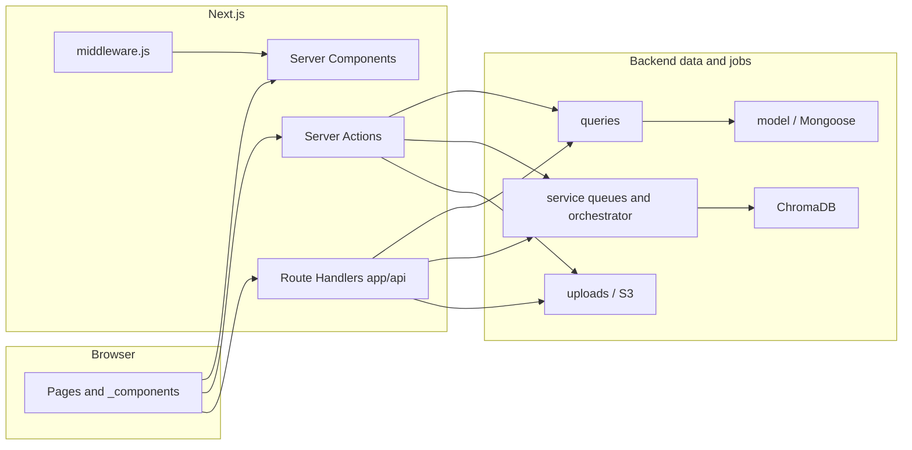

# LMS-main — Project tree and file guide

This document describes how the repository is organized, what major folders and roots are for, and how individual source areas fit together. A **complete sorted file manifest** (paths only, excluding `node_modules`, `.next`, and `.git`) appears at the end.

**Related:** Route-oriented overview lives in [`PROJECT_BRIEF_AND_ROUTE_MAP.md`](./PROJECT_BRIEF_AND_ROUTE_MAP.md) when present.

---

## What this application is

**LMS-main** (`package.json` name: `lms`) is a **Next.js 15 App Router** learning management system: courses, modules, lessons, quizzes (including adaptive / IRT-style flows), enrollment, certificates, instructor dashboards, admin tools, AI-assisted features (RAG tutor, oral assessment, embeddings / ChromaDB, pipelines for indexing and generation), and **next-intl** localization (`en` / `ar`).

---

## Architecture in more detail

### High-level request flow

Pages and layouts in `app/[locale]/…` usually render as **React Server Components**, with **Client Components** (`"use client"`) for interactivity. Mutations go through **Server Actions** in `app/actions/*` or **`app/api/*/route.js`** handlers. Both paths call **`queries/*`** and **`model/*`** via Mongoose (`service/mongo.js`). Vector search and remediation use **ChromaDB** (`service/chroma.js`, `service/semantic-search.js`) plus **Google Gemini** embeddings (`lib/embeddings/gemini.js`). Videos and documents often land in **S3** or local **`uploads/`** (`lib/storage/s3.js`).



### Typical layering (when reading or changing code)

| Layer | Responsibility | Examples |
|--------|----------------|----------|
| **Route UI** | Compose layout, fetch or pass props, client state | `app/[locale]/dashboard/courses/[courseId]/page.jsx` |
| **Server Actions** | Auth-checked mutations, orchestration, redirects | `app/actions/course.js`, `pipeline.js` |
| **API routes** | JSON for clients, webhooks, polling, file responses | `app/api/rag-tutor/query/route.js` |
| **`queries/`** | Focused DB reads/writes, lean queries | `queries/courses.js`, `queries/quizv2.js` |
| **`lib/`** | Pure or side-effect-lite helpers (IRT, alignment, prompts) | `lib/irt/selection.js`, `lib/rag/tutor-response.js` |
| **`service/`** | Singletons: DB connection, queues, Chroma orchestration | `service/pipeline-orchestrator.js`, `embedding-queue.js` |

---

## Environment variables

Copy `.env.example` to `.env` and fill in real values (**never commit** `.env`). Summary of what each area is for:

| Variable area | Purpose |
|---------------|---------|
| `AUTH_SECRET`, `NEXTAUTH_SECRET`, `AUTH_URL`, `NEXTAUTH_URL` | NextAuth v5 session and callback URLs |
| `MONGODB_CONNECTION_STRING` | MongoDB database for Mongoose models |
| Stripe keys + `STRIPE_WEBHOOK_SECRET` | Paid enrollments / webhooks (when Stripe is wired) |
| `RESEND_API_KEY` | Transactional email (Resend) |
| `ADMIN_SETUP_KEY` | Guard for first-time admin bootstrap (`setup/admin`) |
| `GEMINI_API_KEY` | Google AI (embeddings and generative helpers) |
| `CHROMA_HOST`, `CHROMA_COLLECTION` | ChromaDB HTTP API host and collection name for lesson embeddings |

Other code paths may read additional env vars (e.g. AWS for S3 in `lib/storage/s3.js`); search the repo for `process.env` when wiring a new environment.

---

## Authentication, roles, and middleware

### Roles

Defined in `lib/permissions.js`: **`admin`**, **`instructor`**, **`student`**. Permission strings (`PERMISSIONS`, `ROLE_PERMISSIONS`) centralize what each role may do (users, courses, categories, enrollments, reviews, analytics).

### Post-login redirects

`lib/auth-redirect.js`: **admin → `/admin`**, **instructor → `/dashboard`**, **student → `/`** (locale prefix added by middleware).

### `middleware.js` behavior (conceptual order)

1. Derive **locale** from path (`en` \| `ar`); routes are **always prefixed** (`i18n/routing.js`: `localePrefix: 'always'`).
2. If logged in on **login/register**, redirect to role home.
3. If account **status ≠ active**, force login with `error=account_inactive`.
4. If path is **not public** (`lib/routes.js` `PUBLIC_ROUTES`: login variants, catalog prefix, `/api/register`, `/setup/admin`) and user is anonymous → redirect to **`/login`** with `callbackUrl`.
5. **RBAC**: `/dashboard` allows **instructor** and **admin** except **`/dashboard/remediation`**, where **students** are also intended (students must still be authenticated; edge rule relaxes instructor-only restriction for that prefix).
6. **`/admin`**: **admin** only.
7. Run **`next-intl`** middleware, then **`addSecurityHeaders`** (`lib/security-headers.js`).

**Note:** The `matcher` in `middleware.js` largely **skips non-localized internals** (`_next/static`, `favicon`, files with extensions) and **`/api`** — API routes rely on handlers and Server Actions for auth.

---

## Internationalization (`messages/` + `i18n/`)

- **`i18n/routing.js`** — Locales `[en, ar]`, default `en`, **always show locale** in URLs.
- **`i18n/request.js`** — Loads messages for the active locale server-side.
- **`messages/en.json`**, **`messages/ar.json`** — Nested keys consumed via `next-intl` (`useTranslations`, `getTranslations`).
- Client navigation helpers live in **`i18n/navigation.js`** (`Link`, `redirect`, etc.) so URLs stay localized.

---

## Data stores

| Store | Usage in this repo |
|-------|---------------------|
| **MongoDB** | Primary OLTP store: users, courses, lessons, quizzes, attempts, pipeline jobs, lecture documents, remediation profiles, etc. |
| **ChromaDB** | Vector collection (`CHROMA_COLLECTION`) for semantic search and RAG over embedded lesson/document chunks |
| **S3 (optional)** | `lib/storage/s3.js` — presigned uploads or object storage for media |
| **Local `uploads/`** | Frequently used for dev uploads (videos/audio under `uploads/videos/`); **`public/uploads/`** may hold avatars referenced from the gallery |

Persisted **`chroma.sqlite3`** at repo root can appear when Chroma runs in embedded/sqlite mode for local dev — treat as generated.

---

## Lesson processing pipeline (AI / embeddings)

The orchestrator **`service/pipeline-orchestrator.js`** coordinates work per lesson: creates a **`PipelineJob`** (`model/pipeline-job.model.js`), caps **concurrent** pipelines (**5** default), marks **stale** jobs (>10 minutes) failed, and **cancels** other active jobs for the same lesson before starting anew.

Stages (names used in orchestrator/UI):

| Stage | Meaning (typical work) |
|-------|-------------------------|
| `pending` | Job created |
| `extracting` | Lecture document extraction / ingestion (DOCX path via `lib/docx`, job records on `LectureDocument`) |
| `aligning` | Transcript/audio–text alignment (`service/alignment-queue.js`, `lib/alignment/*`) |
| `indexing` | Chunk + embed into Chroma (`service/embedding-queue.js`, `lib/embeddings/*`) |
| `generating` | Optional MCQ and/or oral question generation queues (`service/mcq-generation-queue.js`, `service/oral-generation-queue.js`), tied to **Quiz** definitions where applicable |

`aligning` and `indexing` can be **conceptually parallel** in status updates when both branches are active. Completion cleans up notifications (placeholder hooks exist).

Instructors inspect progress via **`dashboard/courses/[courseId]/lessons/[lessonId]/pipeline/`** (`pipeline-dashboard.jsx` and related UI) and **`app/api/pipeline/[lessonId]/status/route.js`** for polling.

---

## Lesson player (student) — major UI pieces

Under **`courses/[id]/lesson/`**, key `_components`:

| File | Role |
|------|------|
| `lesson-video*.jsx`, `video-player.jsx` | Playback (often React Player paths, loading states) |
| `video-text-sync.jsx`, `lesson-sync-wrapper.jsx` | Highlight transcript / timestamps against video |
| `study-materials*.jsx` | Documents and downloads |
| `rag-tutor-panel.jsx` | RAG chat over embedded content → **`/api/rag-tutor/query`** |
| `oral-assessment-panel.jsx` | Voice / oral assessment UX → related actions and **`/api/evaluate-oral`** |
| `recite-back-modal.jsx` | Recite-back tutoring → **`/api/rag-tutor/recite-back`** |
| `concept-gap-summary.jsx` | Surfaces remediation / gap hints where wired |
| `course-sidebar*.jsx`, `sidebar-*.jsx` | Module/lesson navigation |
| `download-certificate.jsx`, `give-review.jsx` | Certificate and reviews |

Quiz taking for learners sits under **`courses/[id]/quizzes/[quizId]/`** with **`adaptive-*`**, **`bat-*`**, and shared **`quiz-taking-interface*.jsx`** — backed by **`lib/irt/`** selection/estimation and **`app/actions`** for attempts.

---

## Instructor dashboard — course subtree (more granular)

Beyond the sidebar (**analytics**, **courses**, **remediation**, **add course** in `dashboard/_components/sidebar-routes.jsx`), **`/dashboard/courses/[courseId]`** is the hub:

| Relative path segment | Typical purpose |
|------------------------|----------------|
| `_components/` (course root) | Title, subtitle, pricing, publishing, indexing summary, weakness analytics skeletons |
| `modules/[moduleId]/` | Module title, reorder, **`lesson-modal`**, **`lesson-form`**, video URL vs upload fields, lesson access |
| `enrollments/` | Table of enrollees |
| `reviews/` | Course-level review tooling |
| `quizzes/`, `quizzes/[quizId]/` | Quiz list and instructor analytics (`adaptive-config-form`, charts, **`questions/`** CRUD + dialogs |
| `lessons/[lessonId]/document/` | Lecture document upload, preview (`document-upload.jsx`, `document-preview.jsx`) |
| `lessons/[lessonId]/pipeline/` | Pipeline stages UI |
| `lessons/[lessonId]/generate-questions/` | MCQ generation trigger |
| `lessons/[lessonId]/assessments/` | Lesson oral / assessment listing |

---

## Admin app

Routes under **`/admin`** mirror operational needs: **`users`**, **`categories`**, **`courses`**, **`enrollments`**, **`reviews`**, **`analytics`**, **`quizzes`**, **`payments`** — each pairing `page.jsx` with `_components` tables/dialogs.

---

## Spec-to-code map (`specs/`)

Folders **`specs/001-*` … `specs/020-*`** correspond to phased features documented in-repo (plans, APIs, tasks). Useful when onboarding: pick a capability (e.g. **016 adaptive IRT**, **019 RAG tutor**, **020 remediation**) and read **`spec.md`** + **`contracts/`** beside the code paths listed above.

---

## Testing overview

| Area | Location | Focus |
|------|----------|--------|
| Unit / IRT | `tests/unit/` | Pure math/helpers (IRT, embeddings, DOCX/audio, MCQ validators) |
| Integration | `tests/integration/` | HTTP routes, Mongo/Chroma health, quizzes, pipelines, lecture documents |
| Schemas | `tests/schemas/` | Zod-ish validation contracts |
| Parity / services | `__tests__/` | Actions, APIs, remediation, RAG, oral generation, pipelines |

Configure **`jest.config.mjs`** and shared mocks in **`jest.setup.js`**; integration tests frequently depend on **`tests/setup.js`** and running services (**Mongo**, **Chroma**) when enabled.

Python cases in **`testsprite_tests/`** are external scenario scripts and reports—not Jest—useful for scripted UI/API tours.

---

## Excluded from the manifest (but present in a dev checkout)

| Path | Purpose |
|------|---------|
| `node_modules/` | npm dependencies — do not commit; regenerated with `npm install` |
| `.next/` | Next.js build cache and compiled output |
| `.git/` | Version control metadata |

Generated or local artifacts that *may* appear in a working tree: `chroma.sqlite3` (local Chroma), files under `uploads/`, `.env` (secrets).

---

## Top-level layout (conceptual tree)

```
LMS-main/
├── app/                  # Next.js App Router: pages, layouts, API routes
├── components/           # Shared React UI (mostly shadcn-style + domains)
├── lib/                  # Domain logic helpers (IRT, AI, alignment, remediation, …)
├── model/                # Mongoose schemas
├── queries/              # Data-access helpers wrapping Mongo queries
├── service/              # DB connection, queues, orchestrators, Chroma
├── hooks/                # Shared React hooks
├── i18n/                 # next-intl routing and request config
├── messages/             # `en.json` / `ar.json` UI strings
├── public/               # Static assets served as-is (+ some uploaded avatars)
├── scripts/              # Operational Node scripts
├── tests/ + __tests__/   # Jest tests (integration, unit, service)
├── testsprite_tests/     # External Python MCP-style test specs + reports
├── specs/                # Feature specs (plans, contracts, tasks) per numbered feature
├── .cursor/ + .specify/ + .windsurf/  # Editor / Specify toolkit files
├── middleware.js         # Auth, locale prefix, security headers
├── auth.js, auth-edge.js, auth.config.js  # NextAuth v5 wiring
├── next.config.mjs       # Next config
├── seed.ts               # Database seed script (npm run db:reset)
├── tailwind.config.js, postcss.config.mjs, app/globals.css
├── jest.config.mjs, jest.setup.js
└── package.json / package-lock.json
```

---

## Root configuration and entry files

| File | Role |
|------|------|
| `package.json` / `package-lock.json` | Dependencies and npm scripts (`dev`, `build`, `lint`, `test`, `db:reset`, `cleanup-stuck-pipelines`) |
| `next.config.mjs` | Next.js plugins and build options |
| `middleware.js` | Session-aware routing: strips/applies `/en` and `/ar`, protects `/dashboard` (instructors + admins) and `/admin`, adds security headers |
| `auth.js`, `auth-edge.js`, `auth.config.js` | NextAuth configuration split for Node vs edge |
| `jsconfig.json` | Path aliases (e.g. `@/`) |
| `components.json` | shadcn/ui generator configuration |
| `tailwind.config.js`, `postcss.config.mjs` | Tailwind and PostCSS |
| `.eslintrc.json`, `.eslintignore`, `.prettierignore`, `.gitignore` | Lint/format/git ignore rules |
| `.env.example` | Template for required environment variables (copy to `.env`) |
| `.env` | Local secrets — **never commit**; listed in manifest as a path only |
| `jest.config.mjs`, `jest.setup.js` | Jest configuration |
| `seed.ts` | Seeds MongoDB sample data |
| `playground-1.mongodb.js` | Ad-hoc Mongo playground script |
| `start_chroma.py`, `service/strartchroma.py` | Helper scripts related to running Chroma (note typo in filename `strartchroma`) |
| `README.md` | Human-oriented project readme |
| `PROJECT_BRIEF_AND_ROUTE_MAP.md` | Route map brief (when checked in) |

---

## `app/` — Routing, UI, and API

### Global app shell

- `app/layout.js` — Root layout (HTML shell, providers).
- `app/globals.css` — Global Tailwind/CSS.
- `favicon.ico` — Site icon (often under `app/` in App Router setups).

### Locale segment: `app/[locale]/`

All user-facing routes are under `[locale]` (`en`, `ar` per `middleware` and `i18n/routing.js`).

- `app/[locale]/layout.js` — Wraps localized subtree with `next-intl` providers and layout chrome.
- `app/[locale]/loading.jsx`, `error.jsx`, `not-found.jsx` — Segment loading and error boundaries.

### Route group `(main)` — public / student-facing storefront

Under `app/[locale]/(main)/`:

| Area | Typical purpose |
|------|-----------------|
| `page.js`, `loading.jsx`, `layout.js`, `error.jsx` | Home and shared layout |
| `courses/` | Course catalog (`page.jsx`), filters (`_components`), course detail `[id]` with curriculum, quizzes list, enrollment affordances |
| `courses/[id]/lesson/` | Primary lesson player: video, study materials, RAG tutor, oral assessment, recite-back, synced transcript UI (`_components/*`) |
| `courses/[id]/lessons/[lessonId]/` | Alternate lesson path components (study materials sync, etc.) |
| `courses/[id]/quizzes/[quizId]/` | Adaptive / BAT quiz taking, timers, results |
| `account/` | Parallel routes `@tabs/` for profile tabs; `_components/` for forms (password, avatar, enrolled courses card) |
| `categories/[id]/` | Category landing |
| `checkout/mock/` | Mock payment checkout |
| `enroll-success/` | Post-enrollment confirmation |
| `inst-profile/[id]/` | Instructor profile view |

Temporary or legacy navigators (`user-story-4-temp-*.jsx`) may appear under course detail.

### `app/[locale]/login/`, `register/`

Authentication UI (`_components/login-form.jsx`, signup by role).

### `app/[locale]/dashboard/` — instructors (and admins for course tools)

Shared chrome: `_components/navbar.jsx`, `sidebar.jsx`, `sidebar-routes.jsx`, `mobile-sidebar.jsx`.

Major subtrees:

- `dashboard/page.jsx` — Dashboard home.
- `dashboard/courses/` — Course CRUD-ish surfaces: list, `add`, and `[courseId]` with modules, indexing summary, remediation-related analytics, quiz management, enrollments, per-lesson **pipeline**, **document** upload/preview, **generate-questions**, **assessments**, etc.
- `dashboard/lives/` — Instructor “live” sessions listing and forms.
- `dashboard/remediation/` — Instructor-facing remediation / weakness tooling (`page.js`, `loading.js`, `error.js`, `_components/*`).

### `app/[locale]/admin/` — admin-only

Layouts and pages for users, categories, courses, enrollments, reviews, analytics, quizzes, payments; each area uses `_components/*` tables and dialogs.

### `app/[locale]/setup/admin/`

One-time admin bootstrap UI (`setup/admin/`).

### `app/actions/` — Server Actions (“use server”)

Called from Client Components for mutations and server-only work:

| Module | Typical responsibility |
|--------|-------------------------|
| `account.js`, `admin.js`, `admin-categories.js`, `admin-courses.js`, `admin-setup.js` | User/profile and admin surfaces |
| `course.js`, `module.js`, `lesson.js` | Course hierarchy |
| `enrollment.js`, `review.js` | Enrollment and course reviews |
| `quizv2.js`, `quizProgressv2.js`, `bat-quiz.js`, `adaptive-quiz.js`, `adaptive-analytics.js` | Quiz lifecycle, BAT, adaptive testing, analytics |
| `oral-assessment.js`, `oral-generation.js` | Oral Q&A pipelines |
| `lecture-document.js`, `indexing.js`, `pipeline.js`, `alignment.js` | Documents, embeddings pipeline, transcript alignment jobs |
| `semantic-search.js`, `rag-tutor.js`, `mcq-generation.js`, `indexing.js` | Search/RAG/MCQ automation |
| `remediation.js` | Weakness profiles and aggregates |
| `index.js` | Re-exports (barrel file) |

### `app/api/**/route.js` — Route handlers (REST-style)

These are summarized by path (each `route.js` is one HTTP endpoint):

| API path | Role (short) |
|----------|----------------|
| `api/auth/[...nextauth]/` | NextAuth handler |
| `api/register/` | Registration |
| `api/me/` | Current user/session helper |
| `api/health/` | Health probe |
| `api/upload/` + `video/` + `audio-url/` | File and media uploads |
| `api/videos/[filename]/` | Serves or proxies stored video assets |
| `api/profile/avatar/` | Avatar upload/update |
| `api/lesson-watch/` | Record lesson watch progress |
| `api/certificates/[courseId]/` | Certificate generation/download |
| `api/payments/status/`, `mock/confirm/` | Payment status (incl. mock) |
| `api/semantic-search/` + `status/` | Embedding search triggers/status |
| `api/lecture-documents/` … | Lecture document CRUD, by-lesson lookup, download |
| `api/pipeline/[lessonId]/status/` | Embeddings/indexing pipeline status |
| `api/alignments/lesson/[lessonId]/`, `job/[jobId]/` | Transcript/text alignment APIs |
| `api/mcq-generation/`, `[jobId]/` | Automated MCQ job queue |
| `api/oral-generation/`, `[jobId]/` | Oral question generation jobs |
| `api/oral-assessment/lesson/[lessonId]/`, `[assessmentId]/submit/` | Lesson assessments submission |
| `api/evaluate-oral/` | Oral answer scoring |
| `api/rag-tutor/query/`, `recite-back/` | RAG tutor and recite-back |
| `api/answers/[answerId]/status/` | Async answer grading status |
| `api/quizv2/attempts/[attemptId]/` | Quiz attempt fetch/update |
| `api/remediation/aggregate/` | Remediation aggregation job hook |

---

## `components/` — Shared UI

| Subfolder | Role |
|-----------|------|
| `ui/` | shadcn/Radix primitives: buttons, dialogs, forms, toast, tabs, scroll area, **`AudioRecorder`**, etc. |
| `alignment/` | Status badges, timestamps, confidence for transcript alignment |
| `assessment/` | Oral assessment prompts, skeletons, similarity display, concept coverage |
| `documents/` | Lecture document skeletons / extraction status |
| `pipeline/` | Pipeline progress indicators, retry controls |
| `questions/` | Oral question playback and forms |
| `mcq-generation/` | Generation status widgets, difficulty badges |
| Root misc | Navigation (`main-nav`, `mobile-nav`), `video-player`, `course-progress`, `enroll-course`, marketing blocks (`money-back`), `safe-image`, `site-footer`, `support`, etc. |

---

## `lib/` — Pure helpers and domain logic

| Area | Files / focus |
|------|----------------|
| `lib/irt/` | IRT helpers: estimation, Fisher information, item selection (adaptive quizzes, block selection, difficulty bands, probability) |
| `lib/alignment/` | Audio extract, transcription hooks, transcript alignment (`text-aligner`, `timestamp-lookup`), job processor, config |
| `lib/embeddings/` | Chunking (`chunker.js`), Gemini embeddings (`gemini.js`) |
| `lib/docx/` | DOCX text extraction (`extractor`) and heading-based chunking |
| `lib/mcq-generation/` | MCQ generation orchestration helpers: validators, duplicates, difficulty estimation, generator |
| `lib/oral-generation/` | Duplicate detection, reference answers, generators |
| `lib/ai/` | Transcription wrappers, **`ollama`**, Gemini-related evaluation, **`semantic-similarity`**, **`evaluation`**, **`concept-coverage`** |
| `lib/rag/` | **`tutor-response`** assembly for grounded answers |
| `lib/remediation/` | Aggregation, profile merge, priority scoring, deeplinks to lessons, timestamp resolution |
| `lib/storage/s3.js` | S3 uploads / URLs |
| `lib/db/` | Mongo connectivity (`config.js`), health checks |
| `lib/` root | **`authorization`**, **`permissions`**, **`security-headers`**, **`rate-limit`**, **`routes`** (PUBLIC_ROUTES, etc.), **`validations`** (+ `validations/remediation`), **`certificate-helpers`**, **`course-progress`**, **`dashboard-helper`**, **`logger`**, **`utils`**, **`zod-utils`**, **`action-wrapper`**, **`auth-helpers`**, **`auth-redirect`**, **`loggedin-user`**, **`toast-helpers`**, **`convertData`**, **`constants`**, **`errors`**, **`formatPrice`**, **`image-utils`**, **`quiz-storage`** (persisted blobs if used), **`schemas/course-schema`**, **`utils/serialize`**, **`validations/remediation`**, **`oral-generation/__init__.js`** (exports) |

### `lib/irt/` (item-level math and selection)

| File | Role |
|------|------|
| `probability.js` | Item response probabilities under the chosen model |
| `information.js` | Fisher information (where to steer adaptive tests) |
| `estimation.js` | Ability / latent trait estimation updates |
| `selection.js`, `block-selection.js` | Pick next item or next block |
| `difficulty-bands.js`, `ability-display.js` | UX / labeling helpers tied to θ and difficulty tiers |
| `index.js` | Barrel / facades |

### `lib/alignment/` (audio ↔ transcript alignment)

| File | Role |
|------|------|
| `config.js` | Tunables / feature flags |
| `audio-extractor.js` | ffmpeg-based audio extraction paths |
| `transcriber.js` | Sends audio through transcription backends |
| `text-aligner.js` | Matches text segments across sources |
| `timestamp-lookup.js` | Resolve media timecodes from transcript |
| `job-processor.js` | Alignment job lifecycle |

### `lib/ai/`

| File | Role |
|------|------|
| `transcription.js` | Normalized transcription entrypoints |
| `ollama.js` | Optional local LLM calls when configured |
| `evaluation.js` | Structured scoring helpers (oral / textual) |
| `semantic-similarity.js` | Compare learner text against references |
| `concept-coverage.js` | Coverage / gap estimation for remediation |

---

## `model/` — Mongoose models (MongoDB collections)

| Model file | Entities (concise) |
|------------|--------------------|
| `user-model.js` | Users |
| `category-model.js` | Categories |
| `course-model.js` | Courses |
| `module.model.js` | Modules inside courses |
| `lesson.model.js` | Lessons |
| `enrollment-model.js`, `payment-model.js` | Enrollment / payments |
| `quizv2-model.js`, `questionv2-model.js`, `attemptv2-model.js`, `student-response.model.js` | Quiz v2 hierarchy and attempts |
| `assessment-model.js`, `oral-assessment.model.js` | Assessments |
| `lecture-document.model.js`, `video-transcript.model.js` | Documents and transcripts |
| `generation-job.model.js`, `indexing-job.model.js`, `pipeline-job.model.js`, `alignment-job.model.js`, `oral-generation-job.model.js`, `generation-job`-related flows | Background jobs |
| `watch-model.js`, `report-model.js`, `weakness-profile.model.js`, `remediation-session.model.js`, `concept-gap.model.js`, `tutor-interaction.model.js`, `recite-back-attempt.model.js`, `testimonial-model.js` | Progress, remediation, tutoring, testimonials |

Models are wired through `service/mongo.js` and consumed from `queries/*` and `app/actions/*`.

---

## `queries/` — Database query modules

Thin layers per domain: `courses`, `modules`, `lessons`, `enrollments`, `quizv2`, `alignment`, `users`, `payments`, `payments-admin`, `admin`, `admin-setup`, `categories`, `testimonials`, `reports`.

---

## `service/` — Infrastructure services

| File | Role |
|------|------|
| `mongo.js` | Mongoose singleton connection |
| `chroma.js` | ChromaDB client helpers |
| `embedding-queue.js` | Embedding workload queue |
| `semantic-search.js` | Vector search orchestration |
| `pipeline-orchestrator.js` | End-to-end lesson indexing / pipeline stages |
| `alignment-queue.js` | Alignment job queue |
| `oral-generation-queue.js`, `mcq-generation-queue.js` | AI generation queues |
| `remediation-queue.js` | Remediation recomputation queue |
| `lecture-document-search.js` | Search over lecture content |
| `strartchroma.py` | Chroma launcher helper |

---

## `hooks/`

| File | Role |
|------|------|
| `use-toast.js` | Toast UI bridge (often paired with `@/hooks/use-toast` pattern / sonner) |
| `use-lock-body.js` | Locks document scroll when modals/overlays open |

---

## `i18n/`

| File | Role |
|------|------|
| `routing.js` | Supported locales + `defaultLocale` for middleware |
| `request.js`, `navigation.js` | next-intl request config and localized Link/router helpers |

---

## `messages/`

- `en.json`, `ar.json` — UI copy for **next-intl** (nested keys referenced from components and layouts).

---

## `public/` and `assets/` and `uploads/`

- `public/` — Static images (`assets/images/courses/`, categories), SVGs; may include `uploads/avatars/` for user-visible avatar files depending on deployment.
- `assets/profile.png` — Extra bundled image at repo root `assets/` (distinct from `public/`).
- `uploads/` — Local/binary media retained in dev (videos, extracted audio `.wav`). Treat as runtime data rather than curated source files.

---

## `scripts/`

| Script | Purpose |
|--------|---------|
| `cleanup-stuck-pipelines.js` | Resets or fixes stuck pipeline job records (`npm run cleanup-stuck-pipelines`) |
| `view-chroma.js` | Inspects/local debug for Chroma contents |

---

## `tests/` and `__tests__/`

- **`tests/integration/`** — API and cross-module tests (Mongo, chroma health, quizzes, embeddings, lecture documents, alignment).
- **`tests/unit/`** — IRT modules, embeddings, DOCX/audio alignment units, generators.
- **`tests/schemas/`** — Zod / schema-ish validation tests.
- **`tests/models/`** — Mongoose model tests.
- **`tests/services/`** — Service-level helpers.
- **`tests/setup.js`** — Shared test setup.
- **`__tests__/`** — Additional Jest suites organized by domain (`actions/`, `api/`, `lib/`, `service/`, `e2e/`).

---

## `testsprite_tests/`

Python test case files (`TC*.py`), JSON PRD/plans, HTML/Markdown reports, and **`tmp/`** cached outputs from an external test runner (e.g. TestSprite MCP).

---

## `specs/` (numbered features)

Design artifacts for features **001–020**: each folder typically holds `spec.md`, `plan.md`, `tasks.md`, `research.md`, `data-model.md`, `quickstart.md`, optional `contracts/*.md`, and `checklists/requirements.md`. These are **documentation**, not runtime code.

---

## Tooling directories

| Path | Contents |
|------|----------|
| `.cursor/commands/` | Speckit command markdown |
| `.cursor/rules/specify-rules.mdc` | Cursor rules synthesized from specs |
| `.specify/` | Constitution template, scripts (PowerShell), feature templates |
| `.windsurf/` | Alternate editor rules/workflows mirroring Speckit |
| `.swc/` | SWC/compiler cache directory (often local tooling) |

---

## Complete file manifest

Sorted **relative paths** from the repo root. **Excluded:** `.git/`, `node_modules/`, `.next/`.  
Line count matches the checkout at generation time (**875 paths**).

```text
.cursor/commands/speckit.analyze.md
.cursor/commands/speckit.checklist.md
.cursor/commands/speckit.clarify.md
.cursor/commands/speckit.constitution.md
.cursor/commands/speckit.implement.md
.cursor/commands/speckit.plan.md
.cursor/commands/speckit.specify.md
.cursor/commands/speckit.tasks.md
.cursor/commands/speckit.taskstoissues.md
.cursor/rules/specify-rules.mdc
.env
.env.example
.eslintignore
.eslintrc.json
.gitignore
.prettierignore
.specify/memory/constitution.md
.specify/scripts/powershell/check-prerequisites.ps1
.specify/scripts/powershell/common.ps1
.specify/scripts/powershell/create-new-feature.ps1
.specify/scripts/powershell/setup-plan.ps1
.specify/scripts/powershell/update-agent-context.ps1
.specify/templates/agent-file-template.md
.specify/templates/checklist-template.md
.specify/templates/constitution-template.md
.specify/templates/plan-template.md
.specify/templates/spec-template.md
.specify/templates/tasks-template.md
.windsurf/rules/specify-rules.md
.windsurf/workflows/speckit.analyze.md
.windsurf/workflows/speckit.checklist.md
.windsurf/workflows/speckit.clarify.md
.windsurf/workflows/speckit.constitution.md
.windsurf/workflows/speckit.implement.md
.windsurf/workflows/speckit.plan.md
.windsurf/workflows/speckit.specify.md
.windsurf/workflows/speckit.tasks.md
.windsurf/workflows/speckit.taskstoissues.md
__tests__/actions/oral-assessment.test.js
__tests__/actions/pipeline.test.js
__tests__/actions/rag-tutor.test.js
__tests__/actions/recite-back.test.js
__tests__/actions/remediation.test.js
__tests__/api/oral-generation.test.js
__tests__/api/oral-generation-status.test.js
__tests__/api/pipeline-status.test.js
__tests__/e2e/rag-tutor-flow.test.js
__tests__/lib/concept-coverage.test.js
__tests__/lib/concept-gap.test.js
__tests__/lib/oral-generation/duplicate-detector.test.js
__tests__/lib/oral-generation/generator.test.js
__tests__/lib/rag-tutor-response.test.js
__tests__/lib/remediation/aggregator.test.js
__tests__/lib/remediation/priority-scorer.test.js
__tests__/lib/remediation/profile-merge.test.js
__tests__/lib/remediation/timestamp-resolver.test.js
__tests__/lib/semantic-similarity.test.js
__tests__/service/pipeline-orchestrator.test.js
__tests__/service/remediation-queue.test.js
app/[locale]/(main)/account/@tabs/enrolled-courses/page.jsx
app/[locale]/(main)/account/@tabs/page.jsx
app/[locale]/(main)/account/component/account-menu.jsx
app/[locale]/(main)/account/component/account-sidebar.jsx
app/[locale]/(main)/account/component/change-password.jsx
app/[locale]/(main)/account/component/contact-info.jsx
app/[locale]/(main)/account/component/enrolled-coursecard.jsx
app/[locale]/(main)/account/component/personal-details.jsx
app/[locale]/(main)/account/component/profile-image-upload.jsx
app/[locale]/(main)/account/layout.jsx
app/[locale]/(main)/account/loading.jsx
app/[locale]/(main)/categories/[id]/page.jsx
app/[locale]/(main)/checkout/mock/_components/checkout-form.jsx
app/[locale]/(main)/checkout/mock/page.jsx
app/[locale]/(main)/courses/[id]/_components/CourseCurriculam.jsx
app/[locale]/(main)/courses/[id]/_components/CourseDetails.jsx
app/[locale]/(main)/courses/[id]/_components/CourseDetailsIntro.jsx
app/[locale]/(main)/courses/[id]/_components/CourseInstructor.jsx
app/[locale]/(main)/courses/[id]/_components/CourseOverview.jsx
app/[locale]/(main)/courses/[id]/_components/course-search.jsx
app/[locale]/(main)/courses/[id]/_components/module/CourseLessonList.jsx
app/[locale]/(main)/courses/[id]/_components/module/CourseModuleList.jsx
app/[locale]/(main)/courses/[id]/_components/RelatedCourses.jsx
app/[locale]/(main)/courses/[id]/_components/Testimonials.jsx
app/[locale]/(main)/courses/[id]/lesson/_components/concept-gap-summary.jsx
app/[locale]/(main)/courses/[id]/lesson/_components/course-sidebar.jsx
app/[locale]/(main)/courses/[id]/lesson/_components/course-sidebar-mobile.jsx
app/[locale]/(main)/courses/[id]/lesson/_components/download-certificate.jsx
app/[locale]/(main)/courses/[id]/lesson/_components/give-review.jsx
app/[locale]/(main)/courses/[id]/lesson/_components/lesson-sync-wrapper.jsx
app/[locale]/(main)/courses/[id]/lesson/_components/lesson-video.jsx
app/[locale]/(main)/courses/[id]/lesson/_components/lesson-video-loading.jsx
app/[locale]/(main)/courses/[id]/lesson/_components/lesson-video-wrapper.jsx
app/[locale]/(main)/courses/[id]/lesson/_components/oral-assessment-panel.jsx
app/[locale]/(main)/courses/[id]/lesson/_components/rag-tutor-panel.jsx
app/[locale]/(main)/courses/[id]/lesson/_components/recite-back-modal.jsx
app/[locale]/(main)/courses/[id]/lesson/_components/review-modal.jsx
app/[locale]/(main)/courses/[id]/lesson/_components/sidebar-lesson-items.jsx
app/[locale]/(main)/courses/[id]/lesson/_components/sidebar-lessons.jsx
app/[locale]/(main)/courses/[id]/lesson/_components/sidebar-modules.jsx
app/[locale]/(main)/courses/[id]/lesson/_components/study-materials.jsx
app/[locale]/(main)/courses/[id]/lesson/_components/study-materials-wrapper.jsx
app/[locale]/(main)/courses/[id]/lesson/_components/video-description.jsx
app/[locale]/(main)/courses/[id]/lesson/_components/video-player.jsx
app/[locale]/(main)/courses/[id]/lesson/_components/video-text-sync.jsx
app/[locale]/(main)/courses/[id]/lesson/layout.jsx
app/[locale]/(main)/courses/[id]/lesson/page.jsx
app/[locale]/(main)/courses/[id]/lessons/[lessonId]/_components/study-materials.jsx
app/[locale]/(main)/courses/[id]/lessons/[lessonId]/_components/video-text-sync.jsx
app/[locale]/(main)/courses/[id]/page.jsx
app/[locale]/(main)/courses/[id]/quizzes/[quizId]/_components/ability-indicator.jsx
app/[locale]/(main)/courses/[id]/quizzes/[quizId]/_components/adaptive-quiz-interface.jsx
app/[locale]/(main)/courses/[id]/quizzes/[quizId]/_components/adaptive-quiz-wrapper.jsx
app/[locale]/(main)/courses/[id]/quizzes/[quizId]/_components/adaptive-results.jsx
app/[locale]/(main)/courses/[id]/quizzes/[quizId]/_components/bat-quiz-interface.jsx
app/[locale]/(main)/courses/[id]/quizzes/[quizId]/_components/bat-results.jsx
app/[locale]/(main)/courses/[id]/quizzes/[quizId]/_components/block-progress-indicator.jsx
app/[locale]/(main)/courses/[id]/quizzes/[quizId]/_components/question-navigator.jsx
app/[locale]/(main)/courses/[id]/quizzes/[quizId]/_components/quiz-summary.jsx
app/[locale]/(main)/courses/[id]/quizzes/[quizId]/_components/quiz-taking-interface.jsx
app/[locale]/(main)/courses/[id]/quizzes/[quizId]/_components/quiz-taking-interface-wrapper.jsx
app/[locale]/(main)/courses/[id]/quizzes/[quizId]/_components/quiz-timer.jsx
app/[locale]/(main)/courses/[id]/quizzes/[quizId]/_components/results-review.jsx
app/[locale]/(main)/courses/[id]/quizzes/[quizId]/page.jsx
app/[locale]/(main)/courses/[id]/quizzes/[quizId]/result/page.jsx
app/[locale]/(main)/courses/[id]/quizzes/page.jsx
app/[locale]/(main)/courses/[id]/user-story-4-temp-navigator.jsx
app/[locale]/(main)/courses/[id]/user-story-4-temp-summary.jsx
app/[locale]/(main)/courses/_components/ActiveFilters.jsx
app/[locale]/(main)/courses/_components/CourseCard.jsx
app/[locale]/(main)/courses/_components/FilterCourse.jsx
app/[locale]/(main)/courses/_components/FilterCourseMobile.jsx
app/[locale]/(main)/courses/_components/SearchCourse.jsx
app/[locale]/(main)/courses/_components/SortCourse.jsx
app/[locale]/(main)/courses/page.jsx
app/[locale]/(main)/enroll-success/page.jsx
app/[locale]/(main)/error.jsx
app/[locale]/(main)/inst-profile/[id]/page.jsx
app/[locale]/(main)/layout.js
app/[locale]/(main)/loading.jsx
app/[locale]/(main)/page.js
app/[locale]/admin/_components/admin-navbar.jsx
app/[locale]/admin/_components/admin-sidebar.jsx
app/[locale]/admin/analytics/_components/analytics-charts.jsx
app/[locale]/admin/analytics/loading.jsx
app/[locale]/admin/analytics/page.jsx
app/[locale]/admin/categories/_components/add-category-dialog.jsx
app/[locale]/admin/categories/_components/categories-table.jsx
app/[locale]/admin/categories/_components/delete-category-dialog.jsx
app/[locale]/admin/categories/_components/edit-category-dialog.jsx
app/[locale]/admin/categories/loading.jsx
app/[locale]/admin/categories/page.jsx
app/[locale]/admin/courses/_components/courses-table.jsx
app/[locale]/admin/courses/_components/delete-course-dialog.jsx
app/[locale]/admin/courses/loading.jsx
app/[locale]/admin/courses/page.jsx
app/[locale]/admin/enrollments/_components/enrollments-table.jsx
app/[locale]/admin/enrollments/loading.jsx
app/[locale]/admin/enrollments/page.jsx
app/[locale]/admin/error.jsx
app/[locale]/admin/layout.jsx
app/[locale]/admin/loading.jsx
app/[locale]/admin/page.jsx
app/[locale]/admin/payments/page.jsx
app/[locale]/admin/quizzes/page.jsx
app/[locale]/admin/reviews/_components/reviews-table.jsx
app/[locale]/admin/reviews/loading.jsx
app/[locale]/admin/reviews/page.jsx
app/[locale]/admin/users/_components/delete-user-dialog.jsx
app/[locale]/admin/users/_components/user-role-dialog.jsx
app/[locale]/admin/users/_components/users-table.jsx
app/[locale]/admin/users/_components/user-status-dialog.jsx
app/[locale]/admin/users/loading.jsx
app/[locale]/admin/users/page.jsx
app/[locale]/dashboard/_components/mobile-sidebar.jsx
app/[locale]/dashboard/_components/navbar.jsx
app/[locale]/dashboard/_components/sidebar.jsx
app/[locale]/dashboard/_components/sidebar-item.jsx
app/[locale]/dashboard/_components/sidebar-routes.jsx
app/[locale]/dashboard/courses/[courseId]/_components/category-form.jsx
app/[locale]/dashboard/courses/[courseId]/_components/class-weakness-analytics.jsx
app/[locale]/dashboard/courses/[courseId]/_components/class-weakness-analytics-skeleton.jsx
app/[locale]/dashboard/courses/[courseId]/_components/course-action.jsx
app/[locale]/dashboard/courses/[courseId]/_components/course-indexing-summary.jsx
app/[locale]/dashboard/courses/[courseId]/_components/course-info-section.jsx
app/[locale]/dashboard/courses/[courseId]/_components/course-media-section.jsx
app/[locale]/dashboard/courses/[courseId]/_components/course-pricing-section.jsx
app/[locale]/dashboard/courses/[courseId]/_components/course-status-section.jsx
app/[locale]/dashboard/courses/[courseId]/_components/description-form.jsx
app/[locale]/dashboard/courses/[courseId]/_components/image-form.jsx
app/[locale]/dashboard/courses/[courseId]/_components/module-delete-dialog.jsx
app/[locale]/dashboard/courses/[courseId]/_components/module-form.jsx
app/[locale]/dashboard/courses/[courseId]/_components/module-list.jsx
app/[locale]/dashboard/courses/[courseId]/_components/price-form.jsx
app/[locale]/dashboard/courses/[courseId]/_components/publish-button.jsx
app/[locale]/dashboard/courses/[courseId]/_components/publish-checklist.jsx
app/[locale]/dashboard/courses/[courseId]/_components/subtitle-form.jsx
app/[locale]/dashboard/courses/[courseId]/_components/title-form.jsx
app/[locale]/dashboard/courses/[courseId]/enrollments/_components/columns.jsx
app/[locale]/dashboard/courses/[courseId]/enrollments/_components/data-table.jsx
app/[locale]/dashboard/courses/[courseId]/enrollments/page.jsx
app/[locale]/dashboard/courses/[courseId]/lessons/[lessonId]/_components/embedding-status.jsx
app/[locale]/dashboard/courses/[courseId]/lessons/[lessonId]/alignment/_components/alignment-review.jsx
app/[locale]/dashboard/courses/[courseId]/lessons/[lessonId]/alignment/page.jsx
app/[locale]/dashboard/courses/[courseId]/lessons/[lessonId]/assessments/_components/assessment-list.jsx
app/[locale]/dashboard/courses/[courseId]/lessons/[lessonId]/assessments/_components/assessment-review-form.jsx
app/[locale]/dashboard/courses/[courseId]/lessons/[lessonId]/assessments/_components/assessments-dashboard-client.jsx
app/[locale]/dashboard/courses/[courseId]/lessons/[lessonId]/assessments/page.jsx
app/[locale]/dashboard/courses/[courseId]/lessons/[lessonId]/document/_components/document-preview.jsx
app/[locale]/dashboard/courses/[courseId]/lessons/[lessonId]/document/_components/document-upload.jsx
app/[locale]/dashboard/courses/[courseId]/lessons/[lessonId]/document/error.jsx
app/[locale]/dashboard/courses/[courseId]/lessons/[lessonId]/document/loading.jsx
app/[locale]/dashboard/courses/[courseId]/lessons/[lessonId]/document/page.jsx
app/[locale]/dashboard/courses/[courseId]/lessons/[lessonId]/generate-questions/_components/generated-questions-preview.jsx
app/[locale]/dashboard/courses/[courseId]/lessons/[lessonId]/generate-questions/_components/generation-progress.jsx
app/[locale]/dashboard/courses/[courseId]/lessons/[lessonId]/generate-questions/_components/generation-progress-wrapper.jsx
app/[locale]/dashboard/courses/[courseId]/lessons/[lessonId]/generate-questions/_components/generation-trigger.jsx
app/[locale]/dashboard/courses/[courseId]/lessons/[lessonId]/generate-questions/page.jsx
app/[locale]/dashboard/courses/[courseId]/lessons/[lessonId]/pipeline/_components/pipeline-dashboard.jsx
app/[locale]/dashboard/courses/[courseId]/lessons/[lessonId]/pipeline/page.jsx
app/[locale]/dashboard/courses/[courseId]/modules/[moduleId]/_components/lesson-access-form.jsx
app/[locale]/dashboard/courses/[courseId]/modules/[moduleId]/_components/lesson-action.jsx
app/[locale]/dashboard/courses/[courseId]/modules/[moduleId]/_components/lesson-description-form.jsx
app/[locale]/dashboard/courses/[courseId]/modules/[moduleId]/_components/lesson-form.jsx
app/[locale]/dashboard/courses/[courseId]/modules/[moduleId]/_components/lesson-list.jsx
app/[locale]/dashboard/courses/[courseId]/modules/[moduleId]/_components/lesson-modal.jsx
app/[locale]/dashboard/courses/[courseId]/modules/[moduleId]/_components/lesson-title-form.jsx
app/[locale]/dashboard/courses/[courseId]/modules/[moduleId]/_components/module-action.jsx
app/[locale]/dashboard/courses/[courseId]/modules/[moduleId]/_components/module-title-form.jsx
app/[locale]/dashboard/courses/[courseId]/modules/[moduleId]/_components/video-upload-field.jsx
app/[locale]/dashboard/courses/[courseId]/modules/[moduleId]/_components/video-url-form.jsx
app/[locale]/dashboard/courses/[courseId]/modules/[moduleId]/page.jsx
app/[locale]/dashboard/courses/[courseId]/page.jsx
app/[locale]/dashboard/courses/[courseId]/quizzes/[quizId]/_components/ability-distribution-chart.jsx
app/[locale]/dashboard/courses/[courseId]/quizzes/[quizId]/_components/adaptive-analytics-dashboard.jsx
app/[locale]/dashboard/courses/[courseId]/quizzes/[quizId]/_components/adaptive-config-form.jsx
app/[locale]/dashboard/courses/[courseId]/quizzes/[quizId]/_components/concept-gap-analysis.jsx
app/[locale]/dashboard/courses/[courseId]/quizzes/[quizId]/_components/pool-analysis.jsx
app/[locale]/dashboard/courses/[courseId]/quizzes/[quizId]/_components/question-usage-table.jsx
app/[locale]/dashboard/courses/[courseId]/quizzes/[quizId]/_components/quiz-edit-form.jsx
app/[locale]/dashboard/courses/[courseId]/quizzes/[quizId]/attempts/page.jsx
app/[locale]/dashboard/courses/[courseId]/quizzes/[quizId]/page.jsx
app/[locale]/dashboard/courses/[courseId]/quizzes/[quizId]/questions/_components/add-question-form.jsx
app/[locale]/dashboard/courses/[courseId]/quizzes/[quizId]/questions/_components/edit-question-modal.jsx
app/[locale]/dashboard/courses/[courseId]/quizzes/[quizId]/questions/_components/question-form-dialog.jsx
app/[locale]/dashboard/courses/[courseId]/quizzes/[quizId]/questions/_components/question-list.jsx
app/[locale]/dashboard/courses/[courseId]/quizzes/[quizId]/questions/_components/questions-manager.jsx
app/[locale]/dashboard/courses/[courseId]/quizzes/[quizId]/questions/page.jsx
app/[locale]/dashboard/courses/[courseId]/quizzes/_components/quiz-actions.jsx
app/[locale]/dashboard/courses/[courseId]/quizzes/new/_components/quiz-form.jsx
app/[locale]/dashboard/courses/[courseId]/quizzes/new/page.jsx
app/[locale]/dashboard/courses/[courseId]/quizzes/page.jsx
app/[locale]/dashboard/courses/[courseId]/reviews/_components/columns.jsx
app/[locale]/dashboard/courses/[courseId]/reviews/_components/data-table.jsx
app/[locale]/dashboard/courses/[courseId]/reviews/page.jsx
app/[locale]/dashboard/courses/_components/columns.jsx
app/[locale]/dashboard/courses/_components/data-table.jsx
app/[locale]/dashboard/courses/add/_components/course-basic-info-fields.jsx
app/[locale]/dashboard/courses/add/_components/course-form.jsx
app/[locale]/dashboard/courses/add/_components/course-pricing-fields.jsx
app/[locale]/dashboard/courses/add/_components/course-thumbnail-field.jsx
app/[locale]/dashboard/courses/add/page.jsx
app/[locale]/dashboard/courses/page.jsx
app/[locale]/dashboard/error.jsx
app/[locale]/dashboard/layout.jsx
app/[locale]/dashboard/lives/[liveId]/page.jsx
app/[locale]/dashboard/lives/_components/columns.jsx
app/[locale]/dashboard/lives/_components/data-table.jsx
app/[locale]/dashboard/lives/add/page.jsx
app/[locale]/dashboard/lives/page.jsx
app/[locale]/dashboard/loading.jsx
app/[locale]/dashboard/page.jsx
app/[locale]/dashboard/remediation/_components/remediation-player.jsx
app/[locale]/dashboard/remediation/_components/resolved-section.jsx
app/[locale]/dashboard/remediation/_components/weakness-card.jsx
app/[locale]/dashboard/remediation/_components/weakness-list.jsx
app/[locale]/dashboard/remediation/error.js
app/[locale]/dashboard/remediation/loading.js
app/[locale]/dashboard/remediation/page.js
app/[locale]/error.jsx
app/[locale]/layout.js
app/[locale]/loading.jsx
app/[locale]/login/_components/login-form.jsx
app/[locale]/login/page.jsx
app/[locale]/not-found.jsx
app/[locale]/register/[role]/page.jsx
app/[locale]/register/_components/signup-form.jsx
app/[locale]/setup/admin/_components/admin-setup-form.jsx
app/[locale]/setup/admin/page.jsx
app/actions/account.js
app/actions/adaptive-analytics.js
app/actions/adaptive-quiz.js
app/actions/admin.js
app/actions/admin-categories.js
app/actions/admin-courses.js
app/actions/admin-setup.js
app/actions/alignment.js
app/actions/bat-quiz.js
app/actions/course.js
app/actions/enrollment.js
app/actions/index.js
app/actions/indexing.js
app/actions/lecture-document.js
app/actions/lesson.js
app/actions/mcq-generation.js
app/actions/module.js
app/actions/oral-assessment.js
app/actions/oral-generation.js
app/actions/pipeline.js
app/actions/quizProgressv2.js
app/actions/quizv2.js
app/actions/rag-tutor.js
app/actions/remediation.js
app/actions/review.js
app/actions/semantic-search.js
app/api/alignments/job/[jobId]/route.js
app/api/alignments/lesson/[lessonId]/route.js
app/api/answers/[answerId]/status/route.js
app/api/auth/[...nextauth]/route.js
app/api/certificates/[courseId]/route.js
app/api/evaluate-oral/route.js
app/api/health/route.js
app/api/lecture-documents/[id]/download/route.js
app/api/lecture-documents/[id]/route.js
app/api/lecture-documents/by-lesson/[lessonId]/route.js
app/api/lecture-documents/route.js
app/api/lesson-watch/route.js
app/api/mcq-generation/[jobId]/route.js
app/api/mcq-generation/route.js
app/api/me/route.js
app/api/oral-assessment/[assessmentId]/submit/route.js
app/api/oral-assessment/lesson/[lessonId]/route.js
app/api/oral-generation/[jobId]/route.js
app/api/oral-generation/route.js
app/api/payments/mock/confirm/route.js
app/api/payments/status/route.js
app/api/pipeline/[lessonId]/status/route.js
app/api/profile/avatar/route.js
app/api/quizv2/attempts/[attemptId]/route.js
app/api/rag-tutor/query/route.js
app/api/rag-tutor/recite-back/route.js
app/api/register/route.js
app/api/remediation/aggregate/route.js
app/api/semantic-search/route.js
app/api/semantic-search/status/route.js
app/api/upload/audio-url/route.js
app/api/upload/route.js
app/api/upload/video/route.js
app/api/videos/[filename]/route.js
app/favicon.ico
app/fonts/GeistMonoVF.woff
app/fonts/GeistVF.woff
app/globals.css
app/layout.js
assets/easylogo.png
assets/profile.png
auth.config.js
auth.js
auth-edge.js
chroma.sqlite3
components.json
components/alert-banner.jsx
components/alignment/alignment-status.jsx
components/alignment/confidence-indicator.jsx
components/alignment/timestamp-badge.jsx
components/alignment/watch-explanation-link.jsx
components/assessment/assessment-prompt.jsx
components/assessment/assessment-skeleton.jsx
components/assessment/concept-coverage.jsx
components/assessment/similarity-result.jsx
components/course-progress.jsx
components/documents/document-skeleton.jsx
components/documents/extraction-status.jsx
components/element.jsx
components/enroll-course.jsx
components/enrollment-status-poll.jsx
components/file-upload.jsx
components/icon-badge.jsx
components/logo.jsx
components/main-nav.jsx
components/mcq-generation/difficulty-badge.jsx
components/mcq-generation/generation-status.jsx
components/mobile-nav.jsx
components/money-back.jsx
components/pipeline/progress-summary.jsx
components/pipeline/retry-button.jsx
components/pipeline/stage-indicator.jsx
components/questions/OralAnswerStatus.jsx
components/questions/OralQuestionForm.jsx
components/questions/OralQuestionPlayer.jsx
components/safe-image.jsx
components/section-title.jsx
components/site-footer.jsx
components/start-rating.jsx
components/support.jsx
components/ui/accordion.jsx
components/ui/alert.jsx
components/ui/alert-dialog.jsx
components/ui/AudioRecorder.jsx
components/ui/avatar.jsx
components/ui/badge.jsx
components/ui/button.jsx
components/ui/calendar.jsx
components/ui/card.jsx
components/ui/carousel.jsx
components/ui/checkbox.jsx
components/ui/combobox.jsx
components/ui/command.jsx
components/ui/dialog.jsx
components/ui/dropdown-menu.jsx
components/ui/empty-state.jsx
components/ui/error-state.jsx
components/ui/form.jsx
components/ui/input.jsx
components/ui/label.jsx
components/ui/popover.jsx
components/ui/progress.jsx
components/ui/publish-badge.jsx
components/ui/radio-group.jsx
components/ui/scroll-area.jsx
components/ui/select.jsx
components/ui/separator.jsx
components/ui/sheet.jsx
components/ui/skeleton.jsx
components/ui/sonner.jsx
components/ui/switch.jsx
components/ui/table.jsx
components/ui/tabs.jsx
components/ui/textarea.jsx
components/ui/toast.jsx
components/ui/toaster.jsx
components/ui/tooltip.jsx
components/video-player.jsx
docs/chroma_rag_explanation.docx
docs/chroma_rag_explanation_full.docx
docs/README.md
docs/sprint-engineering-diagrams/Sprint-Engineering-Diagrams.pdf
hooks/use-lock-body.js
hooks/use-toast.js
i18n/navigation.js
i18n/request.js
i18n/routing.js
jest.config.mjs
jest.setup.js
jsconfig.json
lib/action-wrapper.js
lib/admin-utils.js
lib/ai/concept-coverage.js
lib/ai/evaluation.js
lib/ai/ollama.js
lib/ai/semantic-similarity.js
lib/ai/transcription.js
lib/alignment/audio-extractor.js
lib/alignment/config.js
lib/alignment/job-processor.js
lib/alignment/text-aligner.js
lib/alignment/timestamp-lookup.js
lib/alignment/transcriber.js
lib/auth-helpers.js
lib/authorization.js
lib/auth-redirect.js
lib/certificate-helpers.js
lib/constants.js
lib/convertData.js
lib/course-progress.js
lib/dashboard-helper.js
lib/date.js
lib/db/config.js
lib/db/health.js
lib/docx/chunker.js
lib/docx/extractor.js
lib/embeddings/chunker.js
lib/embeddings/gemini.js
lib/errors.js
lib/formatPrice.js
lib/image-utils.js
lib/irt/ability-display.js
lib/irt/block-selection.js
lib/irt/difficulty-bands.js
lib/irt/estimation.js
lib/irt/index.js
lib/irt/information.js
lib/irt/probability.js
lib/irt/selection.js
lib/loggedin-user.js
lib/logger.js
lib/mcq-generation/difficulty-estimator.js
lib/mcq-generation/duplicate-detector.js
lib/mcq-generation/generator.js
lib/mcq-generation/question-validator.js
lib/oral-generation/__init__.js
lib/oral-generation/duplicate-detector.js
lib/oral-generation/generator.js
lib/oral-generation/reference-answer-builder.js
lib/permissions.js
lib/quiz-storage.js
lib/rag/tutor-response.js
lib/rate-limit.js
lib/remediation/aggregator.js
lib/remediation/lesson-deeplink.js
lib/remediation/priority-scorer.js
lib/remediation/profile-merge.js
lib/remediation/run-aggregation.js
lib/remediation/timestamp-resolver.js
lib/routes.js
lib/schemas/course-schema.js
lib/security-headers.js
lib/storage/s3.js
lib/toast-helpers.js
lib/utils.js
lib/utils/serialize.js
lib/validations.js
lib/validations/remediation.js
lib/zod-utils.js
messages/ar.json
messages/en.json
middleware.js
model/alignment-job.model.js
model/assessment-model.js
model/attemptv2-model.js
model/category-model.js
model/concept-gap.model.js
model/course-model.js
model/enrollment-model.js
model/generation-job.model.js
model/indexing-job.model.js
model/lecture-document.model.js
model/lesson.model.js
model/module.model.js
model/oral-assessment.model.js
model/oral-generation-job.model.js
model/payment-model.js
model/pipeline-job.model.js
model/questionv2-model.js
model/quizv2-model.js
model/recite-back-attempt.model.js
model/remediation-session.model.js
model/report-model.js
model/student-response.model.js
model/testimonial-model.js
model/tutor-interaction.model.js
model/user-model.js
model/video-transcript.model.js
model/watch-model.js
model/weakness-profile.model.js
next.config.mjs
package.json
package-lock.json
playground-1.mongodb.js
postcss.config.mjs
PROJECT_BRIEF_AND_ROUTE_MAP.md
public/assets/file.svg
public/assets/globe.svg
public/assets/images/categories/avatar_admin2002admin_gmail_com_1769736730255_1772336782874.jpeg
public/assets/images/categories/avatar_student2002student_gmail_com_1766170500638_1772336768322.jpg
public/assets/images/categories/coding_2036408_1772359191774.png
public/assets/images/categories/data_993762_1772359259877.png
public/assets/images/categories/design.jpg
public/assets/images/categories/development.jpg
public/assets/images/categories/it_software.jpg
public/assets/images/categories/marketing.jpg
public/assets/images/categories/music.jpg
public/assets/images/categories/personal_development.jpg
public/assets/images/categories/photography.jpg
public/assets/images/categories/programming.jpg
public/assets/images/courses/____________2023-07-13_030045_1767280832208.png
public/assets/images/courses/____________2023-07-13_030045_1767280832208_1775823829640.png
public/assets/images/courses/____________2023-07-13_030045_1767280832208_1775823829640_1776455172207.png
public/assets/images/courses/__________2026-02-26_190324_1772228374509.png
public/assets/images/courses/__________2026-02-26_190324_1772228374509_1777039193001.png
public/assets/images/courses/3 Food Delivery Website with Laravel 11..png
public/assets/images/courses/3_Food_Delivery_Website_with_Laravel_11._1767806882413.png
public/assets/images/courses/3_Food_Delivery_Website_with_Laravel_11._1767976605104.png
public/assets/images/courses/3_Food_Delivery_Website_with_Laravel_11._1767976605104_1773585153311.png
public/assets/images/courses/3_Food_Delivery_Website_with_Laravel_11._1774959756281.png
public/assets/images/courses/332864992_1353288891880221_6265369911952554532_n_1767280797751.jpg
public/assets/images/courses/332864992_1353288891880221_6265369911952554532_n_1767280797751_1775765905345.jpg
public/assets/images/courses/c1.png
public/assets/images/courses/c1_1772363778654.png
public/assets/images/courses/c1_1772705429513.png
public/assets/images/courses/c1_1772706077991.png
public/assets/images/courses/c1_1773272555115.png
public/assets/images/courses/course_1_1766254319143.png
public/assets/images/courses/course_1_1767791447224.png
public/assets/images/courses/course_1_1769734898655.png
public/assets/images/courses/course_1_1772361878640.png
public/assets/images/courses/default.jpg
public/assets/images/courses/learn_js_thumbnail.jpeg
public/assets/images/courses/learn_js_thumbnail_1772363446097.jpeg
public/assets/images/courses/learn_js_thumbnail_1773520108673.jpeg
public/assets/images/courses/learn_js_thumbnail_1775505596539.jpeg
public/assets/images/courses/python_thumbnail.png
public/assets/images/courses/python_thumbnail_1767878663188.png
public/assets/images/courses/python_thumbnail_1767878663188_1767878727164.png
public/assets/images/courses/python_thumbnail_1767968881246.png
public/assets/images/courses/python_thumbnail_1772362406208.png
public/assets/images/courses/python_thumbnail_1775744375954.png
public/assets/images/courses/Screenshot 2022-11-23 at 7.34.30 PM.png
public/assets/images/courses/Screenshot_2022-11-23_at_7.34.30_PM_1775568229102.png
public/assets/images/d.png
public/assets/images/default.jpg
public/assets/images/money.png
public/assets/images/one.png
public/assets/images/profile.jpg
public/assets/images/profile-banner.jpg
public/assets/images/support.png
public/assets/images/support1.png
public/assets/images/two.png
public/assets/next.svg
public/assets/star.svg
public/assets/vercel.svg
public/assets/window.svg
public/file.svg
public/fonts/kalam/Kalam-Bold.ttf
public/fonts/kalam/Kalam-Light.ttf
public/fonts/kalam/Kalam-Regular.ttf
public/fonts/montserrat/Montserrat-Black.ttf
public/fonts/montserrat/Montserrat-BlackItalic.ttf
public/fonts/montserrat/Montserrat-Bold.ttf
public/fonts/montserrat/Montserrat-BoldItalic.ttf
public/fonts/montserrat/Montserrat-ExtraBold.ttf
public/fonts/montserrat/Montserrat-ExtraBoldItalic.ttf
public/fonts/montserrat/Montserrat-ExtraLight.ttf
public/fonts/montserrat/Montserrat-ExtraLightItalic.ttf
public/fonts/montserrat/Montserrat-Italic.ttf
public/fonts/montserrat/Montserrat-Light.ttf
public/fonts/montserrat/Montserrat-LightItalic.ttf
public/fonts/montserrat/Montserrat-Medium.ttf
public/fonts/montserrat/Montserrat-MediumItalic.ttf
public/fonts/montserrat/Montserrat-Regular.ttf
public/fonts/montserrat/Montserrat-SemiBold.ttf
public/fonts/montserrat/Montserrat-SemiBoldItalic.ttf
public/fonts/montserrat/Montserrat-Thin.ttf
public/fonts/montserrat/Montserrat-ThinItalic.ttf
public/globe.svg
public/logo.png
public/next.svg
public/pattern.jpg
public/sign.png
public/uploads/avatars/avatar_adeeb2002alsalh_gmail_com_1766157021530.jpg
public/uploads/avatars/avatar_admin_example_com_1772360489890.png
public/uploads/avatars/avatar_admin_example_com_1772360500170.png
public/uploads/avatars/avatar_admin_example_com_1772360520309.png
public/uploads/avatars/avatar_admin_example_com_1772360635231.png
public/uploads/avatars/avatar_admin2002admin_gmail_com_1769736730255.jpeg
public/uploads/avatars/avatar_student2_example_com_1772365749802.jpg
public/uploads/avatars/avatar_student2002student_gmail_com_1766170500638.jpg
public/uploads/avatars/avatar_student2002student_gmail_com_1767279907882.jpg
public/vercel.svg
public/window.svg
queries/admin.js
queries/admin-setup.js
queries/alignment.js
queries/categories.js
queries/courses.js
queries/enrollments.js
queries/lessons.js
queries/modules.js
queries/payments.js
queries/payments-admin.js
queries/quizv2.js
queries/reports.js
queries/testimonials.js
queries/users.js
README.md
scripts/cleanup-stuck-pipelines.js
scripts/view-chroma.js
seed.ts
service/alignment-queue.js
service/chroma.js
service/embedding-queue.js
service/lecture-document-search.js
service/mcq-generation-queue.js
service/mongo.js
service/oral-generation-queue.js
service/pipeline-orchestrator.js
service/remediation-queue.js
service/semantic-search.js
service/strartchroma.py
specs/001-improve-quiz-system/checklists/requirements.md
specs/001-improve-quiz-system/contracts/server-actions.md
specs/001-improve-quiz-system/data-model.md
specs/001-improve-quiz-system/plan.md
specs/001-improve-quiz-system/quickstart.md
specs/001-improve-quiz-system/research.md
specs/001-improve-quiz-system/spec.md
specs/001-improve-quiz-system/tasks.md
specs/002-refactor-course-management/checklists/requirements.md
specs/002-refactor-course-management/contracts/server-actions.md
specs/002-refactor-course-management/data-model.md
specs/002-refactor-course-management/plan.md
specs/002-refactor-course-management/quickstart.md
specs/002-refactor-course-management/research.md
specs/002-refactor-course-management/spec.md
specs/002-refactor-course-management/tasks.md
specs/009-question-irt-parameters/checklists/requirements.md
specs/009-question-irt-parameters/data-model.md
specs/009-question-irt-parameters/plan.md
specs/009-question-irt-parameters/quickstart.md
specs/009-question-irt-parameters/research.md
specs/009-question-irt-parameters/spec.md
specs/009-question-irt-parameters/tasks.md
specs/010-add-oral-question/checklists/requirements.md
specs/010-add-oral-question/contracts/api-endpoints.md
specs/010-add-oral-question/data-model.md
specs/010-add-oral-question/plan.md
specs/010-add-oral-question/quickstart.md
specs/010-add-oral-question/research.md
specs/010-add-oral-question/spec.md
specs/010-add-oral-question/tasks.md
specs/011-configure-databases/checklists/requirements.md
specs/011-configure-databases/contracts/health-api.md
specs/011-configure-databases/data-model.md
specs/011-configure-databases/plan.md
specs/011-configure-databases/quickstart.md
specs/011-configure-databases/research.md
specs/011-configure-databases/spec.md
specs/011-configure-databases/tasks.md
specs/012-docx-text-extraction/checklists/requirements.md
specs/012-docx-text-extraction/contracts/lecture-document-api.md
specs/012-docx-text-extraction/data-model.md
specs/012-docx-text-extraction/plan.md
specs/012-docx-text-extraction/quickstart.md
specs/012-docx-text-extraction/research.md
specs/012-docx-text-extraction/spec.md
specs/012-docx-text-extraction/tasks.md
specs/013-text-video-sync/checklists/requirements.md
specs/013-text-video-sync/contracts/alignment-api.md
specs/013-text-video-sync/data-model.md
specs/013-text-video-sync/plan.md
specs/013-text-video-sync/quickstart.md
specs/013-text-video-sync/research.md
specs/013-text-video-sync/spec.md
specs/013-text-video-sync/tasks.md
specs/014-semantic-embeddings-pipeline/checklists/requirements.md
specs/014-semantic-embeddings-pipeline/contracts/semantic-search-api.md
specs/014-semantic-embeddings-pipeline/data-model.md
specs/014-semantic-embeddings-pipeline/plan.md
specs/014-semantic-embeddings-pipeline/quickstart.md
specs/014-semantic-embeddings-pipeline/research.md
specs/014-semantic-embeddings-pipeline/spec.md
specs/014-semantic-embeddings-pipeline/tasks.md
specs/015-auto-mcq-generation/checklists/requirements.md
specs/015-auto-mcq-generation/contracts/generation-api.md
specs/015-auto-mcq-generation/data-model.md
specs/015-auto-mcq-generation/plan.md
specs/015-auto-mcq-generation/quickstart.md
specs/015-auto-mcq-generation/research.md
specs/015-auto-mcq-generation/spec.md
specs/015-auto-mcq-generation/tasks.md
specs/016-adaptive-irt-testing/checklists/requirements.md
specs/016-adaptive-irt-testing/contracts/adaptive-quiz-api.md
specs/016-adaptive-irt-testing/data-model.md
specs/016-adaptive-irt-testing/plan.md
specs/016-adaptive-irt-testing/quickstart.md
specs/016-adaptive-irt-testing/research.md
specs/016-adaptive-irt-testing/spec.md
specs/016-adaptive-irt-testing/tasks.md
specs/017-ai-generation-pipeline/checklists/requirements.md
specs/017-ai-generation-pipeline/contracts/pipeline-api.md
specs/017-ai-generation-pipeline/data-model.md
specs/017-ai-generation-pipeline/plan.md
specs/017-ai-generation-pipeline/quickstart.md
specs/017-ai-generation-pipeline/research.md
specs/017-ai-generation-pipeline/spec.md
specs/017-ai-generation-pipeline/tasks.md
specs/018-block-adaptive-testing/checklists/requirements.md
specs/018-block-adaptive-testing/contracts/bat-quiz-api.md
specs/018-block-adaptive-testing/data-model.md
specs/018-block-adaptive-testing/plan.md
specs/018-block-adaptive-testing/quickstart.md
specs/018-block-adaptive-testing/research.md
specs/018-block-adaptive-testing/spec.md
specs/018-block-adaptive-testing/tasks.md
specs/019-rag-tutor-assessor/checklists/requirements.md
specs/019-rag-tutor-assessor/contracts/api-routes.md
specs/019-rag-tutor-assessor/data-model.md
specs/019-rag-tutor-assessor/plan.md
specs/019-rag-tutor-assessor/quickstart.md
specs/019-rag-tutor-assessor/research.md
specs/019-rag-tutor-assessor/spec.md
specs/019-rag-tutor-assessor/tasks.md
specs/020-ai-remediation-dashboard/checklists/requirements.md
specs/020-ai-remediation-dashboard/contracts/server-actions.md
specs/020-ai-remediation-dashboard/data-model.md
specs/020-ai-remediation-dashboard/plan.md
specs/020-ai-remediation-dashboard/quickstart.md
specs/020-ai-remediation-dashboard/research.md
specs/020-ai-remediation-dashboard/spec.md
specs/020-ai-remediation-dashboard/tasks.md
start_chroma.py
tailwind.config.js
tests/integration/adaptive-analytics.test.js
tests/integration/adaptive-config.test.js
tests/integration/adaptive-quiz.test.js
tests/integration/alignment-pipeline.test.js
tests/integration/alignment-review.test.js
tests/integration/bat-quiz.test.js
tests/integration/bat-us4.test.js
tests/integration/chroma-health.test.js
tests/integration/embedding-pipeline.test.js
tests/integration/health-api.test.js
tests/integration/lecture-document-download.test.js
tests/integration/lecture-document-get.test.js
tests/integration/lecture-document-replace.test.js
tests/integration/lecture-document-search.test.js
tests/integration/lecture-document-upload.test.js
tests/integration/mcq-generation.test.js
tests/integration/mongo-health.test.js
tests/integration/semantic-search.test.js
tests/integration/video-text-sync.test.js
tests/models/question.model.test.js
tests/schemas/adaptive-answer.schema.test.js
tests/schemas/answer.schema.test.js
tests/schemas/question.schema.test.js
tests/schemas/quiz.schema.test.js
tests/services/ai-utils.test.js
tests/services/question.test.js
tests/setup.js
tests/unit/audio-extractor.test.js
tests/unit/db-config.test.js
tests/unit/difficulty-estimator.test.js
tests/unit/docx-extractor.test.js
tests/unit/duplicate-detector.test.js
tests/unit/gemini-embeddings.test.js
tests/unit/heading-chunker.test.js
tests/unit/irt/block-selection.test.js
tests/unit/irt/difficulty-bands.test.js
tests/unit/irt/estimation.test.js
tests/unit/irt/information.test.js
tests/unit/irt/probability.test.js
tests/unit/irt/selection.test.js
tests/unit/mcq-generator.test.js
tests/unit/question-timestamp.test.js
tests/unit/text-aligner.test.js
testsprite_tests/standard_prd.json
testsprite_tests/TC001_User_Registration_Success.py
testsprite_tests/TC002_User_Registration_Validation_Errors.py
testsprite_tests/TC003_User_Login_Success.py
testsprite_tests/TC004_User_Login_Failure.py
testsprite_tests/TC005_Course_CRUD_Operations_by_Instructor.py
testsprite_tests/TC006_Course_CRUD_Permission_Enforcement.py
testsprite_tests/TC007_Module_Management_CRUD.py
testsprite_tests/TC008_Lesson_Management_CRUD_and_Publishing.py
testsprite_tests/TC009_Course_Enrollment_Workflows_for_Free_and_Paid_Courses.py
testsprite_tests/TC010_Enrollment_Payment_Status_and_Error_Handling.py
testsprite_tests/TC011_Quiz_Attempt_with_Time_Limits_and_Max_Attempts_Enforcement.py
testsprite_tests/TC012_Progress_Tracking_Updates_and_Reports.py
testsprite_tests/TC013_Certificate_Generation_on_Course_Completion.py
testsprite_tests/TC014_Admin_Dashboard_Data_Integrity_and_Access_Control.py
testsprite_tests/TC015_User_Profile_Management___View_and_Edit_Profile.py
testsprite_tests/TC016_User_Profile_Management___Avatar_Upload_Validation.py
testsprite_tests/TC017_Course_Reviews_Submission_and_Admin_Moderation.py
testsprite_tests/TC018_Category_Management_CRUD_by_Admin.py
testsprite_tests/TC019_Public_Course_Catalog_Search_and_Filtering.py
testsprite_tests/TC020_Authorization_and_Permission_Checks.py
testsprite_tests/testsprite_frontend_test_plan.json
testsprite_tests/testsprite-mcp-test-report.html
testsprite_tests/testsprite-mcp-test-report.md
testsprite_tests/tmp/code_summary.json
testsprite_tests/tmp/config.json
testsprite_tests/tmp/prd_files/README.md
testsprite_tests/tmp/raw_report.md
testsprite_tests/tmp/test_results.json
uploads/videos/audio_html---css-------------------01--------------------1775765987083-u6qd8mbaell_1775766054948.wav
uploads/videos/audio_learn-css-in-arabic-2021----01---introduction-and--1775744649599-x9xj6sf4l9r_1775744696187.wav
uploads/videos/audio_learn-css-in-arabic-2021----01---introduction-and--1775744649599-x9xj6sf4l9r_1775745178575.wav
uploads/videos/audio_learn-css-in-arabic-2021----01---introduction-and--1775744649599-x9xj6sf4l9r_1775745499770.wav
uploads/videos/audio_learn-css-in-arabic-2021----01---introduction-and--1775823892068-kybra80an2_1775823997092.wav
uploads/videos/audio_learn-css-in-arabic-2021----01---introduction-and--1775823892068-kybra80an2_1775824571356.wav
uploads/videos/audio_learn-css-in-arabic-2021----01---introduction-and--1776455222240-iwz47fj0ujc_1776455257717.wav
uploads/videos/html---css-------------------01--------------------1775765987083-u6qd8mbaell.mp4
uploads/videos/learn-css-in-arabic-2021----01---introduction-and--1775744649599-x9xj6sf4l9r.mp4
uploads/videos/learn-css-in-arabic-2021----01---introduction-and--1775823892068-kybra80an2.mp4
uploads/videos/learn-css-in-arabic-2021----01---introduction-and--1776455222240-iwz47fj0ujc.mp4
uploads/videos/learn-css-in-arabic-2021----01---introduction-and--1777039268318-1x62obc6k8c.mp4
```
