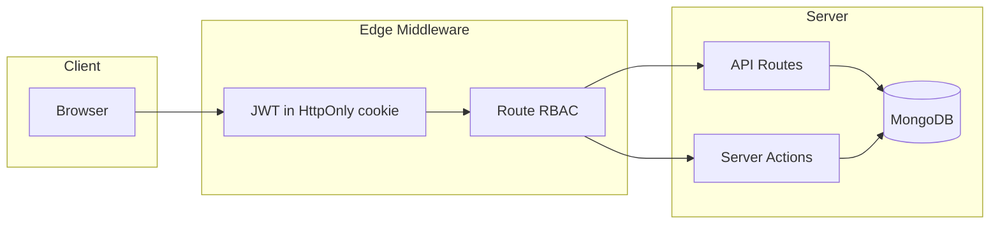
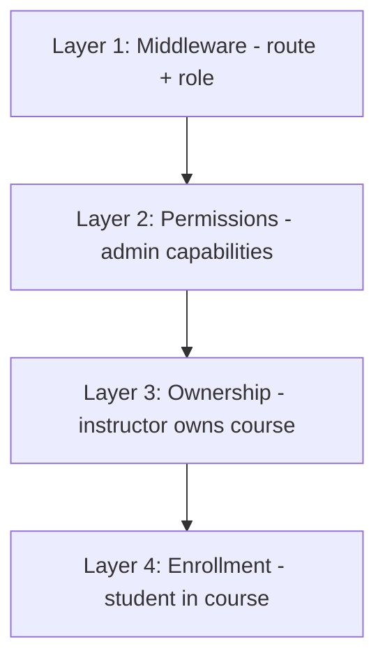

# Security and Permissions Design

This document describes how authentication, roles, and access control work in **LMS-main**, based on the implementation in `auth.js`, `auth.config.js`, `middleware.js`, `lib/permissions.js`, and `lib/authorization.js`.

---

## Table of contents

1. [Overview](#1-overview)
2. [Authentication mechanism](#2-authentication-mechanism)
3. [User roles and account status](#3-user-roles-and-account-status)
4. [Access control layers](#4-access-control-layers)
5. [Access levels by area](#5-access-levels-by-area)
6. [API and resource authorization](#6-api-and-resource-authorization)
7. [Security hardening](#7-security-hardening)
8. [Environment variables](#8-environment-variables)

---

## 1. Overview

| Concept | Implementation |
|--------|----------------|
| **Auth library** | [NextAuth.js v5](https://authjs.dev/) (`next-auth`) |
| **Session strategy** | **JWT** (signed with `NEXTAUTH_SECRET`, stored in **HttpOnly cookies**) |
| **Login provider** | **Credentials** (email + password) only |
| **OAuth** | **Not enabled** in production code (no Google/GitHub providers configured; `NEXTAUTH_URL` warning exists for future OAuth) |
| **API auth** | Session cookie on most routes; **Bearer secret** only for `/api/remediation/aggregate` |
| **Authorization model** | **RBAC** (role + permission strings) + **resource ownership** + **enrollment** |



---

## 2. Authentication mechanism

### 2.1 JWT session (not standalone Bearer JWT)

The app uses NextAuth’s **JWT session strategy**:

- On successful login, user claims are embedded in a JWT: `id`, `email`, `name`, `role`, `status`, `image`.
- The JWT is stored in an **HttpOnly, Secure (production), SameSite=Lax** cookie.
- Clients do **not** send `Authorization: Bearer <token>` for normal LMS APIs; the browser sends the session cookie automatically.

**Configuration** (`auth.config.js`):

| Setting | Default | Purpose |
|---------|---------|---------|
| `session.strategy` | `jwt` | Stateless session in cookie |
| `session.maxAge` | 7 days (`SESSION_MAX_AGE_SECONDS` override) | Max session lifetime |
| `session.updateAge` | 24 hours | Rolling refresh of JWT |

**Callbacks:**

- `jwt` — copies user fields into token on sign-in; supports `trigger: "update"` for profile changes.
- `session` — exposes token fields on `session.user` for app code.

### 2.2 Credentials provider (email / password)

**Flow** (`auth.js`):

1. User submits email + password (login form → NextAuth `signIn`).
2. **Rate limit**: 5 attempts per 15 minutes per email (`login:{email}`).
3. User loaded from MongoDB with `password` field (`select: '+password'`).
4. **Timing-safe failure**: dummy bcrypt compare if user missing or inactive.
5. **Status check**: only `status === 'active'` may log in.
6. Password verified with **bcrypt** (`bcrypt.compare`).
7. Session created with role from DB (`user.role`, default `student`).

**Registration** (`POST /api/register`):

- Public endpoint; creates user with role `student` or `instructor` (from form).
- Password hashed with **bcrypt, 12 rounds**.
- Admin accounts are **not** created via public register (admin via setup or admin UI).

### 2.3 OAuth

**Current state:** No OAuth providers are registered in `auth.js` (only `CredentialsProvider`).

- Social login (Google, GitHub, etc.) is **not** active.
- Cookie names and comments in `auth.config.js` are compatible with adding OAuth later (`sameSite: 'lax'` for callbacks).

### 2.4 Dual auth runtime (Edge vs Node)

| Module | Used by | DB access |
|--------|---------|-----------|
| `auth-edge.js` + `auth.config.js` | **Middleware** (Edge) | No — verifies JWT from cookie only |
| `auth.js` | API routes, Server Actions, pages | Yes — `authorize()` hits MongoDB |

Middleware must stay Edge-safe (no Mongoose). Full credential validation runs only in Node (`auth.js`).

### 2.5 Resolving the current user in server code

| Helper | Returns | Use case |
|--------|---------|----------|
| `auth()` / `getCurrentUser()` | Session user from JWT | Quick checks; `id`, `role`, `status` from token |
| `getLoggedInUser()` | Full user document from DB (by session email) | APIs/actions needing DB `_id` and fresh fields |
| `requireAuth()`, `requireRole()`, `requireAdmin()` | Throws or redirects | Server Actions / pages |

**Note:** `getLoggedInUser()` re-fetches the user from the database; authorization should still validate ownership/enrollment server-side, not trust client input alone.

### 2.6 Guest (unauthenticated)

There is no `guest` role in the database. **Guest** = no session:

- May access **public routes** only (see middleware).
- API calls without a session receive **401** where auth is required.
- Course catalog browsing may be public; lesson video, quizzes, RAG tutor, etc. require login + enrollment/role.

---

## 3. User roles and account status

### 3.1 Roles (RBAC)

Defined in `lib/permissions.js` and `model/user-model.js`:

| Role | Value | Description |
|------|-------|-------------|
| **Admin** | `admin` | Platform-wide management; bypasses course ownership checks |
| **Instructor** | `instructor` | Owns courses; dashboard, content, generation jobs |
| **Student** | `student` | Enrolled learning; quizzes, lessons, RAG tutor (when enrolled) |

There is no generic **“User”** role string; **student** is the default learner role.

**Registration allowed roles:** `student`, `instructor` only (`registerSchema`).  
**Admin assignment:** admin UI / `updateUserRoleSchema` (`admin` | `instructor` | `student`).

### 3.2 Account status (orthogonal to role)

| Status | Login allowed | Middleware behavior |
|--------|---------------|---------------------|
| `active` | Yes | Normal access |
| `inactive` | No | Redirect to login with `error=account_inactive` |
| `suspended` | No | Same as inactive |

Checked at login (`auth.js`) and on each protected page (`middleware.js`).

### 3.3 Post-login redirects

| Role | Default redirect (`getRedirectUrlByRole`) |
|------|------------------------------------------|
| `admin` | `/admin` |
| `instructor` | `/dashboard` |
| `student` | `/` (home) |

---

## 4. Access control layers

Authorization is applied in **four layers** (defense in depth):



### Layer 1 — Edge middleware (`middleware.js`)

- Wraps routes with NextAuth `auth()`.
- **Public routes** (`lib/routes.js`): `/`, `/login`, `/register/*`, `/courses`, `/api/register`, `/setup/admin`.
- **All other UI routes**: require authentication.
- **Role-protected prefixes:**
  - `/admin` → **admin** only
  - `/dashboard` → **instructor** or **admin** (except `/dashboard/remediation` → any authenticated user, typically students)
- Inactive/suspended users forced to re-login.
- **API routes** (`/api/*`) are **excluded** from the middleware matcher; each API handler enforces auth itself.

### Layer 2 — Permission strings (`lib/permissions.js`)

Fine-grained **admin/instructor** capabilities, e.g.:

- `users:view`, `users:change_role`, `courses:edit_all`, `admin:access`, …
- **Admin**: all permissions in `ROLE_PERMISSIONS[admin]`.
- **Instructor**: own-course permissions only (`courses:view_own`, `courses:edit_own`, …).
- **Student**: empty permission list (access via enrollment + pages, not admin permissions).

Used in admin server actions via `requirePermission(session.user.role, permission)` (`lib/admin-utils.js`).

### Layer 3 — Resource ownership (`lib/authorization.js`)

Prevents **IDOR** (Insecure Direct Object Reference):

- `verifyInstructorOwnsCourse(courseId, userId, user)` — instructor matches `course.instructor`, or user is **admin**.
- `assertInstructorOwnsCourse` / `assertInstructorOwnsLesson` / `assertInstructorOwnsModule` — throw `AuthorizationError` (403).
- Batch helpers for reorder operations (`verifyOwnsAllModules`, `verifyOwnsAllLessons`).

**Admin override:** admins pass ownership checks without being the course instructor.

### Layer 4 — Enrollment (`queries/enrollments.js`)

For **student** access to course content:

- `hasEnrollmentForCourse(courseId, studentId)` — required for lessons, semantic search, RAG tutor, oral submit, video stream (students), etc.
- **Instructors** access their own courses without enrollment.
- **Admins** often bypass enrollment where explicitly coded.

---

## 5. Access levels by area

Legend:

- **Public** — no login
- **Auth** — any logged-in active user
- **Role** — specific role(s)
- **Owner** — instructor of the course
- **Enrolled** — student with active enrollment
- **Admin** — platform admin
- **Secret** — shared API secret header

| Area | Guest | Student | Instructor | Admin |
|------|-------|---------|------------|-------|
| Home, course catalog (`/courses`) | Public | Auth | Auth | Auth |
| Login / register | Public | — | — | — |
| Student lesson player, quizzes | — | Enrolled | Owner / Admin | Admin |
| RAG tutor, oral assessment submit | — | Enrolled | Enrolled / role bypass | Yes |
| Instructor dashboard (`/dashboard`) | — | Remediation only* | Role | Role |
| Admin panel (`/admin`) | — | — | — | Role |
| Course CRUD (dashboard) | — | — | Owner | All |
| Video upload/delete | — | — | Owner | Yes |
| MCQ/oral generation, pipeline, alignments | — | — | Owner | Yes |
| User/category management | — | — | — | Permissions |
| Certificates download | — | Enrolled + 100% complete | — | — |
| Payment status API | Public | Public | Public | Public |
| Mock payment confirm | — | Auth (self) | Auth | Auth |
| Health check | Public | Public | Public | Public |
| Remediation aggregate API | — | — | — | Secret |

\* `/dashboard/remediation` is explicitly allowed for authenticated students in middleware.

---

## 6. API and resource authorization

### 6.1 Typical API check pattern

```text
1. getLoggedInUser() or auth() → 401 if missing
2. Validate ObjectIds / body (Zod) → 400
3. If instructor-only: verifyInstructorOwnsCourse / assertInstructorOwnsLesson → 403
4. If student content: hasEnrollmentForCourse → 403
5. If admin: isAdmin(user) → bypass ownership where implemented
6. BOLA on attempts/answers: student owns record OR instructor owns course OR admin
```

### 6.2 Examples

| Endpoint | Auth | Extra checks |
|----------|------|----------------|
| `GET /api/me` | Session | — |
| `POST /api/register` | Public | Rate limit |
| `GET /api/videos/[filename]` | Session | Enrolled **or** instructor of course **or** admin |
| `POST /api/rag-tutor/query` | Session | Enrolled **or** admin/instructor |
| `POST /api/upload/video` | Session | Instructor/admin + owns lesson’s course |
| `GET /api/quizv2/attempts/[id]` | Session | Owner student **or** instructor/admin for course |
| `POST /api/remediation/aggregate` | Bearer / `x-remediation-secret` | Env `REMEDIATION_AGGREGATE_SECRET` |

See [API_DESIGN.md](./API_DESIGN.md) for per-route status codes.

### 6.3 Server Actions

Server Actions use the same helpers (`getLoggedInUser`, `requireAdmin`, `assertInstructorOwnsCourse`, enrollment checks). They are **not** protected by UI middleware; every action must validate auth internally.

---

## 7. Security hardening

| Control | Location | Notes |
|---------|----------|--------|
| HttpOnly session cookies | `auth.config.js` | Mitigates XSS token theft |
| Secure cookies in production | `auth.config.js` | HTTPS only |
| SameSite=Lax | `auth.config.js` | CSRF mitigation for cross-site POSTs |
| CSP, X-Frame-Options, nosniff | `lib/security-headers.js` | Applied in middleware |
| Login rate limiting | `auth.js` | 5 / 15 min per email |
| Register rate limiting | `api/register` | 5/min IP, 3/min email |
| Password hashing | register / auth | bcrypt, ≥12 rounds on register |
| Timing attack mitigation | login, register | Dummy bcrypt on failed lookup |
| Path traversal blocks | upload, video API | Sanitized paths, filename checks |
| Upload MIME + size limits | upload routes | Images 5MB; video 300MB |
| IDOR checks | `lib/authorization.js` | Course/lesson/module ownership |
| Certificate gate | `verifyCertificateAccess` | 100% completion + enrollment |
| Internal cron secret | remediation API | Not session-based |

**Not implemented globally:**

- Per-route API rate limits (only on selected endpoints).
- OAuth / MFA.
- Row-level security in MongoDB (all enforcement is application-layer).

---

## 8. Environment variables

| Variable | Required | Purpose |
|----------|----------|---------|
| `NEXTAUTH_SECRET` | Yes | Signs JWT session tokens |
| `NEXTAUTH_URL` | Prod recommended | Base URL for Auth.js |
| `SESSION_MAX_AGE_SECONDS` | No | Override JWT max age (default 7 days) |
| `REMEDIATION_AGGREGATE_SECRET` | For aggregation API | Bearer / header auth |
| `NODE_ENV` | — | `production` enables Secure cookies |

---

## Mapping to generic terms (Admin / User / Guest)

| Generic term | LMS-main equivalent |
|--------------|---------------------|
| **Admin** | Role `admin` + `/admin` routes + full `PERMISSIONS` set |
| **User** | Typically **student** (`student`) or **instructor** (`instructor`) — not a separate role name |
| **Guest** | Unauthenticated visitor; public routes only |

---

## Source files

| File | Responsibility |
|------|----------------|
| `auth.config.js` | JWT session, cookies, callbacks |
| `auth.js` | Credentials provider, login logic |
| `auth-edge.js` | Edge-safe auth for middleware |
| `middleware.js` | Public routes, RBAC prefixes, inactive account |
| `lib/permissions.js` | Roles, permissions, `hasPermission` |
| `lib/authorization.js` | Course/lesson/module ownership |
| `lib/auth-helpers.js` | `requireAuth`, `requireRole`, etc. |
| `lib/loggedin-user.js` | DB user from session |
| `lib/routes.js` | Public route list |
| `model/user-model.js` | `role`, `status` enums |

*Generated from codebase. Update when adding OAuth providers or new roles.*
