# Test Case Diagrams & Test Results Diagrams

Visual models for **LMS-main** testing: who/what is tested (test cases), how cases relate to features, and how to read **test results** (pass/fail distribution).

**Related:** [TEST_PLAN.md](./TEST_PLAN.md), [TEST_TYPES.md](./TEST_TYPES.md), [MODULE_IMPLEMENTATION.md](./MODULE_IMPLEMENTATION.md).

**Regenerate results:** `npm test -- --ci --json --outputFile=jest-results.json` then summarize with Node (see [§6](#6-regenerating-result-diagrams)).

---

## Table of contents

1. [Test case diagram (actors & cases)](#1-test-case-diagram-actors--cases)
2. [Test case hierarchy by module](#2-test-case-hierarchy-by-module)
3. [Traceability matrix](#3-traceability-matrix)
4. [Scenario sequence diagrams](#4-scenario-sequence-diagrams)
5. [Test case catalog (IDs)](#5-test-case-catalog-ids)
6. [Test results — latest run snapshot](#6-test-results--latest-run-snapshot)
7. [Results by layer and folder](#7-results-by-layer-and-folder)
8. [Suite pass/fail map](#8-suite-passfail-map)
9. [Failure analysis diagram](#9-failure-analysis-diagram)
10. [Results over time (CI template)](#10-results-over-time-ci-template)
11. [Regenerating result diagrams](#11-regenerating-result-diagrams)

---

## 1. Test case diagram (actors & cases)

UML-style view: **actors** trigger **test cases** (automated or manual). Solid lines = automated in Jest; dashed = manual/UAT.

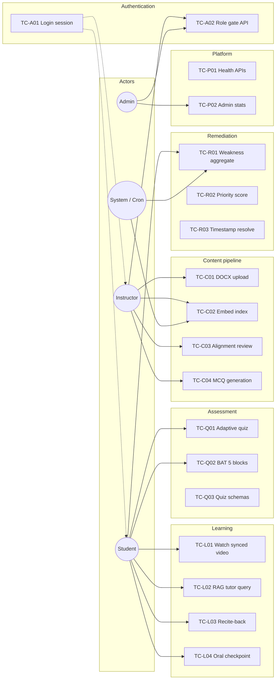

---

## 2. Test case hierarchy by module

Mind map of **automated** test files grouped under product modules.

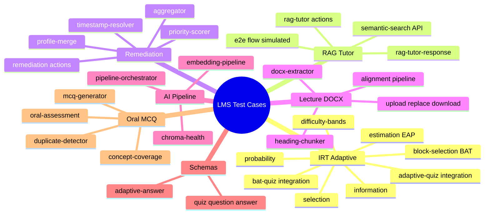

---

## 3. Traceability matrix

Links **test case ID** → **module** → **automated file** → **test type** ([TEST_TYPES.md](./TEST_TYPES.md)).

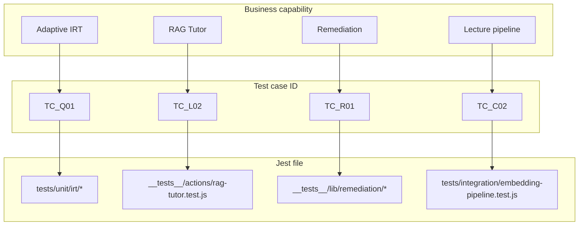

| Test case ID | Module | Primary automated tests | Type |
|--------------|--------|-------------------------|------|
| TC-Q01 | Adaptive IRT | `tests/unit/irt/*`, `adaptive-quiz.test.js` | Unit + integration |
| TC-Q02 | BAT | `block-selection.test.js`, `bat-quiz.test.js` | Unit + integration |
| TC-L02 | RAG tutor | `rag-tutor-response.test.js`, `rag-tutor.test.js`, `semantic-search.test.js` | Unit + integration |
| TC-L03 | Recite-back | `recite-back.test.js` | Integration |
| TC-L04 | Oral assessment | `oral-assessment.test.js`, `concept-coverage.test.js` | Integration + unit |
| TC-R01 | Remediation | `aggregator.test.js`, `remediation.test.js` | Unit + action |
| TC-C01 | DOCX | `docx-extractor.test.js`, `lecture-document-upload.test.js` | Unit + integration |
| TC-C02 | Embeddings | `embedding-pipeline.test.js`, `gemini-embeddings.test.js` | Integration + unit |
| TC-C03 | Alignment | `text-aligner.test.js`, `alignment-pipeline.test.js` | Unit + integration |
| TC-C04 | MCQ gen | `mcq-generator.test.js`, `mcq-generation.test.js` | Unit + integration |
| TC-P01 | Health | `health-api.test.js`, `mongo-health.test.js`, `chroma-health.test.js` | Integration |

---

## 4. Scenario sequence diagrams

### TC-L02 — RAG tutor query (automated path)

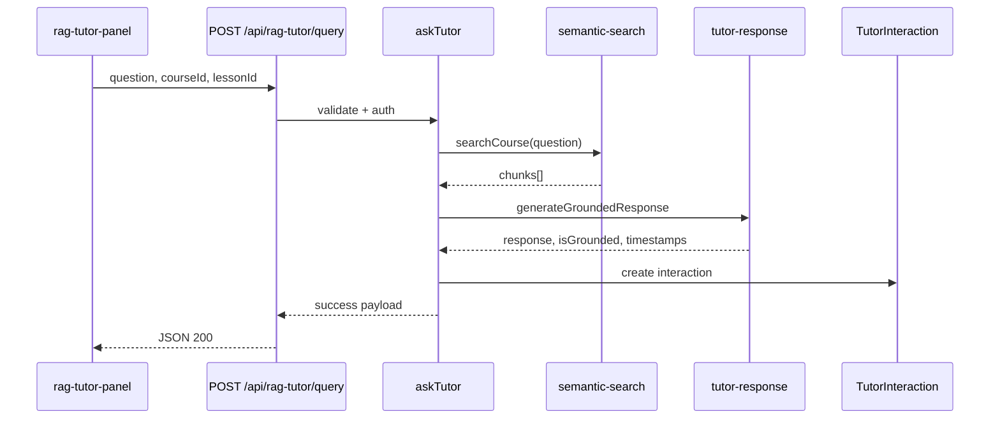

**Tests:** `__tests__/actions/rag-tutor.test.js`, `tests/integration/semantic-search.test.js`, `__tests__/e2e/rag-tutor-flow.test.js` (mocked chain).

### TC-Q02 — BAT block submit

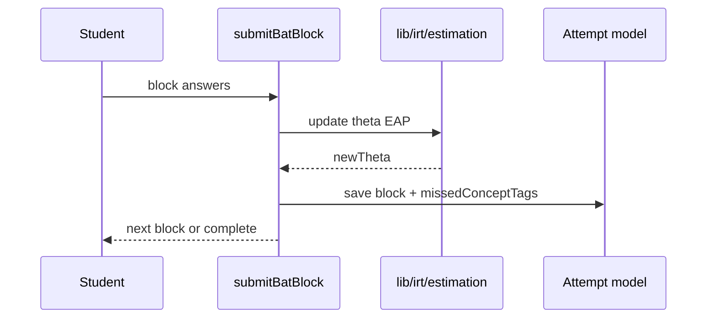

**Tests:** `tests/integration/bat-quiz.test.js`, `tests/unit/irt/block-selection.test.js`.

### TC-R01 — Remediation weakness aggregation

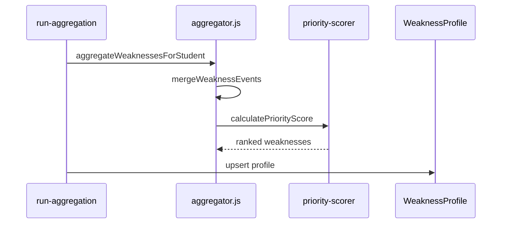

**Tests:** `__tests__/lib/remediation/aggregator.test.js`, `__tests__/actions/remediation.test.js`.

---

## 5. Test case catalog (IDs)

Formal list for test plans and UAT traceability.

| ID | Title | Preconditions | Steps (summary) | Expected result | Automation |
|----|-------|---------------|-----------------|-----------------|------------|
| TC-A01 | Valid login | User exists | Submit credentials | Session cookie, redirect | Manual |
| TC-A02 | API unauthorized | No session | Call protected API | 401 | Partial Jest |
| TC-L01 | Video sync | Alignment published | Play lesson video | Text highlights match time | Manual + `video-text-sync` |
| TC-L02 | Grounded tutor answer | Indexed content | Ask in-scope question | `isGrounded: true`, chunks cited | Jest mocked |
| TC-L03 | Recite-back pass | Prior tutor turn | Record recitation | similarity ≥ threshold | Jest |
| TC-L04 | Oral fail → concepts | Assessment exists | Wrong answer audio | conceptsMissing populated | Jest |
| TC-Q01 | Adaptive termination | Quiz adaptive on | Answer until stop rule | Attempt completed, θ saved | Jest + Mongo |
| TC-Q02 | BAT 5 blocks | BAT pool valid | Complete 5×2 items | 10 questions, final θ | Jest + Mongo |
| TC-C01 | DOCX upload | Instructor owns course | Upload .docx | structuredContent stored | Jest mocked |
| TC-C02 | Re-index cancel | Job in progress | Re-upload doc | Old job cancelled, new index | Jest |
| TC-R01 | Weakness list | BAT/oral failures | Open remediation | Sorted by priority | Jest |
| TC-P01 | Health OK | Mongo/Chroma up | GET /api/health | 200 healthy | Jest |

---

## 6. Test results — latest run snapshot

**Run date:** 2026-05-22 (local `npm test -- --ci`)  
**Command:** `npm test`  
**Duration:** ~22–35 s  

### Overall test results

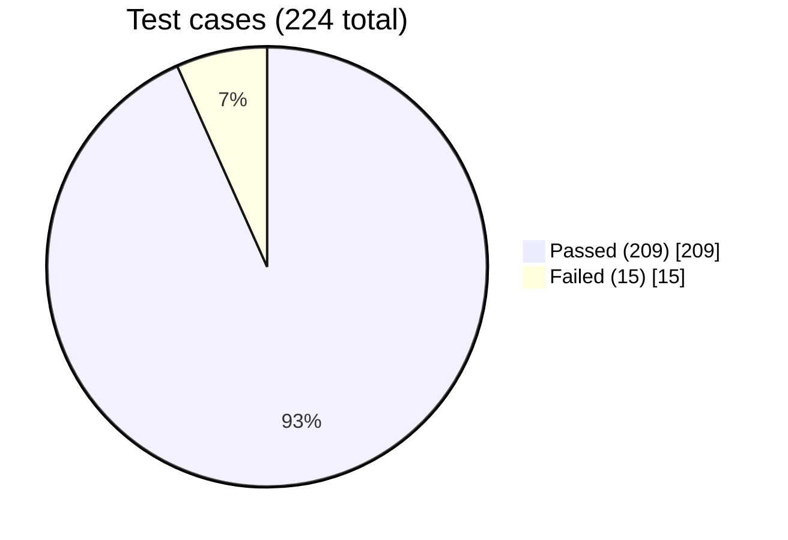

| Metric | Value |
|--------|------:|
| **Test suites** | 63 |
| **Suites passed** | 42 |
| **Suites failed** | 21 |
| **Tests (cases)** | 224 |
| **Passed** | 209 (93.3%) |
| **Failed** | 15 (6.7%) |
| **Snapshots** | 0 |

### Suite results

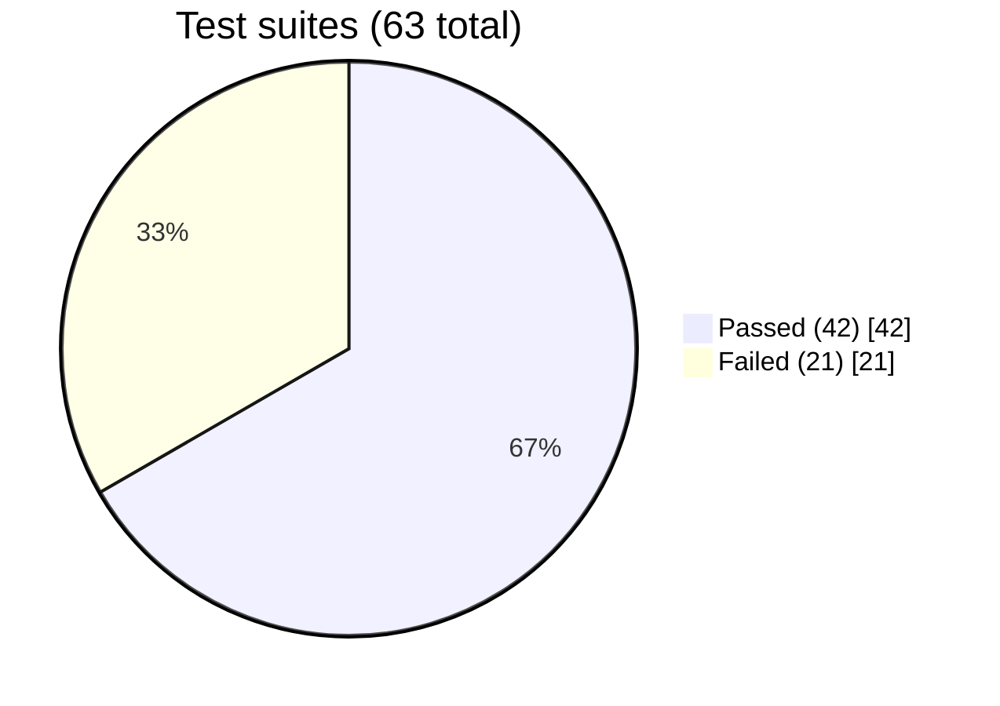

> **Note:** Some suites report **0 assertions** in JSON when the suite fails during `beforeAll` (import/setup). Count those as **failed suites**, not skipped tests.

---

## 7. Results by layer and folder

Distribution of **test cases** (assertions) by primary directory from last Jest JSON export.

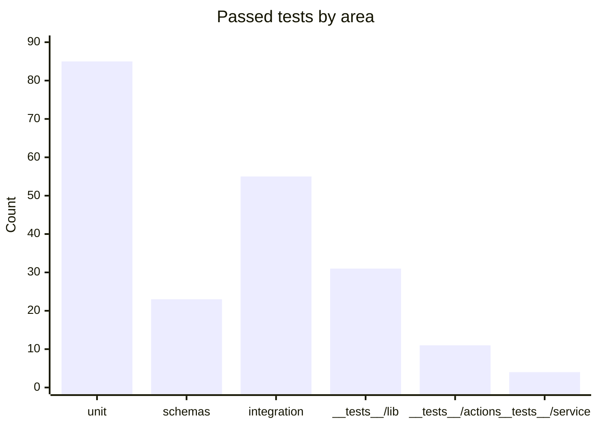

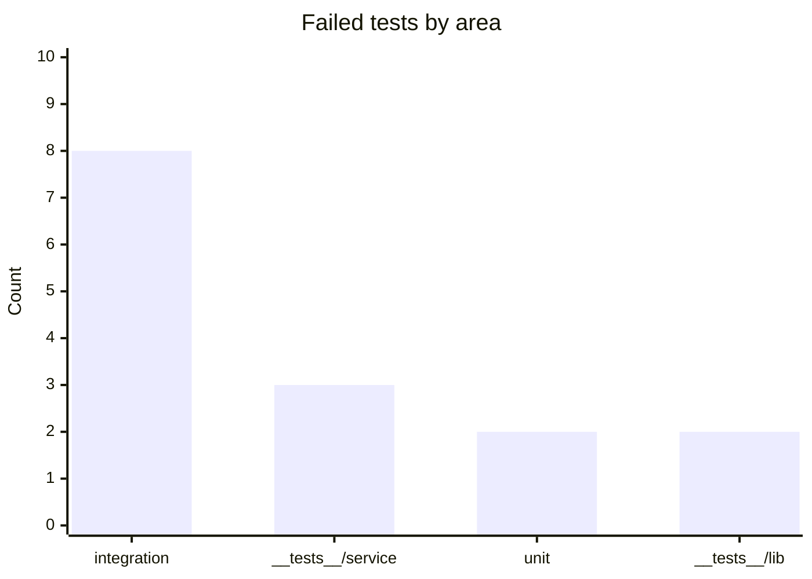

| Area | Passed | Failed | Pass rate |
|------|-------:|-------:|----------:|
| `tests/unit/` | 85 | 2 | 97.7% |
| `tests/schemas/` | 23 | 0 | 100% |
| `tests/integration/` | 55 | 8 | 87.3% |
| `__tests__/lib/` | 31 | 2 | 93.9% |
| `__tests__/actions/` | 11 | 0 | 100% |
| `__tests__/service/` | 4 | 3 | 57.1% |
| Other suites* | — | — | varies |

\*Includes `__tests__/api`, `__tests__/e2e`, `tests/services`, `tests/models` — some failed at suite level without assertion counts in the rollup.

### Results by test type

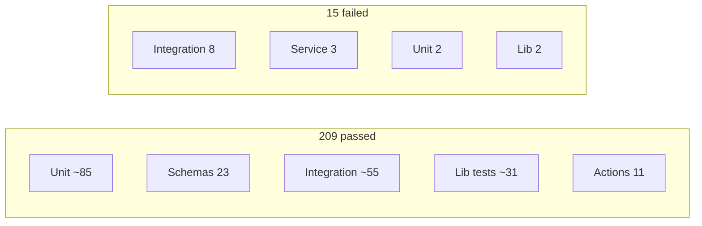

Mapping to [TEST_TYPES.md](./TEST_TYPES.md): majority of automated coverage is **unit** + **integration**; **system** E2E is mostly mocked (1 file).

---

## 8. Suite pass/fail map

Heat-style view: **green** = all tests in suite passed; **red** = one or more failures or suite setup failed.

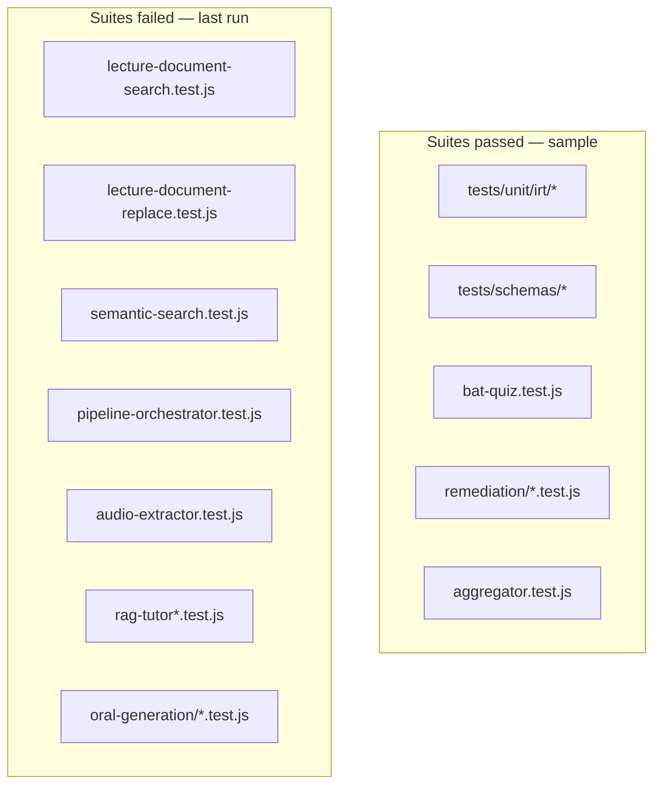

### Top suites by test count (all passed)

| Suite file | Tests passed |
|------------|-------------:|
| `tests/unit/db-config.test.js` | 12 |
| `tests/schemas/question.schema.test.js` | 9 |
| `tests/unit/duplicate-detector.test.js` | 9 |
| `__tests__/actions/remediation.test.js` | 8 |
| `tests/unit/irt/difficulty-bands.test.js` | 8 |
| `tests/integration/bat-quiz.test.js` | 7 |

---

## 9. Failure analysis diagram

Where failures concentrated in the last run (for triage).

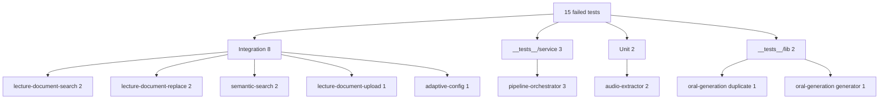

| Failure cluster | Likely cause | Action |
|-----------------|--------------|--------|
| Lecture document search/replace | Timeouts / mock drift | Increase timeout or fix mocks |
| `semantic-search` | Route/action contract change | Align test with `API_DESIGN.md` |
| `pipeline-orchestrator` | Job state machine change | Update fixtures |
| `audio-extractor` | FFmpeg env in CI | Mock ffmpeg or skip in CI |
| RAG/oral API suites | Suite-level import errors | Fix module mocks |

---

## 10. Results over time (CI template)

When GitHub Actions is added, plot **pass rate** and **duration** per build.

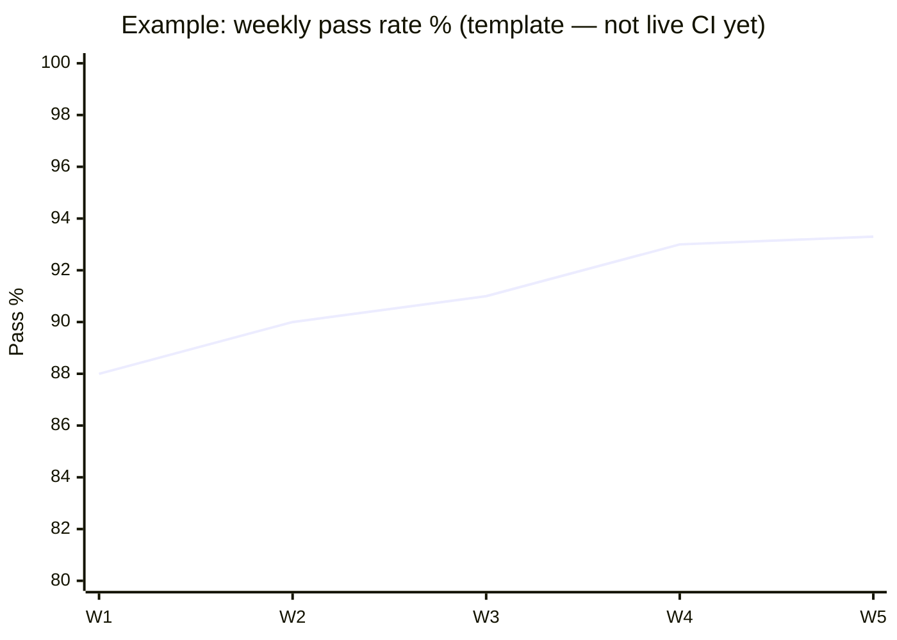

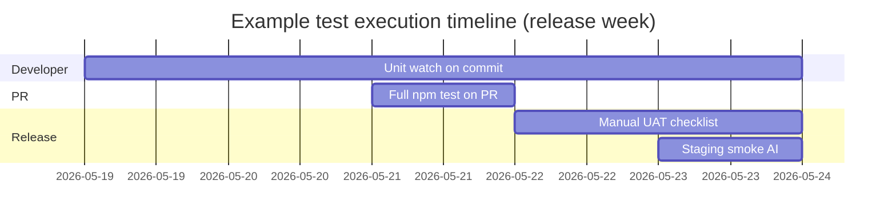

### Coverage funnel (automated vs manual)

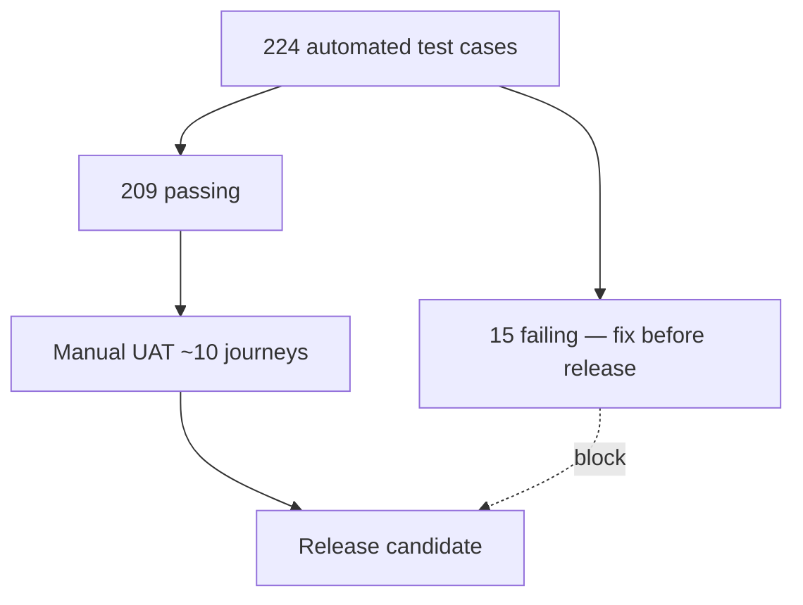

---

## 11. Regenerating result diagrams

### Run tests and export JSON

```bash
npm test -- --ci --json --outputFile=jest-results.json
```

### Summarize by folder (Node)

```javascript
// summarize-jest.js
const r = require("./jest-results.json");
let pass = 0, fail = 0;
r.testResults.forEach((s) =>
  s.assertionResults.forEach((a) =>
    a.status === "passed" ? pass++ : fail++
  )
);
console.log({ pass, fail, total: r.numTotalTests, suites: r.numTotalTestSuites });
```

### Human-readable report

```bash
npm test -- --ci
```

Update the **pie charts** and tables in §6–§9 with new numbers after each release candidate.

### Optional: coverage diagram

```bash
npm test -- --ci --coverage
```

Open `coverage/lcov-report/index.html` for line coverage heatmap (not committed by default).

---

## Diagram legend

| Symbol | Meaning |
|--------|---------|
| Solid arrow | Automated test covers path |
| Dashed arrow | Manual / UAT only |
| Green subgraph | Passing suites (snapshot) |
| Red subgraph | Failing suites (snapshot) |
| TC-xx | Test case ID for traceability |

---

*Test scheduling: [TEST_PLAN.md](./TEST_PLAN.md). Test type definitions: [TEST_TYPES.md](./TEST_TYPES.md). API sample under test: [API_IMPLEMENTATION_SAMPLE.md](./API_IMPLEMENTATION_SAMPLE.md).*
