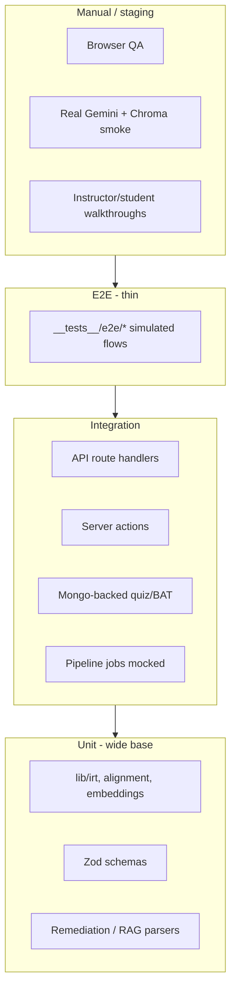

# Test Plan — What, When, and With What Tools

Testing strategy for **LMS-main**: scope by layer, timing in the delivery lifecycle, tools already in the repo, and gaps to close.

**Related:** [TEST_TYPES.md](./TEST_TYPES.md) (unit, integration, system, acceptance, performance, safety, usability, a11y, compatibility), [MODULE_IMPLEMENTATION.md](./MODULE_IMPLEMENTATION.md), [INTELLIGENT_ALGORITHMS.md](./INTELLIGENT_ALGORITHMS.md) §12, [SECURITY_AND_PERMISSIONS.md](./SECURITY_AND_PERMISSIONS.md), [API_DESIGN.md](./API_DESIGN.md).

---

## Table of contents

0. [Test types (classical taxonomy)](./TEST_TYPES.md) — unit, integration, system, acceptance, performance, endurance, safety, usability, accessibility, compatibility  
0b. [Test case & results diagrams](./TEST_DIAGRAMS.md) — actors, traceability, sequence charts, pass/fail charts  
1. [Goals and principles](#1-goals-and-principles)
2. [Tools](#2-tools)
3. [Test layers (pyramid)](#3-test-layers-pyramid)
4. [When to run what](#4-when-to-run-what)
5. [What to test by module](#5-what-to-test-by-module)
6. [Existing automated coverage](#6-existing-automated-coverage)
7. [Manual and exploratory testing](#7-manual-and-exploratory-testing)
8. [Environments and dependencies](#8-environments-and-dependencies)
9. [CI/CD (recommended)](#9-cicd-recommended)
10. [Gaps and roadmap](#10-gaps-and-roadmap)
11. [Command reference](#11-command-reference)

---

## 1. Goals and principles

| Goal | How |
|------|-----|
| **Correct business logic** | Unit tests for IRT, remediation scoring, chunking, alignment — deterministic, no network |
| **Safe refactors** | Integration tests for server actions and API routes with mocks for DB/AI |
| **Regression on AI paths** | Mock Gemini/Chroma in CI; real API smoke tests only manually or in a gated job |
| **Fast feedback** | Run unit + schema tests on every change; full suite before merge |
| **Documented behavior** | Tests live next to features (`tests/`, `__tests__/`) and mirror [MODULE_IMPLEMENTATION.md](./MODULE_IMPLEMENTATION.md) |

**Principles:**

- **Mock external services in automated CI** — `GEMINI_API_KEY`, Chroma, Resend, S3 should not be required for `npm test` to pass.
- **Real MongoDB only where the test proves persistence** — e.g. `bat-quiz.test.js`, `adaptive-quiz.test.js`; use disposable data and cleanup in `afterAll`.
- **No secrets in tests** — use `.env` locally; CI injects vars from secrets store.
- **Prefer testing `lib/` and validators** over full browser E2E until Playwright (or similar) is added.

---

## 2. Tools

| Tool | Version (package.json) | Role |
|------|------------------------|------|
| **Jest** | ^30.2 | Test runner (`npm test`, `npm run test:watch`) |
| **next/jest** | via Next 15 | Loads `next.config.mjs`, path aliases `@/` |
| **jest-environment-jsdom** | ^30.2 | Default env (React/DOM) |
| **`@jest-environment node`** | per-file pragma | Server actions, Mongo, API routes |
| **@testing-library/react** | ^16.3 | Component rendering (minimal use today) |
| **@testing-library/jest-dom** | ^6.9 | DOM matchers (`jest.setup.js`) |
| **@testing-library/user-event** | ^14.6 | User interaction simulation |
| **Babel** | presets env/react/typescript | Transpile tests |
| **ESLint** (`next lint`) | ^9 | Static analysis — not tests, but run with quality gates |
| **tsx** | dev | `npm run db:reset` — seed data for manual QA |
| **Node scripts** | — | `scripts/view-chroma.js`, `cleanup-stuck-pipelines.js` — ops/debug, not CI |
| **Docker** (optional) | specs docs | MongoDB, ChromaDB for local integration |

**Not in repo today (gaps):**

| Tool | Intended use |
|------|----------------|
| **GitHub Actions / other CI** | No `.github/workflows` yet — see [§9](#9-cicd-recommended) |
| **Playwright / Cypress** | Real browser E2E |
| **TestSprite** | Referenced in [TECH_STACK.md](./TECH_STACK.md); no `testsprite_tests/` in tree |

---

## 3. Test layers (pyramid)



| Layer | Location | Typical mocks | Speed |
|-------|----------|---------------|-------|
| **Unit** | `tests/unit/`, `tests/schemas/`, parts of `__tests__/lib/` | None or pure functions | Fast |
| **Integration** | `tests/integration/`, `__tests__/actions/`, `__tests__/api/` | Mongo, Gemini, Chroma, auth | Medium |
| **Simulated E2E** | `__tests__/e2e/` | Entire stack mocked | Medium |
| **Component** | `tests/integration/video-text-sync.test.js` | React tree | Medium |
| **Manual** | Staging + production checklist | None | Slow |

---

## 4. When to run what

| Trigger | What to run | Tools / commands | Pass criteria |
|---------|-------------|------------------|---------------|
| **While coding** (continuous) | Unit tests for touched area | `npm run test:watch -- --testPathPattern="irt"` | Green for edited modules |
| **Before local commit** | Lint + full Jest (or affected paths) | `npm run lint`; `npm test` | No lint errors; all tests pass |
| **Pull request** (recommended CI) | Lint + full `npm test` | GitHub Actions | Green workflow |
| **PR touching Mongo flows** | + integration tests that use real DB | `npm test` with `MONGODB_CONNECTION_STRING` on CI service | BAT/adaptive/health tests pass |
| **PR touching AI/RAG** | Unit + mocked integration; optional manual smoke | `npm test -- rag-tutor`; manual `POST /api/rag-tutor/query` | Grounded responses; chunks retrieved |
| **Before release / demo** | Full automated suite + manual checklist [§7](#7-manual-and-exploratory-testing) | Jest + browser + seed DB | Critical paths signed off |
| **After dependency upgrade** (Next, Mongoose, Jest) | Full suite + `npm run build` | `npm test`; `npm run build` | Build and tests green |
| **Nightly / weekly** (optional) | Real Chroma + embedding index smoke; pipeline cleanup | `node scripts/view-chroma.js`; staging env | Collections healthy; no stuck jobs |
| **Hotfix production** | Targeted unit + smoke on changed API | Pattern-matched Jest + one manual path | Fix verified |

### Suggested developer workflow

1. Implement feature + **unit tests** for `lib/` logic first (TDD where specs exist under `specs/`).
2. Add **integration test** for server action or `route.js` with mocks.
3. If persistence matters, add **Mongo integration** test with create/delete cleanup.
4. Run **`npm run lint`** and **`npm test`** before push.
5. Manual QA for UI and real AI only when the feature is user-visible or prompt-dependent.

---

## 5. What to test by module

Maps to [MODULE_IMPLEMENTATION.md](./MODULE_IMPLEMENTATION.md). **Priority:** P0 = must automate; P1 = should; P2 = manual until tooling exists.

| Module | What to verify | Layer | Priority | Example tests / files |
|--------|----------------|-------|----------|------------------------|
| **Auth & sessions** | JWT/session, role gates, unauthorized API | Integration + manual | P1 | Mock `getLoggedInUser` in action tests; manual login flows |
| **Courses / lessons** | CRUD authorization, publish flags | Integration | P2 | Extend `lecture-document-*` patterns |
| **Enrollment** | `hasEnrollmentForCourse` gates RAG/tutor | Unit/mock in actions | P0 | `__tests__/actions/rag-tutor.test.js` |
| **Quiz v2** | Schemas, grading, attempts | Schema + service | P0 | `tests/schemas/quiz.schema.test.js`, `tests/services/question.test.js` |
| **Adaptive IRT** | θ update, item selection, termination | Unit + integration | P0 | `tests/unit/irt/*`, `tests/integration/adaptive-quiz.test.js` |
| **BAT** | Block selection, 5 blocks, concept tags | Unit + integration | P0 | `block-selection.test.js`, `bat-quiz.test.js`, `bat-us4.test.js` |
| **DOCX extraction** | Text, structure, word count | Unit | P0 | `tests/unit/docx-extractor.test.js` |
| **Chunking / embeddings** | Chunk boundaries, batch embed API shape | Unit | P0 | `heading-chunker.test.js`, `gemini-embeddings.test.js` |
| **Chroma / semantic search** | Health, query scoring, course filter | Integration (mocked) | P0 | `chroma-health.test.js`, `semantic-search.test.js` |
| **Embedding pipeline** | Job states, re-index, delete vectors | Integration | P0 | `embedding-pipeline.test.js`, `__tests__/actions/pipeline.test.js` |
| **Alignment** | Fuzzy match thresholds, segment times | Unit + integration | P0 | `text-aligner.test.js`, `alignment-pipeline.test.js` |
| **MCQ generation** | Schema validation, Bloom→b, dedup | Unit | P0 | `mcq-generator.test.js`, `duplicate-detector.test.js` |
| **Oral generation** | API status, duplicates | Unit + API | P1 | `__tests__/api/oral-generation*.test.js` |
| **RAG tutor** | Auth, enrollment, search, grounded JSON | Unit + action + e2e | P0 | `rag-tutor-response.test.js`, `rag-tutor.test.js`, `e2e/rag-tutor-flow.test.js` |
| **Oral assessment** | Transcription mock, scoring, concept coverage | Action + lib | P0 | `oral-assessment.test.js`, `concept-coverage.test.js` |
| **Recite-back** | Similarity threshold, persistence | Action | P1 | `recite-back.test.js` |
| **Remediation** | Aggregate weaknesses, priority, merge | Unit + action | P0 | `aggregator.test.js`, `priority-scorer.test.js`, `remediation.test.js` |
| **Progress / certificates** | Completion rules | Unit (add) | P1 | Extend `lib/certificate-helpers` tests |
| **Admin / payments** | Aggregates, MockPay | Manual + integration (add) | P2 | — |
| **Health APIs** | Mongo/Chroma status codes | Integration | P1 | `health-api.test.js`, `mongo-health.test.js` |
| **i18n / RTL** | Locale routing, Arabic UI | Manual | P2 | Browser with `/ar` |
| **Security** | Role escalation, IDOR on course APIs | Integration + manual | P1 | Per [SECURITY_AND_PERMISSIONS.md](./SECURITY_AND_PERMISSIONS.md) |

### Intelligent algorithms ([INTELLIGENT_ALGORITHMS.md](./INTELLIGENT_ALGORITHMS.md))

| Algorithm area | Automate | Tool |
|----------------|----------|------|
| IRT 3PL, EAP, information | Yes — fixed inputs/outputs | Jest unit |
| Text aligner windows | Yes — known transcript + DOCX blocks | Jest unit |
| Jaccard / cosine dedup | Yes | Jest unit |
| Concept coverage thresholds | Yes — mock embeddings | Jest |
| RAG prompt / JSON schema | Partial — parse + validator; not LLM quality | Jest + manual rubric |
| Retrieval relevance | Manual or staging with fixed corpus | Browser + Chroma viewer script |

---

## 6. Existing automated coverage

**~63 test files** under `tests/` and `__tests__/` (run with `npm test`).

### Directory map

| Path | Count (approx) | Focus |
|------|------------------|--------|
| `tests/unit/` | 18 | IRT, DOCX, chunker, aligner, MCQ, duplicates |
| `tests/unit/irt/` | 6 | probability, estimation, information, selection, block-selection, difficulty-bands |
| `tests/schemas/` | 4 | Zod: quiz, question, answer, adaptive-answer |
| `tests/models/` | 1 | Mongoose question model |
| `tests/services/` | 2 | question service, ai-utils |
| `tests/integration/` | 22 | APIs, lecture docs, adaptive/BAT, pipeline, health |
| `__tests__/lib/` | 12 | RAG, remediation, oral-gen, similarity |
| `__tests__/actions/` | 5 | rag-tutor, oral, remediation, pipeline, recite-back |
| `__tests__/api/` | 3 | oral-generation, pipeline-status |
| `__tests__/service/` | 2 | pipeline-orchestrator, remediation-queue |
| `__tests__/e2e/` | 1 | Simulated RAG + oral + recite-back chain |

### Tests that need a real MongoDB

These call `dbConnect()` and read/write collections (use a **test database** URI, not production):

- `tests/integration/mongo-health.test.js`
- `tests/integration/adaptive-quiz.test.js`
- `tests/integration/bat-quiz.test.js`
- `tests/integration/bat-us4.test.js`
- `tests/integration/alignment-pipeline.test.js` (partial — check file for DB use)

All other integration tests **mock** `service/mongo` and models.

### Tests using jsdom (UI)

- `tests/integration/video-text-sync.test.js` — `@testing-library/react`

### Configuration files

| File | Purpose |
|------|---------|
| `jest.config.mjs` | next/jest, `@/` mapper, jsdom default, transform allowlist for mongoose/bson |
| `jest.setup.js` | jest-dom, TextEncoder/TextDecoder |

---

## 7. Manual and exploratory testing

Use before releases or when changing prompts, UX, or infrastructure.

### Critical user journeys (checklist)

| # | Journey | Roles | Verify |
|---|---------|-------|--------|
| 1 | Register / login / logout | All | Session cookie, redirect, locale |
| 2 | Instructor creates course → module → lesson → upload video | Instructor | Publish, media playback |
| 3 | Upload DOCX → pipeline → alignment review → publish index | Instructor | Chroma count increases (`node scripts/view-chroma.js`) |
| 4 | Student enrolls (MockPay) → opens lesson | Student | Enrollment gate |
| 5 | Adaptive quiz attempt → θ changes → completion | Student | Attempt saved, correct termination |
| 6 | BAT quiz → 5 blocks → missed concept tags | Student | Block flow, remediation input |
| 7 | RAG tutor question → grounded answer → timestamp link | Student | `isGrounded`, video seek |
| 8 | Oral checkpoint → record → score → concept gaps | Student | Transcription + feedback |
| 9 | Remediation dashboard → priority order → jump to video | Student | Weakness aggregation |
| 10 | Admin stats / user management | Admin | Role restrictions |

### AI / vector smoke (staging only)

1. Set `GEMINI_API_KEY`, `CHROMA_HOST`, `MONGODB_CONNECTION_STRING`.
2. Index one lesson document; query semantic search and RAG tutor with a question answerable from that doc.
3. Confirm **low-similarity** query returns “not in materials” behavior (see [API_IMPLEMENTATION_SAMPLE.md](./API_IMPLEMENTATION_SAMPLE.md)).

### Security spot checks

- Student cannot access another student’s attempt or instructor dashboard URLs.
- Unauthenticated `POST /api/rag-tutor/query` → 401.
- See [SECURITY_AND_PERMISSIONS.md](./SECURITY_AND_PERMISSIONS.md).

### Accessibility / i18n

- Switch `en` / `ar`; RTL layout on dashboard and lesson pages.
- Keyboard focus on quiz and tutor panels.

---

## 8. Environments and dependencies

| Environment | Purpose | Services |
|-------------|---------|----------|
| **Local dev** | Feature work + most Jest | Optional Mongo; mocks for AI |
| **Local integration** | BAT/adaptive/mongo-health | MongoDB (`MONGODB_CONNECTION_STRING`) |
| **Local AI** | Manual RAG/MCQ | Mongo + Chroma + `GEMINI_API_KEY` |
| **CI** | PR gate | Mongo service container; mocked Gemini/Chroma |
| **Staging** | Pre-release manual | Parity with production secrets (scoped keys) |

**Env vars commonly referenced in tests:**

| Variable | Needed when |
|----------|-------------|
| `MONGODB_CONNECTION_STRING` | Real Mongo integration tests |
| `GEMINI_API_KEY` | Manual AI smoke only (mocked in Jest) |
| `CHROMA_HOST` | Manual vector smoke; mocked in most tests |
| `NEXTAUTH_SECRET` | Manual auth flows |

Load via Next/jest from project root `.env` (same as `next dev`).

---

## 9. CI/CD (recommended)

No workflow is committed yet. Suggested **GitHub Actions** job on `pull_request` and `push` to `main`:

```yaml
# .github/workflows/test.yml (recommended — not yet in repo)
jobs:
  test:
    runs-on: ubuntu-latest
    services:
      mongodb:
        image: mongo:7
        ports: ['27017:27017']
    env:
      MONGODB_CONNECTION_STRING: mongodb://127.0.0.1:27017/lms_test
      NODE_ENV: test
    steps:
      - uses: actions/checkout@v4
      - uses: actions/setup-node@v4
        with: { node-version: '22', cache: 'npm' }
      - run: npm ci
      - run: npm run lint
      - run: npm test -- --ci --coverage
      - run: npm run build
```

**When:** every PR and merge to main. **Optional nightly:** staging smoke with real Gemini (secret-gated, allow failure).

---

## 10. Gaps and roadmap

| Gap | Risk | Recommendation | When |
|-----|------|----------------|------|
| No CI workflow | Regressions merge unnoticed | Add §9 workflow | Next infra task |
| Almost no React component tests | UI regressions | Add RTL tests for quiz, tutor panel, dashboard forms | Per feature PR |
| No Playwright/Cypress | End-to-end gaps | 5–10 critical paths (login, lesson, quiz) | Before major release |
| Real Chroma not in CI | Index/query drift | Optional job with Chroma service container | Nightly |
| LLM output quality | Bad tutor/MCQ answers | Golden-set manual eval + prompt version tags | Each prompt change |
| Auth/oauth E2E | Session bugs | Playwright with test user seed | With E2E framework |
| Payment (MockPay) | Enrollment bugs | Integration test for checkout action | P1 |
| Coverage reporting | Unknown blind spots | `npm test -- --coverage` in CI | With CI |

---

## 11. Command reference

```bash
# Full suite
npm test

# Watch mode (local dev)
npm run test:watch

# Single file
npm test -- tests/unit/irt/estimation.test.js

# Pattern (path substring)
npm test -- --testPathPattern="remediation"

# Coverage (local / CI)
npm test -- --ci --coverage

# Lint (quality gate, not Jest)
npm run lint

# Production build smoke (after test pass)
npm run build

# Seed DB for manual QA
npm run db:reset

# Inspect vector index (manual)
node scripts/view-chroma.js
```

### Mapping PR types → minimum tests

| PR changes | Minimum automated run |
|------------|-------------------------|
| `lib/irt/*` | `npm test -- --testPathPattern=irt` |
| `lib/rag/*`, `app/actions/rag-tutor.js` | `npm test -- --testPathPattern="rag-tutor"` |
| `lib/remediation/*` | `npm test -- --testPathPattern=remediation` |
| `app/api/lecture-documents/*` | `npm test -- --testPathPattern=lecture-document` |
| `model/*`, schemas | `npm test -- tests/schemas` + affected model tests |
| Global / Next upgrade | `npm test` + `npm run build` |

---

*For algorithm-specific test file list see [INTELLIGENT_ALGORITHMS.md](./INTELLIGENT_ALGORITHMS.md) §12. For API contract checks see [API_DESIGN.md](./API_DESIGN.md) and [API_IMPLEMENTATION_SAMPLE.md](./API_IMPLEMENTATION_SAMPLE.md).*
