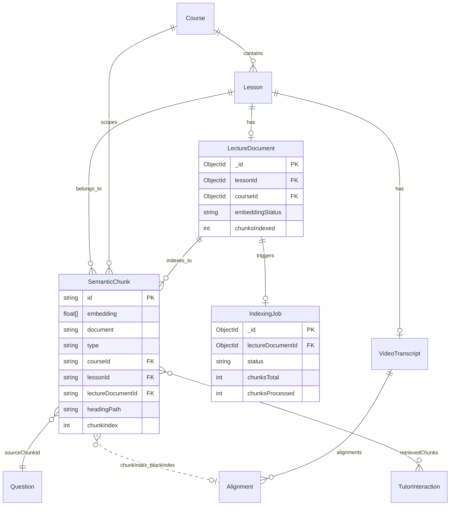

# LMS Vector Database Design Documentation

> **Last Updated:** May 2026
>
> This document describes the **ChromaDB** vector store used for semantic search, RAG tutoring, MCQ/oral generation, and remediation timestamp resolution. It mirrors the structure of `DATABASE_DESIGN.md`: ER diagram, schema, and constraints (keys, filters, validation).

---

## Table of Contents

1. [Vector Database Overview](#1-vector-database-overview)
2. [Entity-Relationship (ER) Diagram](#2-entity-relationship-er-diagram)
   - 2.1 [Full ER Diagram (ChromaDB + MongoDB)](#21-full-er-diagram-chromadb--mongodb)
   - 2.2 [ChromaDB Internal Model](#22-chromadb-internal-model)
   - 2.3 [Indexing and Query Flow](#23-indexing-and-query-flow)
3. [Collection Schema](#3-collection-schema)
   - 3.1 [Collection: `lms_embeddings`](#31-collection-lms_embeddings)
   - 3.2 [Record Types (Metadata `type`)](#32-record-types-metadata-type)
   - 3.3 [Transient Entities (Not Stored in ChromaDB)](#33-transient-entities-not-stored-in-chromadb)
4. [Constraints and Keys](#4-constraints-and-keys)
   - 4.1 [Primary Keys](#41-primary-keys)
   - 4.2 [Logical Foreign Keys (MongoDB References)](#42-logical-foreign-keys-mongodb-references)
   - 4.3 [Unique Keys](#43-unique-keys)
   - 4.4 [Check Constraints and Validation](#44-check-constraints-and-validation)
   - 4.5 [Metadata Filters (Query / Delete Indexes)](#45-metadata-filters-query--delete-indexes)
   - 4.6 [Vector Constraints](#46-vector-constraints)
5. [Configuration](#5-configuration)
6. [Operations API](#6-operations-api)
7. [Relationship to MongoDB](#7-relationship-to-mongodb)
8. [Distance, Similarity, and Ranking](#8-distance-similarity-and-ranking)

---

## 1. Vector Database Overview

| Property | Value |
|----------|-------|
| **Engine** | ChromaDB 3.3.2 |
| **Client** | `chromadb` npm package (`service/chroma.js`) |
| **Required?** | **No** — application degrades gracefully if unavailable |
| **Collections** | **1** default collection per deployment |
| **Default collection name** | `lms_embeddings` |
| **Embedding provider** | Google Gemini (`lib/embeddings/gemini.js`) — **not** Chroma’s built-in embedder |
| **Approximate record count** | One vector per semantic text chunk per lecture document (typically tens to hundreds per lesson) |
| **Job orchestration (OLTP)** | MongoDB `IndexingJob`, `LectureDocument.embeddingStatus` |

### Why a Separate Vector Store?

| Concern | MongoDB | ChromaDB |
|---------|---------|----------|
| Full-text + vector similarity at scale | Possible but not optimized | Purpose-built ANN search |
| Course-scoped semantic search | Requires custom indexing | `where: { courseId }` + vector query |
| Storage of 768–3072-dim float arrays | Bloated documents | Native vector index (HNSW) |
| Source of truth for lecture text | Yes (`LectureDocument`) | Denormalized `document` field for retrieval |

### Domain Use Cases

| Feature | Chroma Operation | MongoDB Companion |
|---------|------------------|-------------------|
| **Semantic search** | `queryEmbeddings` + course filter | `Lesson` (titles), enrollment checks |
| **RAG tutor** | Same as search (top-k chunks) | `TutorInteraction.retrievedChunks[]` |
| **MCQ / oral generation** | `getChunksByLesson` | `GenerationJob`, `Question.sourceChunkId` |
| **Remediation deep links** | `queryEmbeddings` by concept | `VideoTranscript.alignments` |
| **Re-indexing** | `removeEmbeddingsByDocument` then `addEmbeddings` | `IndexingJob`, pipeline |

---

## 2. Entity-Relationship (ER) Diagram

### 2.1 Full ER Diagram (ChromaDB + MongoDB)

Logical relationships between **vector records** (ChromaDB) and **OLTP entities** (MongoDB). ChromaDB does not enforce FKs; links are application-level.

```
┌─────────────────────────────────────────────────────────────────────────────────────────────┐
│                              MONGODB (Source of Truth)                                       │
│                                                                                              │
│  ┌──────────┐     ┌──────────┐     ┌──────────┐     ┌──────────────────┐                     │
│  │  Course  │◄────│  Lesson  │◄────│ Lecture  │────►│  IndexingJob     │                     │
│  │          │     │          │     │ Document │     │  (job tracking)  │                     │
│  └────┬─────┘     └────┬─────┘     └────┬─────┘     └──────────────────┘                     │
│       │                │                │                                                    │
│       │                │                │ 1:1 (unique lessonId)                              │
│       │                ▼                ▼                                                    │
│       │         ┌──────────────────┐  ┌──────────────────┐                                   │
│       │         │ VideoTranscript  │  │ extractedText    │                                   │
│       │         │ (alignments[])   │  │ .structuredContent│                                  │
│       │         └────────┬─────────┘  └────────┬─────────┘                                   │
│       │                  │                     │                                             │
│       │                  │ blockIndex ≈        │ chunkByHeadings()                           │
│       │                  │ chunkIndex          │                                             │
└───────┼──────────────────┼─────────────────────┼─────────────────────────────────────────────┘
        │                  │                     │
        │    indexes into  │                     │ produces chunks
        ▼                  ▼                     ▼
┌─────────────────────────────────────────────────────────────────────────────────────────────┐
│                         CHROMADB — Collection: lms_embeddings                                │
│                                                                                              │
│  ┌─────────────────────────────────────────────────────────────────────────────────────┐    │
│  │                         SemanticChunk (vector record)                                │    │
│  │                                                                                      │    │
│  │  PK: id  = embed-{courseId}-{lectureDocumentId}-{chunkIndex}                         │    │
│  │                                                                                      │    │
│  │  embedding: float[N]     ← Gemini (768 or 3072 dims, model-dependent)               │    │
│  │  document:  string         ← chunk text (retrieval / display)                          │    │
│  │  metadata:  { type, courseId, lessonId, lectureDocumentId, headingPath, chunkIndex }  │    │
│  │                                                                                      │    │
│  │  FK (logical) courseId          ──────────► Course._id                                 │    │
│  │  FK (logical) lessonId          ──────────► Lesson._id                                 │    │
│  │  FK (logical) lectureDocumentId ──────────► LectureDocument._id                        │    │
│  │  FK (logical) chunkIndex        ──────────► VideoTranscript.alignments[].blockIndex      │    │
│  └─────────────────────────────────────────────────────────────────────────────────────┘    │
│                                                                                              │
│  Queried by:                                                                                 │
│    • SemanticSearch / RAG     — queryEmbeddings(embedding, courseId)                         │
│    • MCQ / Oral generation    — getChunksByLesson(lessonId)                                  │
│    • Remediation              — queryEmbeddings(conceptEmbedding, courseId)                  │
│  Deleted by:                                                                                 │
│    • Re-index                 — delete where lectureDocumentId = X                           │
│                                                                                              │
└─────────────────────────────────────────────────────────────────────────────────────────────┘
        │
        │  persisted references (MongoDB)
        ▼
┌─────────────────────────────────────────────────────────────────────────────────────────────┐
│  Question.sourceChunkId  ──► SemanticChunk.id                                                │
│  TutorInteraction.retrievedChunks[].chunkId  ──► SemanticChunk.id                            │
│  GenerationJob.chunkErrors[].chunkId  ──► SemanticChunk.id                                   │
└─────────────────────────────────────────────────────────────────────────────────────────────┘
```

### 2.2 ChromaDB Internal Model

ChromaDB exposes a single **collection** containing **records**. Each record is not a SQL row but a tuple of four parallel arrays at insert time:

```
┌─────────────────────────────────────────────────────────────┐
│                    Collection: lms_embeddings                │
├─────────────────────────────────────────────────────────────┤
│  Record (SemanticChunk)                                      │
│  ┌─────────────┬──────────────────────────────────────────┐ │
│  │ id          │ string (unique within collection)       │ │
│  ├─────────────┼──────────────────────────────────────────┤ │
│  │ embeddings  │ number[]  (fixed dimension N per model)   │ │
│  ├─────────────┼──────────────────────────────────────────┤ │
│  │ documents   │ string    (human-readable chunk text)     │ │
│  ├─────────────┼──────────────────────────────────────────┤ │
│  │ metadatas   │ object    (scalar fields for filtering)   │ │
│  └─────────────┴──────────────────────────────────────────┘ │
│                                                              │
│  Internal ANN index: HNSW (Chroma-managed, not app-configured) │
└─────────────────────────────────────────────────────────────┘
```

### 2.3 Indexing and Query Flow

```
┌──────────────────┐     DOCX extract      ┌──────────────────┐
│ LectureDocument  │ ────────────────────► │ structuredContent │
│ (MongoDB)        │                       │ (in MongoDB)      │
└────────┬─────────┘                       └────────┬─────────┘
         │                                          │
         │ IndexingJob (pending → processing)       │ chunkByHeadings()
         ▼                                          ▼
┌──────────────────┐     Gemini batch        ┌──────────────────┐
│ embedding-queue  │ ───────────────────────►│ float[][] vectors │
└────────┬─────────┘                       └────────┬─────────┘
         │                                            │
         │ removeEmbeddingsByDocument (re-index)      │
         │ addEmbeddings([{ id, embedding, document, metadata }])
         ▼
┌──────────────────────────────────────────────────────────────┐
│ ChromaDB: lms_embeddings                                      │
└──────────────────────────────────────────────────────────────┘

Query path (search / RAG / remediation):
  User query text → generateEmbedding() → queryEmbeddings(vec, courseId, limit)
                    → filter by similarity threshold (app layer)
                    → enrich with Lesson.title from MongoDB
```

---

## 3. Collection Schema

### 3.1 Collection: `lms_embeddings`

| Property | Value |
|----------|-------|
| **Name** | `lms_embeddings` (override: `CHROMA_COLLECTION` env) |
| **Created by** | `getOrCreateCollection()` in `service/chroma.js` |
| **Embedding function (Chroma)** | Dummy no-op (embeddings supplied manually) |
| **Distance space** | Chroma default (application treats lower `distance` as better match) |
| **Record types** | Primarily `semantic_chunk`; legacy `lecture_document` possible |

### 3.2 Record Schema: Semantic Chunk (Canonical)

This is the **primary** record shape written by `service/embedding-queue.js` (pipeline indexing).

| Field | Type | Required | Description |
|-------|------|----------|-------------|
| **id** | String | Yes | Primary key; see [ID format](#id-format-canonical) |
| **embedding** | `number[]` | Yes | Gemini embedding vector |
| **document** | String | Yes | Chunk text (~≤ 8000 chars source limit from chunker) |
| **metadata.type** | String | Yes | Constant: `semantic_chunk` |
| **metadata.courseId** | String | Yes | MongoDB `Course._id` as string |
| **metadata.lessonId** | String | Yes | MongoDB `Lesson._id` as string |
| **metadata.lectureDocumentId** | String | Yes | MongoDB `LectureDocument._id` as string |
| **metadata.headingPath** | String | Yes | Hierarchy path, e.g. `"Chapter 1 > Section 1.1"` |
| **metadata.chunkIndex** | Number | Yes | Zero-based index within document; maps to alignment `blockIndex` |

#### ID Format (Canonical)

```
embed-{courseId}-{lectureDocumentId}-{chunkIndex}
```

**Example:**

```
embed-674a1b2c3d4e5f6789012345-674a1b2c3d4e5f6789012346-0
       └─ courseId ────────────┘ └─ lectureDocumentId ─────┘ └chunkIndex
```

**Parsing** (used by `lib/alignment/timestamp-lookup.js` for video timestamps):

| Segment | Meaning |
|---------|---------|
| `embed` | Fixed prefix |
| `{courseId}` | 24-char hex ObjectId string |
| `{lectureDocumentId}` | 24-char hex ObjectId string |
| `{chunkIndex}` | Integer chunk sequence |

> **Note:** Parsing assumes ObjectIds do not contain `-`. Standard MongoDB ObjectIds satisfy this.

#### Embedding Dimensions

| Model (Gemini) | Dimensions | Env / order |
|----------------|------------|-------------|
| `gemini-embedding-001` | **3072** | Preferred (default fallback chain) |
| `text-embedding-004` | **768** | Legacy fallback |

All vectors in a collection **must share the same dimension** for a given deployment. Switching models after data is indexed requires **full re-indexing**.

#### Source Chunk Structure (Pre-Embed)

Produced by `lib/embeddings/chunker.js` before persistence to ChromaDB:

| Field | Type | Description |
|-------|------|-------------|
| `content` | String | Chunk body (stored as Chroma `document`) |
| `headingPath` | String | Section breadcrumb |
| `headingLevel` | Number | Deepest heading level (1–6) |
| `chunkIndex` | Number | Sequence index |
| `tokenCount` | Number | Estimated tokens (`ceil(length/4)`) |

**Chunking rules:**

- Target size: ~2000 tokens (~8000 characters)
- Split at paragraph boundaries between structured blocks
- Headings start new sections; `headingPath` rebuilt from hierarchy

### 3.3 Record Types (Metadata `type`)

| `metadata.type` | ID Pattern | Written By | Status |
|-----------------|------------|------------|--------|
| `semantic_chunk` | `embed-{courseId}-{lectureDocumentId}-{chunkIndex}` | `service/embedding-queue.js` | **Canonical / active** |
| `lecture_document` | `lecture-doc-{lectureDocumentId}-chunk-{index}` | `service/lecture-document-search.js` | **Legacy** — plain text chunking via `chunkText()` |

#### Legacy Record Schema: `lecture_document`

| Field | Type | Required |
|-------|------|----------|
| **id** | `lecture-doc-{lectureDocumentId}-chunk-{index}` | Yes |
| **metadata.type** | `lecture_document` | Yes |
| **metadata.lectureDocumentId** | String | Yes |
| **metadata.lessonId** | String | Yes |
| **metadata.courseId** | String | Yes |
| **metadata.chunkIndex** | Number | Yes |
| **metadata.headingPath** | — | **Absent** in legacy path |

New features should use **`semantic_chunk`** only. Re-indexing via the pipeline replaces vectors per `lectureDocumentId`.

### 3.4 Transient Entities (Not Stored in ChromaDB)

| Entity | Lifetime | Description |
|--------|----------|-------------|
| **TextChunk** | In-memory during indexing | Output of `chunkByHeadings()` before embed |
| **SemanticQuery** | Per HTTP request | `{ queryText, queryEmbedding, courseId, userId }` |
| **SearchResult** | API response | Mapped in `service/semantic-search.js` / Zod `searchResultSchema` |

**SearchResult shape (API / validation):**

| Field | Type | Source |
|-------|------|--------|
| `chunkId` | String | Chroma `id` |
| `score` | Number | `1 - (distance / 2)`, clamped interpretation |
| `text` | String | Chroma `document` |
| `headingPath` | String | `metadata.headingPath` |
| `lessonId` | String | `metadata.lessonId` |
| `lessonTitle` | String | MongoDB `Lesson.title` |
| `courseId` | String | `metadata.courseId` |

**TutorInteraction stored chunk reference:**

| Field | Type | Description |
|-------|------|-------------|
| `chunkId` | String | Chroma record id |
| `content` | String | First 500 chars of chunk text |
| `similarity` | Number | Relevance score from search |

---

## 4. Constraints and Keys

### 4.1 Primary Keys

| Scope | Key | Type | Enforcement |
|-------|-----|------|-------------|
| Collection record | `id` | String | ChromaDB — must be unique within `lms_embeddings` |
| Collection | `name` | String | Single default collection per app config |

### 4.2 Logical Foreign Keys (MongoDB References)

ChromaDB metadata fields reference MongoDB collections. **Not enforced by Chroma** — maintained by application on write.

| Metadata Field | References | MongoDB Collection | Required on Write |
|----------------|------------|--------------------|-------------------|
| `courseId` | `Course._id` | `courses` | Yes |
| `lessonId` | `Lesson._id` | `lessons` | Yes |
| `lectureDocumentId` | `LectureDocument._id` | `lecturedocuments` | Yes |
| `chunkIndex` | `VideoTranscript.alignments[].blockIndex` | `videotranscripts` | Yes (semantic_chunk) |

**Downstream MongoDB references to Chroma `id`:**

| MongoDB Field | References Chroma |
|---------------|-------------------|
| `Question.sourceChunkId` | `SemanticChunk.id` |
| `TutorInteraction.retrievedChunks[].chunkId` | `SemanticChunk.id` |
| `GenerationJob.chunkErrors[].chunkId` | `SemanticChunk.id` |
| `OralGenerationJob.chunkErrors[].chunkId` | `SemanticChunk.id` |

### 4.3 Unique Keys

| Key | Scope | Rule |
|-----|-------|------|
| `id` | Per collection | One vector per chunk index per lecture document |
| `(lectureDocumentId, chunkIndex)` | Implied | Same as canonical `id` formula — duplicate `add` with same `id` overwrites or errors per Chroma version |

**Business rule:** At most one **indexed** Chroma record set per `LectureDocument` (enforced by delete-before-insert on re-index).

### 4.4 Check Constraints and Validation

#### Configuration (Zod — `lib/db/config.js`)

| Field | Constraint |
|-------|------------|
| `chroma.host` | Valid URL (default `http://localhost:8000`) |
| `chroma.collection` | Regex `^[a-zA-Z0-9_]+$` (default `lms_embeddings`) |
| `chroma.timeout` | 1000–30000 ms (default 5000) |

#### Metadata (Application — on write)

| Field | Constraint |
|-------|------------|
| `metadata.type` | Must be `semantic_chunk` (canonical path) |
| `metadata.courseId` | Non-empty string (ObjectId string) |
| `metadata.lessonId` | Non-empty string |
| `metadata.lectureDocumentId` | Non-empty string |
| `metadata.headingPath` | String (may be empty for untitled sections) |
| `metadata.chunkIndex` | Integer ≥ 0 |

#### API Validation (Zod — `lib/validations.js`)

| Schema | Field | Constraint |
|--------|-------|------------|
| `semanticSearchQuerySchema` | `query` | 3–500 characters |
| `semanticSearchQuerySchema` | `courseId` | Required string |
| `semanticSearchQuerySchema` | `limit` | Integer 1–10 (default 5) |
| `semanticSearchQuerySchema` | `threshold` | Number 0–1 (default 0.7) |
| `searchResultSchema` | `score` | 0–1 |
| `ragTutorQuerySchema` | `question` | Validated before embed |

#### Embedding Input

| Rule | Source |
|------|--------|
| Single text required, non-empty string | `generateEmbedding()` |
| Batch max **100** texts | `generateBatchEmbeddings()` |

### 4.5 Metadata Filters (Query / Delete Indexes)

ChromaDB supports **metadata filtering** on scalar fields. The application uses:

| Operation | Filter (`where`) | Purpose |
|-----------|------------------|---------|
| **Semantic query** | `{ courseId: "<courseId>" }` | Course-scoped RAG / search |
| **Get by lesson** | `{ lessonId: "<lessonId>" }` | MCQ/oral generation chunk list |
| **Delete / re-index** | `{ lectureDocumentId: "<id>" }` | Remove all vectors for a document |
| **Legacy delete** | `{ lectureDocumentId: "<id>" }` | `unindexLectureDocument()` |

**Not used in current code (optional future metadata):**

| Field | Potential use |
|-------|----------------|
| `metadata.type` | Filter `semantic_chunk` vs legacy |
| `metadata.lessonId` | Could scope queries to single lesson (RAG currently uses course scope) |

### 4.6 Vector Constraints

| Constraint | Description |
|------------|-------------|
| **Fixed dimension** | All embeddings in a collection must have identical length (768 or 3072) |
| **Manual embeddings** | Vectors must be provided on `add` / `query` — Chroma embed function is a no-op stub |
| **Query requires vector** | `queryEmbeddings` needs pre-computed query embedding from Gemini |
| **No partial update API** | Re-index = delete by `lectureDocumentId` + batch `add` |
| **Concurrency** | Max 5 concurrent `IndexingJob` processors (`embedding-queue.js`) |
| **Retries** | Up to 3 retries per indexing job on failure |

---

## 5. Configuration

### Environment Variables

| Variable | Required | Default | Description |
|----------|----------|---------|-------------|
| `CHROMA_HOST` | No* | `http://localhost:8000` | Chroma HTTP endpoint |
| `CHROMA_COLLECTION` | No | `lms_embeddings` | Collection name |
| `CHROMA_TIMEOUT` | No | `5000` | Request timeout (ms) |
| `GEMINI_API_KEY` | Yes (for embed) | — | Embedding generation |
| `GEMINI_EMBEDDING_MODEL` | No | — | Override model name |

\*If Chroma config is missing entirely, `getClient()` returns `null` and vector features are disabled.

### Client Initialization

```text
ChromaClient({ host, port, ssl })
  └── getOrCreateCollection({ name, embeddingFunction: dummy })
        └── cached in global.chroma (singleton per process)
```

### Health States

| Status | Meaning |
|--------|---------|
| `healthy` | Heartbeat succeeded |
| `unhealthy` | Heartbeat failed |
| `unavailable` | Client not initialized (no config) |

Exposed via `GET /api/health` (aggregated with MongoDB in `lib/db/health.js`).

---

## 6. Operations API

Implemented in `service/chroma.js`:

| Function | Chroma API | Inputs | Output |
|----------|------------|--------|--------|
| `getClient()` | — | Config from env | `ChromaClient \| null` |
| `getCollection()` | `getOrCreateCollection` | Collection name | `Collection \| null` |
| `addEmbeddings(embeddings[])` | `collection.add` | `{ id, embedding, document, metadata }[]` | `{ success, error? }` |
| `removeEmbeddingsByDocument(lectureDocumentId)` | `collection.delete` | `where: { lectureDocumentId }` | `{ success, error? }` |
| `getChunksByLesson(lessonId)` | `collection.get` | `where: { lessonId }` | `{ id, document, metadata }[]` |
| `queryEmbeddings(queryEmbedding, courseId, limit)` | `collection.query` | `queryEmbeddings`, `where: { courseId }`, `nResults` | `{ id, score, document, metadata }[]` |
| `getHealthStatus()` | `client.heartbeat` | — | Status object |
| `isAvailable()` | — | Cached flag | `boolean` |

### Callers

| Module | Operations Used |
|--------|-------------------|
| `service/embedding-queue.js` | `removeEmbeddingsByDocument`, `addEmbeddings` |
| `service/semantic-search.js` | `getCollection`, `queryEmbeddings` |
| `service/mcq-generation-queue.js` | `getChunksByLesson` (+ MongoDB fallback) |
| `service/oral-generation-queue.js` | `getChunksByLesson` (+ MongoDB fallback) |
| `lib/remediation/timestamp-resolver.js` | `queryEmbeddings` |
| `service/lecture-document-search.js` | Direct `collection.add` / `delete` (legacy) |

---

## 7. Relationship to MongoDB

### Cardinality

| MongoDB Entity | Chroma Relationship | Cardinality |
|----------------|---------------------|-------------|
| `LectureDocument` | Semantic chunks | **1 : N** (one doc → many vectors) |
| `Lesson` | Semantic chunks | **1 : N** (via documents in lesson) |
| `Course` | Semantic chunks | **1 : N** (all lessons in course) |
| `LectureDocument` | Chroma records | **1 : 0..1** active index sets (re-index replaces) |

### Synchronization Rules

| Event | MongoDB | ChromaDB |
|-------|---------|----------|
| DOCX uploaded & extracted | `LectureDocument.status = ready` | No vectors yet |
| Indexing triggered | `IndexingJob` created, `embeddingStatus = pending` | — |
| Indexing starts | `embeddingStatus = processing` | `delete` all with `lectureDocumentId` |
| Indexing completes | `embeddingStatus = indexed`, `chunksIndexed = N` | `add` N vectors |
| Indexing fails | `embeddingStatus = failed` | Partial vectors may exist until retry |
| Document removed / re-pipeline | Job cancelled | `removeEmbeddingsByDocument` |

### Fallback When Chroma Is Unavailable

| Feature | Fallback |
|---------|----------|
| Semantic search | Empty results, `degraded: true` |
| RAG tutor | Answers from general knowledge (`isGrounded: false`) |
| MCQ / oral generation | Re-chunk from `LectureDocument.extractedText` in MongoDB (same `id` format) |

---

## 8. Distance, Similarity, and Ranking

### Query Semantics

```javascript
// service/chroma.js
collection.query({
  queryEmbeddings: [queryEmbedding],
  nResults: limit,
  where: { courseId: courseId.toString() }
});
```

### Distance → Similarity (Application)

Used in `service/semantic-search.js`:

```text
similarity = 1 - (distance / 2)
```

| Chroma `distance` | Approx. similarity | Typical interpretation |
|-------------------|--------------------|-------------------------|
| 0.0 | 1.0 | Near-identical |
| 1.0 | 0.5 | Moderate match |
| 2.0 | 0.0 | Poor match |

Results below `threshold` (default **0.7**, RAG often **0.6**) are discarded.

### Default Limits

| Use Case | `limit` | `threshold` |
|----------|---------|-------------|
| Course search UI | 5 (max 10) | 0.7 |
| RAG tutor | 3 | 0.6 |
| Remediation resolver | 8 | — (best hit selected) |
| MCQ generation | All chunks for lesson | — |

---

## Appendix A: ER Diagram (Mermaid)

For tools that render Mermaid:



---

## Appendix B: Comparison with MongoDB Design

| Aspect | MongoDB (`DATABASE_DESIGN.md`) | ChromaDB (this document) |
|--------|-------------------------------|---------------------------|
| Collections / tables | 28 Mongoose models | 1 vector collection |
| Primary key | `_id` ObjectId | `id` string |
| Relationships | `ref`, indexes, unique compounds | Metadata filters + logical FKs |
| Schema enforcement | Mongoose validators | Application + Zod on API |
| Optional | No (required for app) | Yes (graceful degradation) |
| Job tracking | Native collections | `IndexingJob` in MongoDB |

---

> **Note:** ChromaDB does not support SQL-style CHECK or FOREIGN KEY constraints. All integrity rules are enforced in `service/chroma.js`, `service/embedding-queue.js`, and consuming services. When changing embedding models or collection names, plan a full re-index of all `LectureDocument` records.
