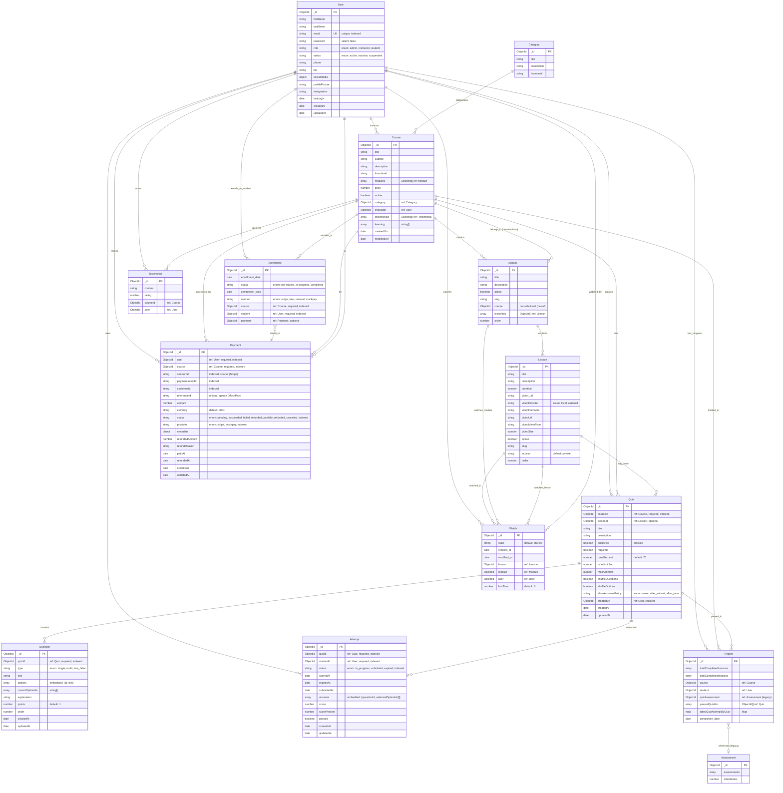

# Entity Relationship Diagram (ERD) - LMS Repository

This document provides a complete Entity Relationship Diagram for the Learning Management System based on actual Mongoose schemas in the `model/` directory.

## Mermaid ER Diagram

## Entity Glossary

| Entity | Purpose | Key Fields | Notes |
|--------|---------|------------|-------|
| **User** | Core user account management | `_id`, `email` (unique), `role`, `status` | Supports admin, instructor, student roles. Email is unique and indexed. |
| **Category** | Course categorization | `_id`, `title`, `thumbnail` | Simple taxonomy for organizing courses. |
| **Course** | Main course entity | `_id`, `title`, `instructor`, `category`, `price`, `active` | Contains modules array, linked to instructor (User) and category. |
| **Module** | Course section/chapter | `_id`, `title`, `course`, `order`, `slug` | Note: `course` field is ObjectId without ref (non-relational). Contains lessonIds array. |
| **Lesson** | Individual lesson content | `_id`, `title`, `duration`, `video_url`, `slug`, `order` | Supports both local and external video providers. |
| **Enrollment** | Student-course enrollment | `_id`, `student`, `course`, `status`, `method`, `payment` | Unique constraint on (student, course). Links to optional Payment. |
| **Payment** | Payment transaction records | `_id`, `user`, `course`, `status`, `provider`, `amount` | Supports Stripe and MockPay. Multiple indexed fields for querying. |
| **Quiz** | Quiz/assessment definition | `_id`, `courseId`, `lessonId`, `title`, `published`, `createdBy` | V2 quiz system. Can be course-level or lesson-specific. |
| **Question** | Quiz question definition | `_id`, `quizId`, `type`, `text`, `options`, `correctOptionIds` | Embedded options schema. Supports single, multi, true/false types. |
| **Attempt** | Student quiz attempt | `_id`, `quizId`, `studentId`, `status`, `score`, `passed` | Embedded answers schema. Unique constraint for one in-progress attempt per (quizId, studentId). |
| **Watch** | Lesson viewing progress | `_id`, `user`, `lesson`, `module`, `state`, `lastTime` | Tracks video watch state and last playback position. |
| **Report** | Course completion/progress | `_id`, `student`, `course`, `totalCompletedLessons`, `totalCompletedModules` | Unique constraint on (course, student). Tracks Quiz V2 passes. |
| **Testimonial** | Course reviews/ratings | `_id`, `courseId`, `user`, `content`, `rating` | User reviews for courses. Referenced in Course.testimonials array. |
| **Assessment** | Legacy assessment model | `_id`, `assessments`, `otherMarks` | **LEGACY**: Referenced by Report.quizAssessment but appears deprecated. No relationships defined. |

## Relationships

### One-to-Many Relationships

| Parent → Child | Cardinality | Field(s) | Required/Optional | Notes |
|----------------|-------------|----------|-------------------|-------|
| **User → Course** | 1:N | `Course.instructor` | Required | Instructor creates courses |
| **User → Enrollment** | 1:N | `Enrollment.student` | Required | Student enrollments |
| **User → Payment** | 1:N | `Payment.user` | Required | User payment transactions |
| **User → Quiz** | 1:N | `Quiz.createdBy` | Required | User creates quizzes |
| **User → Attempt** | 1:N | `Attempt.studentId` | Required | Student quiz attempts |
| **User → Watch** | 1:N | `Watch.user` | Optional | User watch history |
| **User → Report** | 1:N | `Report.student` | Optional | Student progress reports |
| **User → Testimonial** | 1:N | `Testimonial.user` | Optional | User reviews |
| **Category → Course** | 1:N | `Course.category` | Optional | Course categorization |
| **Course → Module** | 1:N | `Course.modules[]` | Optional (array) | Course contains modules |
| **Course → Enrollment** | 1:N | `Enrollment.course` | Required | Course enrollments |
| **Course → Payment** | 1:N | `Payment.course` | Required | Course payments |
| **Course → Quiz** | 1:N | `Quiz.courseId` | Required | Course quizzes |
| **Course → Report** | 1:N | `Report.course` | Optional | Course progress reports |
| **Course → Testimonial** | 1:N | `Course.testimonials[]` | Optional (array) | Course reviews (bidirectional) |
| **Module → Lesson** | 1:N | `Module.lessonIds[]` | Optional (array) | Module contains lessons |
| **Module → Watch** | 1:N | `Watch.module` | Optional | Module watch tracking |
| **Lesson → Quiz** | 1:N | `Quiz.lessonId` | Optional | Lesson-specific quizzes |
| **Lesson → Watch** | 1:N | `Watch.lesson` | Optional | Lesson watch tracking |
| **Quiz → Question** | 1:N | `Question.quizId` | Required | Quiz questions |
| **Quiz → Attempt** | 1:N | `Attempt.quizId` | Required | Quiz attempts |
| **Quiz → Report** | 1:N | `Report.passedQuizIds[]` | Optional (array) | Passed quizzes tracking |

### Many-to-Many Relationships (via Join Collections)

| Relationship | Join Collection | Fields | Cardinality | Notes |
|--------------|----------------|--------|-------------|-------|
| **User ↔ Course** (enrollment) | `Enrollment` | `student`, `course` | M:N | Unique constraint: one enrollment per (student, course) |
| **User ↔ Course** (payment) | `Payment` | `user`, `course` | M:N | Multiple payments possible per user-course pair |
| **User ↔ Quiz** (attempts) | `Attempt` | `studentId`, `quizId` | M:N | Multiple attempts allowed (one in-progress at a time) |

### Optional/One-to-One Relationships

| Parent → Child | Cardinality | Field(s) | Required/Optional | Notes |
|----------------|-------------|----------|-------------------|-------|
| **Enrollment → Payment** | 1:1 | `Enrollment.payment` | Optional | Enrollment may link to payment |
| **Report → Assessment** | N:1 | `Report.quizAssessment` | Optional | **LEGACY**: References deprecated Assessment model |

### Non-Relational References

| Entity | Field | Target | Notes |
|--------|-------|--------|-------|
| **Module** | `course` | Course | ObjectId without `ref:` - non-relational reference. Use `Course.modules[]` array for reverse lookup. |

## Key Constraints & Indexes

### Unique Constraints
- `User.email` - Unique email addresses
- `Enrollment(student, course)` - One enrollment per student per course
- `Payment.referenceId` - Unique reference IDs (sparse, for MockPay)
- `Report(course, student)` - One report per student per course
- `Attempt(quizId, studentId)` - One in-progress attempt per quiz-student pair (partial unique index)

### Important Indexes
- `User.email` - Indexed for fast lookups
- `Enrollment.course`, `Enrollment.student` - Indexed for enrollment queries
- `Payment.user`, `Payment.course`, `Payment.status`, `Payment.provider` - Multiple indexes for payment queries
- `Quiz.courseId`, `Quiz.published`, `Quiz.lessonId` - Indexed for quiz queries
- `Question.quizId`, `Question.order` - Indexed for question ordering
- `Attempt.quizId`, `Attempt.studentId`, `Attempt.status` - Indexed for attempt queries
- `Watch.user`, `Watch.module`, `Watch.lesson` - Indexed for progress tracking

## Notes

1. **Module-Course Relationship**: The `Module.course` field is an ObjectId without a `ref:` declaration, making it a non-relational reference. The reverse relationship is maintained via `Course.modules[]` array.

2. **Legacy Models**: 
   - `Assessment` model appears to be legacy/deprecated. It's referenced by `Report.quizAssessment` but has no defined relationships. The system appears to have migrated to the Quiz V2 system (Quiz, Question, Attempt).

3. **Quiz System**: The system uses a V2 quiz architecture with separate Quiz, Question, and Attempt models. Questions use embedded option schemas, and attempts use embedded answer schemas.

4. **Payment Providers**: The Payment model supports multiple providers (Stripe, MockPay) with provider-specific fields (sessionId for Stripe, referenceId for MockPay) using sparse indexes.

5. **Progress Tracking**: Two models track progress:
   - `Watch`: Tracks individual lesson/module viewing state and video playback position
   - `Report`: Aggregates course completion data including completed lessons/modules and passed quizzes

6. **Testimonials**: Bidirectional relationship - `Course.testimonials[]` array and `Testimonial.courseId` both reference each other.

7. **Enrollment Methods**: Supports multiple enrollment methods: 'stripe', 'free', 'manual', 'mockpay'.

8. **Video Storage**: Lesson model supports both local file storage (videoFilename, videoMimeType, videoSize) and external URLs (video_url).
